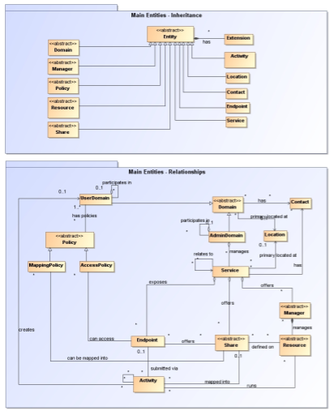
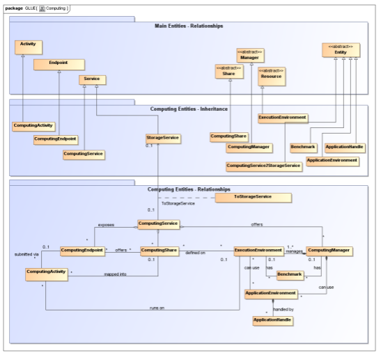
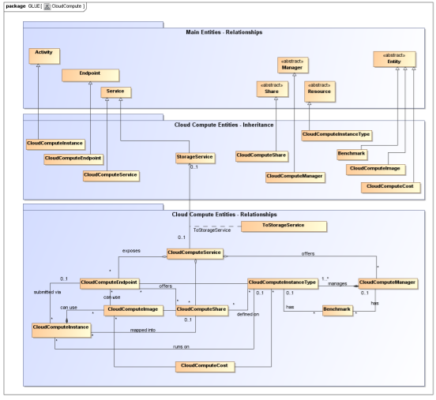
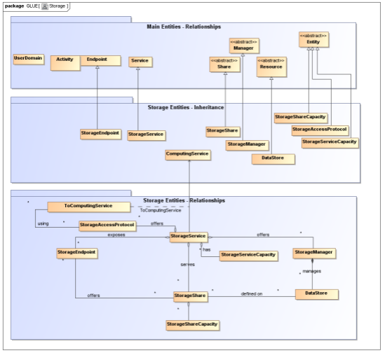
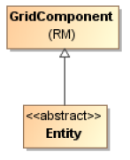

**GLUE Specification v 2.1-DRAFT**

Status of This Document

This document provides information to the Grid community regarding the
specification of the GLUE information model. Distribution is unlimited.

Copyright Notice

Copyright © Open Grid Forum (2009). All Rights Reserved.

Trademark

Open Grid Services Architecture and OGSA are trademarks of the Open Grid Forum.

Abstract

The GLUE specification is an information model for Grid entities described using
the natural language and UML Class Diagrams. As a conceptual model, it is
designed to be independent from the concrete data models adopted for its
implementation. This document extend the GLUE 2.0 model to include Cloud
resources and services. Rendering to concrete data models such XML Schema, LDAP
Schema and SQL are provided in a separate document.

Contents

[TOC]

**Introduction**
----------------

In this document, we present a conceptual information model for Grid and Cloud
entities described using natural language and enriched with a graphical
representation using UML Class Diagrams. As a conceptual model, it is designed
to be independent from the concrete data models adopted for its implementation.
Rendering to concrete data models such XML Schema, LDAP Schema, JSON schema and
SQL are provided in a separate document. From the semantic viewpoint, the
concrete data models SHOULD represent the same concepts and relationships of the
conceptual information model; nevertheless they MAY contain simplifications
targeted at improving query performance or other aspects of interest.

This information model is based on the experience of several modeling approaches
being used in current production Grid infrastructures (e.g., GLUE Schema 1.x
[GLUE-1.X], GLUE Schema 2.0 [GLUE-2.0], NorduGrid schema [NG-SCHEMA], Naregi
model [NAREGI-SCHEMA]). The main supporting use cases are collected in the use
cases document [GLUE-USECASES].

The mapping to concrete data models will be published in separate documents.
Profile documents SHOULD appear to define how to generate and use the
information in production scenarios or how to integrate the GLUE specification
along with clarifications, refinements, interpretations and amplifications to
promote interoperability (e.g., a profile MAY decide that an attribute which is
optional in the conceptual model, is considered mandatory in a certain Grid
infrastructure; or that optional attributes are never published).

**Change-log**
--------------

The following table provides a list of changes from the past GLUE editions

Release

Change description

1.0

Initial release

2.0

Major re-design to other information models

2.1

Addition of Cloud Computing objects

**Notational Conventions**
--------------------------

The key words "MUST", "MUST NOT," "REQUIRED," "SHALL", "SHALL NOT", "SHOULD",
"SHOULD NOT", "RECOMMENDED", "MAY", and "OPTIONAL" are to be interpreted as
described in RFC 2119 (see http://www.ietf.org/rfc/rfc2119.txt). All class names
are written using `this font`.

**General Statements**
----------------------

The Information Model and its renderings MUST treat strings, both entity and
attribute names and their values, as being case-sensitive. Each GLUE entity MUST
have an ID attribute (an exception is made for the `Extension` class) which is
needed for identification or for access to the attributes of the related entity
over time and across different information sources. As a general guideline, ID's
SHOULD be persistent at least for a day when assigned to an entity. The ID MUST
NOT be interpreted by the user or the system as having any meaning other than an
identifier. In particular, there is no relationship between an ID and a network
endpoint. Every ID MUST be a valid URI. The usage of URN (Uniform Resource Name,
a subset of Uniform Resource Identifier or URI) is RECOMMENDED. The motivations
for choosing URI's reside in the fact that Grid services are evolving towards
Web-based technologies, therefore it is meaningful to adopt the same
identification system.

As regards units of measure, multiples of bytes MUST refer to the SI (*Le
Système International d'Unités*) prefix
(http://en.wikipedia.org/wiki/SI_prefix), therefore GB is 109 Bytes and not 230
Bytes (the latter are GibiBytes).

In Appendix A, we provide guidelines for place-holder values that MUST be used
when the attributes have no good default value or when the attribute cannot be
measured for some reason.

As regards extensibility, two main approaches are introduced to extend the
information associated to the existing classes: the OtherInfo attribute and the
`Extension` class. The OtherInfo attribute is present in the `Entity` class,
therefore it is inherited by all GLUE classes. Its type is string and its
multiplicity is \*. This SHOULD be used for associating a flat list of tags to a
certain class instance. The `Extension` class is associated to the `Entity`
class (and therefore also to all the derived classes) and enables to link
key/value pairs to any GLUE class instance. This SHOULD be used when there is
the need for advertising more structured information, for instance an attribute
not present in the model with a related value.

Both solutions are proposed because they have a different impact in the
implementations: the OtherInfo approach is easier to query, nevertheless it MAY
require parsing in case of concatenation of different chunks of information
(e.g., attribute name and attribute value). The `Extension` class offers a
two-dimensional construct, but nevertheless it is more complex to query.

The extensibility regarding the addition of new classes and associations is not
supported at the conceptual level. We RECOMMEND to create specializations of the
conceptual model and to implement them by extending the concrete data models.
Such extensions MUST NOT be considered part of the GLUE specification, but
nevertheless we RECOMMEND submitting them to the GLUE WG for consideration in
future revisions of the specification.

1.  \*\* Template\*\*

In order to enrich the UML Class Diagrams with additional information, a table
for each UML class is provided. This descriptive table is composed of three
parts.

The first part refers to the whole entity and presents the entity name, the
entity from which it inherits and the description of what the entity represents.

The second part refers to the properties of the class; for each of them, the
following characteristics are described: the attribute name, the data type, the
multiplicity concerning how many values are allowed (\* means zero or more), the
unit of measurement and a description. For easy of reading, the properties that
are inherited from a parent class are also listed. As regards the multiplicity,
the value of zero means that it is allowed to refrain from publishing a value
for the related attribute even though this MAY be measured.

The third part refers to the associations (association, composition, aggregation
or association class) that the class MAY hold with other classes. For each
association, the associated class reference is described in terms of the
associated end class and key attribute, the multiplicity (i.e., the number of
instances of the associated class that are allowed) and a description. The
inherited associations are also reported in the "inherited association end" if
they are not redefined in the "association end". The template structure is the
following:

Entity

Inherits from

Description

Inherited Attribute

Type

Mult.

Unit

Description

Attribute

Type

Mult.

Unit

Description

Association End

Mult.

Description

Inherited Association End

Mult.

Description

1.  **Conceptual Model of the Main Entities**

This section introduces the main entities of the GLUE information model. They
capture the core concepts relevant in a Grid environment. The main entities
SHOULD be used to derive specialized information models. In Figure 1, the
classes and the related relationships are presented in the form of a UML Class
Diagram.

**Figure 1 Entities and relationships for the Main Entities conceptual model**

1.  Entity

The `Entity` class is the root entity from which all the GLUE classes inherit
(an exception is made for the `Extension` class). The specialized classes will
inherit both the associations and the attributes of `Extension` class. The
attributes CreationTime and Validity are metadata related to the generation and
life of the information. The Name attribute allows a human-readable name to be
provided for any object, usable for e.g. monitoring or diagnostic displays. The
Name SHOULD NOT have any semantic interpretation.

Entity

Inherits from

Description

Entity  

\<\<abstract\>\>

Abstract root concept from which all the other concepts are derived (except the
Extension class); it has metadata about information creation and validity plus a
key-value pair extension mechanism.

Attribute

Type

Mult.

Unit

Description

CreationTime

DateTime_t

0..1

Timestamp describing when the entity instance was generated.

Validity

UInt64

0..1

s

The duration after CreationTime that the information presented in the Entity
SHOULD be considered relevant. After that period has elapsed,

the information SHOULD NOT be considered relevant.

ID [key]

URI

1

A global unique ID.

Name

String

0..1

A human-readable name.

OtherInfo

String

-   Placeholder to publish information that does not fit in any other attribute.
    Free-form string, comma-separated tags, (name, value) pairs are all examples
    of valid syntax.

    Association End

    Mult.

    Description

    Extension.Key

    -   The entity MAY be associated to zero or more key-value pairs.

        1.  Extension

The `Extension` class provides a general mechanism to add key/value pairs to
GLUE classes when suitable specific attributes are not present. The creation
time and validity of each `Extension` instance are those of the extended class
instance.

Entity

Inherits from

Description

Extension

A key/value pair enabling the association of extra information not captured by
the model with an Entity instance.

Attribute

Type

Mult.

Unit

Description

LocalID

LocalID_t

1

An identifier unique within the class instance to which it is associated

Key  

String

1

An identifier local to the container class instance; typically an attribute name
not present in the model. This identifier is not required to be unique; several
instances of this class MAY hold the same value for this attribute.

Value

String

1

A value for the attribute named by the Key.

Association End

Mult.

Description

Entity

1

The key/value pair is associated to an Entity instance.

1.  Location

The `Location` class is introduced to model geographical locations where a
certain `Domain` or `Service` are placed. The aim is to provide a simple way to
express geographical information, and it is not intended to be used in complex
geographical information systems. Due to different requirements, the granularity
is not strictly defined and is left to the information producers depending on
their needs. Hence the extent of a geographical location can vary from an exact
position to a region spanning several different countries, not necessarily
adjacent. The accuracy of the latitude and longitude attributes should be
defined in an interoperability profile defined by projects adopting this
specification.

Entity

Inherits from

Description

Location

Entity

A geographical region where the granularity MAY vary from an exact position to a
region spanning several different countries, not necessarily adjacent.

Inherited Attribute

Type

Mult.

Unit

Description

CreationTime

DateTime_t

0..1

Timestamp describing when the entity instance was generated

Validity

UInt64

0..1

s

The duration after CreationTime that the information presented in the Entity
SHOULD be considered relevant. After that period has elapsed,

the information SHOULD NOT be considered relevant

ID [key]

URI

1

A global unique ID

Name

String

0..1

Human-readable name

OtherInfo

String

\*

Placeholder to publish info that does not fit in any other attribute. Free-form
string, comma-separated tags, (name, value ) pair are all examples of valid
syntax

Attribute

Type

Mult.

Unit

Description

Address

String

0..1

Street address (free format).

Place

String

0..1

Name of town/city.

Country

String

0..1

Name of country.

PostCode

String

0..1

Postal code.

Latitude

Real32

0..1

degree

The position of a place north or south of the equator measured from -90° to +90°
with positive values going north and negative values going south.

Longitude

Real32

0..1

degree

The position of a place east or west of the primary meridian (located in
Greenwich, UK) measured from -180° to +180° with positive values going east and
negative values going west (the value -180° is excluded from the range).

Association End

Mult.

Description

Service.ID

-   The location is related to zero or more services.

    Domain.ID \<\>

    -   The location is related to zero or more domains.

        Inherited Association End

        Mult.

        Description

        Extension.Key

        -   The entity MAY be associated to zero or more key-value pairs.

            ComputingService.ID

            The location is related to zero or more computing services.

            CloudComputingService.ID

            The location is related to zero or more cloud computing services

            StorageService.ID

            The location is related to zero or more storage services.

            AdminDomain.ID

            The location is related to zero or more admin domains.

            UserDomain.ID

            The location is related to zero or more user domains.

            1.  Contact

The `Contact` class is introduced to represent contact information for different
groups or expert roles responsible for aspects of the operation of services and
domains (e.g., user support, security or sysadmin). The various types of contact
are identified by the Type attribute. In case of time-dependent contact
information (e.g., due to work on shifts), the instances of this entity should
represent only the currently active contact information.

The contact information SHOULD be encoded as a URI. There are several
specifications recommending how to embed contacts into a URI. The following
specifications SHOULD be used:

-   telephone and fax: http://www.ietf.org/rfc/rfc2806.txt

-   email: http://www.ietf.org/rfc/rfc2368.txt

-   irc: http://www.w3.org/Addressing/draft-mirashi-url-irc-01.txt

Entity

Inherits from

Description

Contact

Entity

Information enabling the establishment of communication with a person or group
of persons related to a Domain.

Inherited Attribute

Type

Mult.

Unit

Description

CreationTime

DateTime_t

0..1

Timestamp describing when the entity instance was generated

Validity

UInt64

0..1

s

The duration after CreationTime that the information presented in the Entity
SHOULD be considered relevant. After that period has elapsed,

the information SHOULD NOT be considered relevant

ID [key]

URI

1

A global unique ID

Name

String

0..1

Human-readable name

OtherInfo

String

\*

Placeholder to publish info that does not fit in any other attribute. Free-form
string, comma-separated tags, (name, value ) pair are all examples of valid
syntax

Attribute

Type

Mult.

Unit

Description

Detail

URI

1

URI embedding the contact information. The syntax of the URI depends on the
nature of the communication channel.

Type

ContactType_t

1

Type of contact.

Association End

Mult.

Description

Service.ID

-   The contact is related to zero or more services

    Domain.ID \<\>

    -   The contact is related to zero or more domains

        Inherited Association End

        Mult.

        Description

        Extension.Key

        -   The entity MAY be associated to zero or more key-value pairs

            ComputingService.ID

            The contact is related to zero or more computing services

            CloudComputingService.ID

            The contact is related to zero or more cloud computing services

            StorageService.ID

            The contact is related to zero or more storage services

            AdminDomain.ID

            The contact is related to zero or more admin domains

            UserDomain.ID

            The contact is related to zero or more user domains

            1.  Domain

The `Domain` class is introduced to model and identify groups of actors that MAY
play roles in a Grid system. It is an abstract entity that MUST NOT be
instantiated; it SHOULD be used in order to derive specialized entities.

Entity

Inherits from

Description

Domain

\<\<abstract\>\>

Entity

A collection of actors that MAY be assigned with roles and privileges associated
with Entities via Policies. A Domain MAY have relationships to other domains.

Inherited Attribute

Type

Mult.

Unit

Description

CreationTime

DateTime_t

0..1

Timestamp describing when the entity instance was generated

Validity

UInt64

0..1

s

The duration after CreationTime that the information presented in the Entity
SHOULD be considered relevant. After that period has elapsed,

the information SHOULD NOT be considered relevant

ID [key]

URI

1

A global unique ID

Name

String

0..1

Human-readable name

OtherInfo

String

\*

Placeholder to publish info that does not fit in any other attribute. Free-form
string, comma-separated tags, (name, value ) pair are all examples of valid
syntax

Attribute

Type

Mult.

Unit

Description

Description

String

0..1

A description of the domain (free format).

WWW

URL

-   A URL identifying a web page with more information about the domain.

    Association End

    Mult.

    Description

    Contact.ID

    -   A domain MAY be contacted via zero or more contacts.

        Location.ID

        0..1

        A domain is primarily located at one location.

        Association End

        Mult.

        Description

        Extension.Key

        -   The entity MAY be associated to zero or more key-value pairs.

            ~~~~~~~~~~~~~~~~~~~~~~~~~~~~~~~~~~~~~~~~~~~~~~~~~~~~~~~~~~~~~~~~~~~~
             1.  AdminDomain
            ~~~~~~~~~~~~~~~~~~~~~~~~~~~~~~~~~~~~~~~~~~~~~~~~~~~~~~~~~~~~~~~~~~~~

The `AdminDomain` class is introduced to model a collection of actors that
manage a number of services. An `AdminDomain` MAY be associated to both
`Contact` and `Location` class instances in order to provide contact information
and geographical location respectively. An `AdminDomain` MAY be composed by
other `AdminDomains` in a hierarchical structure. This structure MAY represent a
"participates in" association.

Entity

Inherits from

Description

AdminDomain

Domain

A collection of actors that MAY be assigned administrative roles and privileges
over services via policies. An AdminDomain manages services that MAY be
geographically distributed, but nevertheless a primary location should be
identified.

Inherited Attribute

Type

Mult.

Unit

Description

CreationTime

DateTime_t

0..1

Timestamp describing when the entity instance was generated

Validity

UInt64

0..1

s

The duration after CreationTime that the information presented in the Entity
SHOULD be considered relevant. After that period has elapsed,

the information SHOULD NOT be considered relevant

ID [key]

URI

1

A global unique ID

Name

String

0..1

Human-readable name

OtherInfo

String

\*

Placeholder to publish info that does not fit in any other attribute. Free-form
string, comma-separated tags, (name, value ) pair are all examples of valid
syntax

Description

String

0..1

A description of the domain

WWW

URI

\*

The URL identifying a web page with more information about the domain

Attribute

Type

Mult.

Unit

Description

Distributed

ExtendedBoolean_t

0..1

True if the services managed by the AdminDomain are considered geographically
distributed by the administrators themselves.

Owner

String

-   Identification of a person or legal entity which pays for the services and
    resources (no particular format is defined).

    Association End

    Mult.

    Description

    Service.ID

    -   An AdminDomain manages zero or more Services.

        AdminDomain.ID

        -   An AdminDomain aggregates zero or more AdminDomains.

            AdminDomain.ID

            0..1

            An AdminDomain participates in another AdminDomain.

            Inherited Association End

            Mult.

            Description

            Extension.Key

            The entity MAY be extended via key-value pairs.

            ComputingService.ID

            An AdminDomain manages zero or more Computing Services.

            CloudComputingService.ID

            An AdminDomain manages zero or more Cloud Computing Services

            StorageService.ID

            An AdminDomain manages zero or more Storage Services.

            Contact.ID

            A domain MAY be contacted via zero or more contacts.

            Location.ID

            0..1

            A domain is primary located at one location.

            ~~~~~~~~~~~~~~~~~~~~~~~~~~~~~~~~~~~~~~~~~~~~~~~~~~~~~~~~~~~~~~~~~~~~
             1.  UserDomain
            ~~~~~~~~~~~~~~~~~~~~~~~~~~~~~~~~~~~~~~~~~~~~~~~~~~~~~~~~~~~~~~~~~~~~

The `UserDomain` class SHOULD be used to capture the concept of a Virtual
Organization (VO). By VO, we mean a set of individuals and/or institutions
having direct access to computers, software, data, and other resources for
collaborative problem-solving or other purposes. Resources utilized by a VO are
expected to be accessible via network endpoints and constrained by defined
utilization targets called shares. The VO MAY exhibit its internal structure in
terms of groups of individuals, each of them constituting a `UserDomain`.
`UserDomains` MAY be hierarchically structured. The "participates in"
association MAY represent this structure.

Entity

Inherits from

Description

UserDomain

Domain

A collection of actors that MAY be assigned with user roles and privileges to
services or shares via policies.

Inherited Attribute

Type

Mult.

Unit

Description

CreationTime

DateTime_t

0..1

Timestamp describing when the entity instance was generated

Validity

UInt64

0..1

s

The duration after CreationTime that the information presented in the Entity
SHOULD be considered relevant. After that period has elapsed,

the information SHOULD NOT be considered relevant

ID [key]

URI

1

A global unique ID

Name

String

0..1

Human-readable name

OtherInfo

String

\*

Placeholder to publish info that does not fit in any other attribute. Free-form
string, comma-separated tags, (name, value ) pair are all examples of valid
syntax

Description

String

0..1

A description of the domain

WWW

URI

\*

The URL identifying a web page with more information about the domain

Attribute

Type

Mult.

Unit

Description

Level

UInt32

0..1

The number of hops to reach the root for hierarchically organized domains
described by the "composed by" association (0 is for the root).

UserManager

URI

-   An Endpoint ID for the endpoint of a service managing the association of
    users with the domain, and related attributes such as groups or roles.

    Member

    String

    -   An identifier for a user in this user domain.

        Association End

        Mult.

        Description

        Policy.ID \<\>

        -   A User Domain has associated zero or more policies.

            UserDomain.ID

            A User Domain aggregates zero or more User Domains.

            UserDomain.ID

            0..1

            An User Domain participates in another User Domain.

            Inherited Association End

            Mult.

            Description

            Extension.Key

            The entity MAY be extended via key-value pairs.

            Contact.ID

            The domain MAY be contacted via zero or more contacts.

            Location.ID

            0..1

            A domain is primary located at one location.

            AccessPolicy.ID

            A User Domain has associated zero or more access policies.

            MappingPolicy.ID

            A User Domain has associated zero or more mapping policies.

As regards the UserManager attribute, it is RECOMMENDED that its value is an
Endpoint ID enabling discovery of the related `Service` class instance and
associated attributes. An example of a User Manager would be an endpoint for a
VOMS (Virtual Organization Membership Service,
http://en.wikipedia.org/wiki/VOMS) server.

~~~~~~~~~~~~~~~~~~~~~~~~~~~~~~~~~~~~~~~~~~~~~~~~~~~~~~~~~~~~~~~~~~~~~~~~~~~~~~~~
1.  Service
~~~~~~~~~~~~~~~~~~~~~~~~~~~~~~~~~~~~~~~~~~~~~~~~~~~~~~~~~~~~~~~~~~~~~~~~~~~~~~~~

One of the main goals of the GLUE information model is to enable the discovery
of the Grid capabilities available in a certain infrastructure. Based on the use
cases and modeling experience, a number of concepts were identified as general
building blocks: `Endpoint`, `Share`, `Manager`, `Resource.`The`Service` class
enables the unique identification of instances of these concepts participating
in the provision of some unified capability. The`Service` class SHOULD be also
used to characterize this overall capability.

Entity

Inherits from

Description

Service

Entity

An abstracted, logical view of actual software components that participate in
the creation of an entity providing one or more functionalities useful in a Grid
environment. A service exposes zero or more Endpoints having well-defined
interfaces, zero or more Shares and zero or more Managers and the related
Resources. The Service is autonomous and denotes a weak aggregation among
Endpoints, the underlying Managers and the related Resources, and the defined
Shares. The Service enables the identification of this whole set of entities
providing the functionality with a persistent name.

Inherited Attribute

Type

Mult.

Unit

Description

CreationTime

DateTime_t

0..1

Timestamp describing when the entity instance was generated

Validity

UInt64

0..1

s

The duration after CreationTime that the information presented in the Entity
SHOULD be considered relevant. After that period has elapsed,

the information SHOULD NOT be considered relevant

ID [key]

URI

1

A global unique ID

Name

String

0..1

Human-readable name

OtherInfo

String

\*

Placeholder to publish info that does not fit in any other attribute. Free-form
string, comma-separated tags, (name, value ) pair are all examples of valid
syntax

Attribute

Type

Mult.

Unit

Description

Capability

Capability_t

-   The provided capabilities according to the Open Grid Service Architecture
    (OGSA) architecture [OGF-GFD80] (this is the union of all values assigned to
    the Capability attribute of the Endpoints which form part of this service).

    Type

    ServiceType_t

    1

    The type of service according to a namespace-based classification (the
    namespace MAY be related to a middleware name, an organization or other
    concepts; org.ogf.glue.\* is reserved for Types defined by the OGF GLUE
    Working Group).

    QualityLevel

    QualityLevel_t

    1

    The maturity of the Service in terms of the quality of the underlying
    software components; the value corresponds to the highest QualityLevel among
    the available Endpoints.

    StatusInfo

    URL

    -   A URL specifying a web page providing additional information, for
        example monitoring of the underlying services.

        Complexity

        String

        0..1

        A human-readable summary description of the complexity in terms of the
        number of endpoint types, shares and resources. The syntax should be:
        endpointType=X, share=Y, resource=Z.

        Association End

        Mult.

        Description

        Endpoint.ID

        -   A service exposes zero or more endpoints.

            Share.ID \<\>

            A service offers zero or more shares.

            Manager.ID \<\>

            A service offers zero or more managers.

            Contact.ID

            A service has zero or more contacts.

            Location.ID

            0..1

            A service is primary located at a location.

            Service.ID

            A service is related to zero or more services.

            Inherited Association End

            Mult.

            Description

            Extension.Key

            The entity MAY be extended via key-value pairs.

A simple `Service` aggregates an `Endpoint`, no `Share`, no `Manager` and no
`Resource` (e.g., a metadata catalogue service). In the context of a `Service`
class, the same `Resource` MAY be exposed via multiple `Endpoints` based on the
defined `Shares`. For instance, in the area of storage systems, two `Endpoints`
implementing SRMv1 [SRMV1] and SRMv2.2 [SRMV2] interfaces respectively MAY
expose the same `Resource` via different `Endpoints` offering different
interface versions; in the area of computing systems, the CREAM [cream] and GRAM
[GRAM] `Endpoints` MAY expose the `Resources` locally managed by the same
`Manager` (typically a batch system). `Endpoints, Shares`, `Managers`and
`Resources` MUST belong to precisely one Service.

~~~~~~~~~~~~~~~~~~~~~~~~~~~~~~~~~~~~~~~~~~~~~~~~~~~~~~~~~~~~~~~~~~~~~~~~~~~~~~~~
1.  Endpoint
~~~~~~~~~~~~~~~~~~~~~~~~~~~~~~~~~~~~~~~~~~~~~~~~~~~~~~~~~~~~~~~~~~~~~~~~~~~~~~~~

The `Endpoint` class models a network location that can be contacted to access
certain functionalities based on a well-defined interface. The defined
attributes refer to aspects such as the network location, the exposed interface
name and version, the details of the implementation, the functional state and
the scheduled downtime.

Entity

Inherits from

Description

Endpoint

Entity

A network location having a well-defined interface and exposing specific service
functionalities.

Inherited Attribute

Type

Mult.

Unit

Description

CreationTime

DateTime_t

0..1

Timestamp describing when the entity instance was generated

Validity

UInt64

0..1

s

The duration after CreationTime that the information presented in the Entity
SHOULD be considered relevant. After that period has elapsed,

the information SHOULD NOT be considered relevant

ID [key]

URI

1

A global unique ID

Name

String

0..1

Human-readable name

OtherInfo

String

\*

Placeholder to publish info that does not fit in any other attribute. Free-form
string, comma-separated tags, (name, value ) pair are all examples of valid
syntax

Attribute

Type

Mult.

Unit

URL

URL

1

Network location of an endpoint,which enables a specific component of the
Service to be contacted.

Capability

Capability_t

-   The provided capability according to the OGSA architecture classification.

    Technology

    EndpointTechnology_t

    0..1

    The technology used to implement the endpoint interface.

    InterfaceName

    InterfaceName_t

    1

    The identification name of the primary protocol supported by the endpoint
    interface.

    InterfaceVersion

    String

    0..\*

    The version of the primary interface protocol (free format).

    InterfaceExtension

    URI

    -   The identification of an extension to the interface protocol supported
        by the Endpoint.

        WSDL

        URL

        -   The URL of a WSDL document describing the offered interface (this
            applies only to Web Services endpoints).

            SupportedProfile

            URI

            A URI identifying a supported profile for the Endpoint interface.

            Semantics

            URL

            The URl of a document providing a human-readable description of the
            semantics of the Endpoint functionalities (e.g. a software manual).

            Implementor

            String

            0..1

            The name of the main organization implementing this software
            component (free format, but the chosen names SHOULD be clearly
            identifiable with the organisation).

            ImplementationName

            String

            0..1

            The name of the implementation (as defined by the Implementor).

            ImplementationVersion

            String

            0..1

            The version of the implementation (the syntax is defined by the
            Implementor, but MAY be: major.minor.patch).

            QualityLevel

            QualityLevel_t

            1

            The maturity of the endpoint in terms of the quality of the software
            components which implement it.

            HealthState

            EndpointHealthState_t

            1

            A state representing the current health of the Endpoint in terms of
            its ability to properly deliver the expected functionality.

            HealthStateInfo

            String

            0..1

            A human-readable explanation of the HealthState of the Endpoint
            (free format).

            ServingState

            ServingState_t

            1

            A state specifying whether the Endpoint is currently accepting new
            requests, and whether it is currently servicing requests which have
            already been accepted.

            StartTime

            DateTime_t

            0..1

            The timestamp of the start time of the service underlying the
            Endpoint.

            Authentication

            EndpointAuthentication_t

            0..1

            Name of the authentication method supported by the endpoint.

            IssuerCA

            DN_t

            0..1

            The Distinguished Name of the Certification Authority issuing the
            host/service certificate presented by the Endpoint.

            TrustedCA

            DN_t

            The Distinguished Name of a trusted Certification Authority (CA);
            i.e., certificates issued by the CA are accepted by the
            authentication process. Alternatively this may identify a standard
            bundle of accepted CAs, e.g. those accredited by the IGTF. Note that
            this does not imply that such certificates will be authorized to use
            the Endpoint.

            DowntimeAnnounce

            DateTime_t

            0..1

            The timestamp for an announcement of the next scheduled downtime.

            DowntimfeStart

            DateTime_t

            0..1

            A timestamp describing when the next downtime is scheduled to start.

            DowntimeEnd

            DateTime_t

            0..1

            A timestamp describing when the next downtime is scheduled to end.

            DowntimeInfo

            String

            0..1

            A human-readable description of the next scheduled downtime (free
            format).

            Association End

            Mult.

            Description

            Service.ID

            1

            An endpoint is part of a Service.

            Share.ID \<\>

            An endpoint MAY pass activities to zero or more Shares.

            AccessPolicy.ID

            An endpoint has associated zero or more AccessPolicies.

            Activity.ID

            An endpoint has accepted and is managing zero or more Activities.

            Inherited Association End

            Mult.

            Description

            Extension.Key

            The entity MAY be extended via key-value pairs.

For Grid services requiring a richer set of attributes for the `Endpoint`,
specific models MAY be derived by specializing from the `Endpoint` class and
adding new properties or relationships. The current proposal contains the
`ComputingEndpoint` specialization (see Section 8.2) and the `StorageEndpoint`
specialization (see Section 9.4).

The network location of an endpoint MUST be encoded in a URI. When available,
standard schemes for the encoding SHOULD be used (e.g., as used for the Java
Messaging Service
http://www.ietf.org/internet-drafts/draft-merrick-jms-uri-03.txt).

Concerning the SupportedProfile attribute, if there is no recommended URI for
the identification of a certain profile, then the following options SHALL be
considered: (1) use the main URL of the document specifying the profile, or (2)
use the target namespace URI (in case of an XML Schema representation of the
profile).

~~~~~~~~~~~~~~~~~~~~~~~~~~~~~~~~~~~~~~~~~~~~~~~~~~~~~~~~~~~~~~~~~~~~~~~~~~~~~~~~
1.  Share
~~~~~~~~~~~~~~~~~~~~~~~~~~~~~~~~~~~~~~~~~~~~~~~~~~~~~~~~~~~~~~~~~~~~~~~~~~~~~~~~

The `Share` class is an abstract entity that MUST NOT be instantiated; it SHOULD
be used in order to derive specialized entities. At this level, it is introduced
to capture the concept of a utilization target, that is a constrained usage of
service functionalities or resources that MAY be created based on aspects such
as identify or UserDomain membership, usage information or resource
characteristics.

Entity

Inherits from

Description

Share

\<\<abstract\>\>

Entity

A utilization target for a set of Resources managed by a local Manager and
offered via related Endpoints. The share is defined by configuration parameters
and characterized by status information.

Inherited Attribute

Type

Mult.

Unit

Description

CreationTime

DateTime_t

0..1

Timestamp describing when the entity instance was generated

Validity

UInt64

0..1

s

The duration after CreationTime that the information presented in the Entity
SHOULD be considered relevant. After that period has elapsed,

the information SHOULD NOT be considered relevant

ID [key]

URI

1

A global unique ID

Name

String

0..1

Human-readable name

OtherInfo

String

\*

Placeholder to publish info that does not fit in any other attribute. Free-form
string, comma-separated tags, (name, value ) pair are all examples of valid
syntax

Attribute

Type

Mult.

Unit

Description

Description

String

0..1

A human-readable description of this share (free format).

Association End

Mult.

Description

Endpoint.ID  

-   A share is consumed via one or more endpoints.

    Resource.ID \<\>

    -   A share is defined on one or more resources.

        Service.ID  
        

        1

        A share participates in a service.

        Activity.ID  
        

        -   A share is consumed by zero or more activities.

            MappingPolicy.ID

            A share has zero or more mapping policies.

            Inherited Association End

            Mult.

            Description

            Extension.Key

            The entity MAY be extended via key-value pairs.

            1.  Manager

The `Manager` class is an abstract entity that MUST NOT be instantiated; it
SHOULD be used in order to derive specialized entities. At this level, it is
introduced to capture the characteristics of a local software layer (not
directly exposed via an Endpoint) which has control of the underlying resources.
The functionalities of a manager layer that need to be accessible by remote
users are typically abstracted by a middleware component via a standard
interface, and are modeled by the concept of `Endpoint.` Examples of managers
are: for computing resources, batch systems such as OpenPBS or LSF; for storage
resources, GPFS or HPSS.

Entity

Inherits from

Description

Manager

\<\<abstract\>\>

Entity

A software component locally managing one or more resources. It MAY also
describe aggregated information about the managed resources.

Inherited Attribute

Type

Mult.

Unit

Description

CreationTime

DateTime_t

0..1

Timestamp describing when the entity instance was generated

Validity

UInt64

0..1

s

The duration after CreationTime that the information presented in the Entity
SHOULD be considered relevant. After that period has elapsed,

the information SHOULD NOT be considered relevant

ID [key]

URI

1

A global unique ID

Name

String

0..1

Human-readable name

OtherInfo

String

\*

Placeholder to publish info that does not fit in any other attribute. Free-form
string, comma-separated tags, (name, value ) pair are all examples of valid
syntax

Attribute

Type

Mult.

Unit

ProductName

String

1

The name of the software product which implements the Manager functionality. The
attribute is free format, but SHOULD correspond to the standard name by which
the product is generally known.

ProductVersion

String

0..1

The version of the software product which implements the Manager functionality.
The attribute is free format, but SHOULD correspond to the primary version as
defined by the software provider.

Association End

Mult.

Description

Service.ID  

1

A manager participates in a service.

Resource.ID \<\>

1..\*

A manager manages zero or more resources.

Inherited Association End

Mult.

Description

Extension.Key

-   The entity MAY be extended via key-value pairs.

    1.  Resource

The `Resource` class is an abstract entity that MUST NOT be instantiated; it
SHOULD be used in order to derive specialized entities. It is introduced to
identify and model hardware entities providing capabilities which are exposed
via `Endpoints`. Examples are execution environments for computational
activities or data stores for data.

Entity

Inherits from

Description

Resource

\<\<abstract\>\>

Entity

An entity providing a capability or capacity, managed by a local software
component (Manager), part of a logical Service, reachable via one or more
Endpoints and having one or more Shares defined on it. A Resource MAY refer to a
specified category of hardware, with summary information on the available
resources in that category.  

Inherited Attribute

Type

Mult.

Unit

Description

CreationTime

DateTime_t

0..1

Timestamp describing when the entity instance was generated

Validity

UInt64

0..1

s

The duration after CreationTime that the information presented in the Entity
SHOULD be considered relevant. After that period has elapsed,

the information SHOULD NOT be considered relevant

ID [key]

URI

1

A global unique ID

Name

String

0..1

Human-readable name

OtherInfo

String

\*

Placeholder to publish info that does not fit in any other attribute. Free-form
string, comma-separated tags, (name, value ) pair are all examples of valid
syntax

Attribute

Type

Mult.

Unit

Description

No extra properties are defined in the specialized entity

Association End

Mult.

Description

Manager.ID \<\>

1

A resource is managed by a manager.

Share.ID \<\>

-   A resource provides capacity in terms of shares.

    Activity.ID  
    

    -   A resource runs zero or more activities.

        Inherited Association End

        Mult.

        Description

        Extension.Key

        -   The entity MAY be extended via key-value pairs.

            1.  Activity

The `Activity` class models units of work which are submitted to `Services` via
`Endpoints`. Grid jobs, i.e. Computing Activities in GLUE, are example of
`Activities` for a Computing Service. An interesting type of relationship for
jobs derives from their propagation through several `Services`. For instance, a
broker `Service` submits a Grid job to a selected execution `Service;` upon
completion the execution `Service` submits a logging record to an accounting
`Service`. Each of these `Services` may have associated an instance of a Grid
`Activity` related to the lifecycle of the job within the service. All instances
refer to the same conceptual job submitted by the user.

Entity

Inherits from

Description

Activity

Entity

An Activity is a unit of work managed by a Service and submitted via an
Endpoint; when accepted by the Endpoint, than it MAY be mapped to a Share and
MAY be executed by a local Manager via one or more Resources. An Activity MAY
have relationships to other Activities being managed by different Services, in
which case it shares a common context.

Inherited Attribute

Type

Mult.

Unit

Description

CreationTime

DateTime_t

0..1

Timestamp describing when the entity instance was generated

Validity

UInt64

0..1

s

The duration after CreationTime that the information presented in the Entity
SHOULD be considered relevant. After that period has elapsed,

the information SHOULD NOT be considered relevant

ID [key]

URI

1

A global unique ID

Name

String

0..1

Human-readable name

OtherInfo

String

\*

Placeholder to publish info that does not fit in any other attribute. Free-form
string, comma-separated tags, (name, value ) pair are all examples of valid
syntax

Attribute

Type

Mult.

Unit

Description

No extra properties are defined in the specialized entity

Association End

Mult.

Description

UserDomain.ID  

0..1

An activity is managed by a user domain.

Endpoint.ID  

0..1

An activity is submitted to an endpoint.

Share.ID \<\>

0..1

An activity is mapped into a share.

Resource.ID \<\>

0..1

An activity is executed in a resource.

Activity.ID  

-   An activity is related to zero or more activities.

    Activity.ID  
    

    -   An activity is related to zero or more activities.

        Inherited Association End

        Mult.

        Description

        Extension.Key

        -   The entity MAY be extended via key-value pairs.

            1.  Policy

The `Policy` class is an abstract entity that MUST NOT be instantiated; it
SHOULD be used in order to derive specialized entities. This class is introduced
to model statements, rules or assertions that define the correct or expected
behavior of entities. Two specializations are introduced: `AccessPolicy` related
to `Endpoints` and `MappingPolicy` related to `Shares`.

For a given entity to which policies are associated (i.e., `Endpoint` and
`AccessPolicy`, `Share` and `MappingPolicy`), several instances of the `Policy`
class MAY be defined. This is allowed in order to enable the advertisement of
policies using different schemes. We RECOMMEND that only one instance per policy
scheme is associated to the same entity instance. The evaluation algorithm for
the rules SHOULD be defined by the policy scheme.

If an entity instance is associated to different `Policy` instances, each of
them based on a different scheme, then the evaluation process SHOULD consider
each set of policies independently. This means that the evaluation SHOULD rely
on a certain policy scheme which is selected and understood by the consumer, and
not by composing policies expressed using different schemes.

In this document, we provide the definition for a "basic" scheme (see Appendix
B.37). Such a scheme is designed to be simple and is inspired by real world
scenarios in current production Grid systems. The Rule attribute implicitly
contains a reference to the associated User Domains; therefore, in the concrete
data model mapping, we RECOMMEND to not represent the association between User
Domain and Access Policy or Mapping Policy explicitly since it is already
captured by the Rule.

More complex schemes MAY be defined in profile documents describing the usage of
the schema in particular Grid infrastructures.

The published `Policies` do not represent a contract, and hence the associated
`Service` is not bound to honour the decisions implied by the published rules.
In addition the published rules may be expressed at a coarse granularity, which
may be modified internally by more finely-grained rules which are not published.
However, the published rules SHOULD match the decisions which will be made in
practice in a substantial majority of cases.

Entity

Inherits from

Description

Policy

\<\<abstract\>\>

Entity

Statements, rules or assertions that specify the correct or expected behavior of
an entity.

Inherited Attribute

Type

Mult.

Unit

Description

CreationTime

DateTime_t

0..1

Timestamp describing when the entity instance was generated

Validity

UInt64

0..1

s

The duration after CreationTime that the information presented in the Entity
SHOULD be considered relevant. After that period has elapsed,

the information SHOULD NOT be considered relevant

ID [key]

URI

1

A global unique ID

Name

String

0..1

Human-readable name

OtherInfo

String

\*

Placeholder to publish info that does not fit in any other attribute. Free-form
string, comma-separated tags, (name, value ) pair are all examples of valid
syntax

Attribute

Type

Mult.

Unit

Description

Scheme

PolicyScheme_t

1

The scheme used to define the syntax and semantics of the policy Rules.

Rule

String

1..\*

A policy rule (for the basic policy scheme, the syntax is provided in the
Appendix).

Association End

Mult.

Description

UserDomain.ID  

1..\*

A policy is related to a user domain.

Inherited Association End

Mult.

Description

Extension.Key

-   The entity MAY be extended via key-value pairs.

    ~~~~~~~~~~~~~~~~~~~~~~~~~~~~~~~~~~~~~~~~~~~~~~~~~~~~~~~~~~~~~~~~~~~~~~~~~~~~
       1.  AccessPolicy
    ~~~~~~~~~~~~~~~~~~~~~~~~~~~~~~~~~~~~~~~~~~~~~~~~~~~~~~~~~~~~~~~~~~~~~~~~~~~~

The `AccessPolicy` class is a specialization of the `Policy` class. This entity
MAY be used to express authorization rules, e.g. which `UserDomains` MAY access
a certain service `Endpoint`. The granularity of these policies SHOULD be
coarse-grained and suitable for pre-selection of services. The actual decision
on the service side is performed by an authorization component that MAY contain
a finer-grained set of policy rules that in some case MAY contradict the
published coarse-grained policy rules. The default policy is assumed to be to
deny access, hence `Endpoints`for which there are no matching Rules SHOULD NOT
be selected for possible use.

Examples of actors involved in this entity are `UserDomains` representing VOs or
groups.

Entity

Inherits from

Description

AccessPolicy

Policy

Statements, rules or assertions that provide coarse-granularity information
about the authorization of access by groups of actors to an Endpoint.

Inherited Attribute

Type

Mult

Unit

Description

CreationTime

DateTime_t

0..1

Timestamp describing when the entity instance was generated

Validity

UInt64

0..1

s

The duration after CreationTime that the information presented in the Entity
SHOULD be considered relevant. After that period has elapsed,

the information SHOULD NOT be considered relevant

ID [key]

URI

1

A global unique ID

Name

String

0..1

Human-readable name

OtherInfo

String

\*

Placeholder to publish info that does not fit in any other attribute. Free-form
string, comma-separated tags, (name, value ) pair are all examples of valid
syntax

Scheme

PolicyScheme_t

1

Scheme adopted to define the policy rules

Rule

PolicyRule_t

1..\*

A policy rule (for the basic policy scheme, syntax is provide in the Appendix)

Attribute

Type

Mult.

Unit

Description

No extra properties are defined in the specialized entity.

Association End

Mult.

Description

Endpoint.ID  

1

An access policy is related to an endpoint.

Inherited Association End

Mult.

Description

Extension.Key

-   The entity MAY be extended via key-value pairs.

    UserDomain.ID  
    

    1..\*

    An access policy is related to a user domain.

    ~~~~~~~~~~~~~~~~~~~~~~~~~~~~~~~~~~~~~~~~~~~~~~~~~~~~~~~~~~~~~~~~~~~~~~~~~~~~
     1.  MappingPolicy
    ~~~~~~~~~~~~~~~~~~~~~~~~~~~~~~~~~~~~~~~~~~~~~~~~~~~~~~~~~~~~~~~~~~~~~~~~~~~~

The `MappingPolicy` class is a specialization of the `Policy` class. This entity
MAY be used to express which `UserDomains` MAY consume a certain share of
resources. The granularity of these policies SHOULD be coarse-grained and
suitable for pre-selection of services. The actual decision on the service side
is performed by an authorization component that MAY contain a finer-grained set
of policy rules that in some case MAY contradict the published coarse-grained
policy rules.

Conceptually, the union of all the `MappingPolicy` rules should match the
corresponding `AccessPolicy`rules, i.e. any authorised`UserDomain`will be mapped
to at least one `Share.`However, publication of`Shares`is OPTIONAL, and hence
there MAY be no`Share`with a matching`MappingPolicy`rule. In this case a
consumer SHOULD NOT make any assumption about the properties of the `Share`to
which it will be mapped. Conversely, the published `MappingPolicy`rules MAY not
have a corresponding`AccessPolicy`, in which case the implication is that there
is some unpublished access method enabling access to the associated Share.

When evaluating the mapping to a certain `Share` using the algorithm implied by
the policy scheme, if multiple solutions are available then the consumer SHOULD
NOT make any assumption about which `Share` will be assigned to its `Activity,`
and if it requires a specific `Share` it SHOULD request that `Share` explicitly.

Entity

Inherits from

Description

MappingPolicy

Policy

Statements, rules or assertions that provide coarse-granularity information
about the mapping of User Domain requests to a Share.

Inherited Attribute

Type

Mult

Unit

Description

CreationTime

DateTime_t

0..1

Timestamp describing when the entity instance was generated

Validity

UInt64

0..1

s

The duration after CreationTime that the information presented in the Entity
SHOULD be considered relevant. After that period has elapsed,

the information SHOULD NOT be considered relevant

ID [key]

URI

1

A global unique ID

Name

String

0..1

Human-readable name

OtherInfo

String

\*

Placeholder to publish info that does not fit in any other attribute. Free-form
string, comma-separated tags, (name, value ) pair are all examples of valid
syntax

Scheme

PolicyScheme_t

1

Scheme adopted to define the policy rules

Rule

PolicyRule_t

1..\*

A policy rule (for the basic policy scheme, syntax is provide in the Appendix)

Attribute

Type

Mult.

Unit

Description

No extra properties are defined in the specialized entity.

Association End

Mult.

Description

Share.ID \<\>

1

A mapping policy is related to a share.

Inherited Association End

Mult.

Description

Extension.Key

-   The entity MAY be extended via key-value pairs.

    UserDomain.ID  
    

    1..\*

    An access policy is related to a user domain.

1.  **Conceptual Model of the Computing Service**

The conceptual model of the Computing Service is based on the main entities and
uses specializations of the `Service`, `Endpoint`, `Share`, `Manager`,
`Resource`, and `Activity` entities.  Further computing related concepts such as
`Application Environment`, `Application Handle` and `Benchmark` are introduced.

**Figure 2 Entities and relationships for the Computing Service conceptual
model**

In this section, we extensively use the concepts of physical CPU, logical CPU
and slot defined as follows:

-   a physical CPU is defined by a socket on a motherboard, i.e. there is one
    physical CPU per socket (e.g., a multi-core CPU counts as one physical CPU);

-   a logical CPU corresponds to a CPU as visible by the operating system
    running either on a real or virtual machine (e.g. a four-core CPU counts as
    four logical CPUs);

-   a slot is a portion of executable time in a logical CPU offered by an
    execution environment instance which MAY be occupied by a job:

    -   typically there is one slot per logical CPU, but a logical CPU MAY be
        shared among multiple slots;

    -   jobs MAY occupy several slots at the same time (e.g., MPI jobs); a
        multi-slot job is counted as one `Activity`.

Throughout the specification, we also use the concept of storage extent to mean
the capabilities and management of the various media that exist to store data
and allow data retrieval.

~~~~~~~~~~~~~~~~~~~~~~~~~~~~~~~~~~~~~~~~~~~~~~~~~~~~~~~~~~~~~~~~~~~~~~~~~~~~~~~~
1.  ComputingService
~~~~~~~~~~~~~~~~~~~~~~~~~~~~~~~~~~~~~~~~~~~~~~~~~~~~~~~~~~~~~~~~~~~~~~~~~~~~~~~~

  
The `ComputingService` class is a specialization of the `Service` class for a
service offering computational capacity. The `ComputingService` entity is the
main logical unit, and aggregation point for several entities together modeling
a computing capability in a Grid system. A `ComputingService` is capable of
executing `ComputingActivities` on its associated resources. The resources
behind the `ComputingService` are described via the `ComputingManager`,
`ExecutionEnvironment`, `ApplicationEnvironment`, `ApplicationHandle` and
`Benchmark` entities. The governing policies and status of the resources are
given by the `ComputingShare` elements. The `ComputingActivities` of a
`ComputingService` are submitted and controlled via a `ComputingEndpoint`.

Entity

Inherits from

Description

ComputingService

Service

An abstracted, logical view of software and hardware components that participate
in the creation of a computational capacity in a Grid environment. A Computing
Service exposes zero or more Computing Endpoints having well-defined interfaces,
zero or more Computing Shares and zero or more Computing Managers and the
related Execution Environments.

The computing service is autonomous and denotes a weak aggregation among
Computing Endpoints, the underlying Computing Managers and related Execution
Environments, and the defined Computing Shares. The Computing Service enables
the identification of the whole set of entities providing the computing
functionality with a persistent name.

Inherited Attribute

Type

Mult

Unit

Description

CreationTime

DateTime_t

0..1

Timestamp describing when the entity instance was generated

Validity

UInt64

0..1

s

The duration after CreationTime that the information presented in the Entity
SHOULD be considered relevant. After that period has elapsed,

the information SHOULD NOT be considered relevant

ID [key]

URI

1

A global unique ID

Name

String

0..1

Human-readable name

OtherInfo

String

\*

Placeholder to publish info that does not fit in any other attribute. Free-form
string, comma-separated tags, (name, value ) pair are all examples of valid
syntax

Capability

Capability_t

\*

The provided capability according to the Open Grid Service Architecture (OGSA)
architecture [OGF-GFD80] (this is the union of all values assigned to the
capability attribute of the endpoints part of this service)

Type

ServiceType_t

1

The type of service according to a namespace-based classification (the namespace
MAY be related to a middleware name, an organization or other concepts;
org.ogf.glue is reserved for the OGF GLUE Working Group)

QualityLevel

QualityLevel_t

1

Maturity of the service in terms of quality of the software components

StatusInfo

URI

\*

Web page providing additional information like monitoring aspects

Complexity

String

0..1

Human-readable summary description of the complexity in terms of the number of
endpoint types, shares and resources. The syntax should be: endpointType=X,
share=Y, resource=Z.

Attribute

Type

Mult

Unit

Description

TotalJobs

UInt32

0..1

job

The total number of Grid jobs currently known to the system (the sum of
RunningJobs, WaitingJobs, StagingJobs, SuspendedJobs and PreLRMSWaitingJobs);
this value SHOULD not include jobs submitted locally rather than via the Grid.

RunningJobs

UInt32

0..1

job

The number of Grid jobs which are currently running in an Execution Environment.

WaitingJobs

UInt32

0..1

job

The number of Grid jobs which are currently waiting to start execution. Usually
these will be queued in the underlying Computing Manager (i.e., a Local Resource
Managment System or LRMS).

StagingJobs

UInt32

0..1

job

The number of Grid jobs which are currently either staging files in before
starting execution, or staging files out after finishing execution.

SuspendedJobs

UInt32

0..1

job

The number of Grid jobs which have started their execution, but are currently
suspended (e.g., having been preempted by another job).

PreLRMSWaitingJobs

UInt32

0..1

job

The number of Grid jobs which are currently managed by the Grid software layer
waiting to be passed to the underlying Computing Manager (LRMS), and hence are
not yet candidates to start execution.

Association End

Mult.

Description

ComputingEndpoint.ID  

[redefines Endpoint.ID]

-   A computing service exposes zero or more computing endpoints.

    ComputingShare.ID [redefines Share.ID]

    -   A computing service offers zero or more computing shares.

        ComputingManager.ID [redefines Manager.ID]

        -   A computing service offers zero or more computing managers.

            StorageService.ID

            Inherited Association End

            Mult.

            Description

            Extension.Key

            The entity MAY be extended via key-value pairs.

            Contact.ID

            A computing service has zero or more contacts.

            Location.ID

            0..1

            A computing service is primarily located at a location.

            Service.ID

            A computing service is related to zero or more services.

A simple `Computing Service` is formed by a `Computing Endpoint` exposing an
interface for job submission and control. In the case of a single `Computing
Manager` whose `Execution Environments` are exposed by multiple `Computing
Endpoints`, the `Computing Manager`, `Execution Environments` and `Computing
Endpoints` MUST be considered as part of the same `Computing Service`. In the
case of a single `Computing Endpoint` exposing `Execution Environments` managed
by different `Computing Managers`, then the `Computing Endpoint`, the `Execution
Environments` and the related `Computing Managers` MUST be considered as part of
the same `Computing Service`.

The `Computing Service` always aggregates `Computing Endpoints`, `Computing
Shares`, `Computing Managers` and `Execution Environments` forming a connected
set. In other words, `Endpoint` A exposing `Execution Environment` A of
`Manager` A via `Share` A and `Endpoint` B exposing `Execution Environment` B of
`Manager` B via `Share` B form two different `Computing Services`. On the other
hand, `Endpoint` A exposing `Execution Environment` A of `Manager` A via `Share`
A and `Endpoint` B exposing `Execution Environment`A of `Manager` A via `Share`
B form a single `Computing Service`.

~~~~~~~~~~~~~~~~~~~~~~~~~~~~~~~~~~~~~~~~~~~~~~~~~~~~~~~~~~~~~~~~~~~~~~~~~~~~~~~~
1.  ComputingEndpoint
~~~~~~~~~~~~~~~~~~~~~~~~~~~~~~~~~~~~~~~~~~~~~~~~~~~~~~~~~~~~~~~~~~~~~~~~~~~~~~~~

The `ComputingEndpoint` is a specialization of the `Endpoint` class for a
service possessing computational capability. The class represents an endpoint
which is used to create, control and monitor computational activities. The
computational-specific information concerns service load related parameters,
staging capabilities and supported types of job description. This class provides
attributes that MAY be used to publish summary information about jobs submitted
via a particular Endpoint. Such attributes are optional and may not always be
measurable (e.g., in the case of a stateless Endpoint which does not keep
information about the jobs submitted through it).

Entity

Inherits from

Description

ComputingEndpoint

Endpoint

A network Endpoint for creating, monitoring, and controlling computational
Activities called jobs. It MAY also be used to expose complementary capabilities
(e.g., resource reservation or proxy manipulation).

Inherited Attribute

Type

Mult

Unit

Description

CreationTime

DateTime_t

0..1

Timestamp describing when the entity instance was generated

Validity

UInt64

0..1

s

The duration after CreationTime that the information presented in the Entity
SHOULD be considered relevant. After that period has elapsed,

the information SHOULD NOT be considered relevant

ID [key]

URI

1

A global unique ID

Name

String

0..1

Human-readable name

OtherInfo

String

\*

Placeholder to publish info that does not fit in any other attribute. Free-form
string, comma-separated tags, (name, value ) pair are all examples of valid
syntax

URL

URI

1

Network location of the endpoint to contact the related service

Capability

Capability_t

\*

The provided capability according to the OGSA architecture

Technology

EndpointTechnology_t

0..1

Technology used to implement the endpoint

InterfaceName

InterfaceName_t

1

Identification of the interface

InterfaceVersion

String

0..\*

Version of the interface

InterfaceExtension

URI

\*

Identification of an extension to the interface

WSDL

URI

\*

URL of the WSDL document describing the offered interface (applies to Web
Services endpoint)

SupportedProfile

URI

\*

URI identifying a supported profile

Semantics

URI

\*

URI of a document providing a human-readable description of the semantics of the
endpoint functionalities

Implementor

String

0..1

Main organization implementing this software component

ImplementationName

String

0..1

Name of the implementation

ImplementationVersion

String

0..1

Version of the implementation (e.g., major version.minor version.patch version)

QualityLevel

QualityLevel_t

1

Maturity of the endpoint in terms of quality of the software components

HealthState

EndpointHealthState_t

1

A state representing the health of the endpoint in terms of its capability of
properly delivering the functionalities

HealthStateInfo

String

0..1

Textual explanation of the state endpoint

ServingState

ServingState_t

1

A state specifying if the endpoint is accepting new requests and if it is
serving the already accepted requests

StartTime

DateTime_t

0..1

The timestamp for the start time of the endpoint

Authentication

EndpointAuthentication_t

0..1

Name of the authentication method supported by the endpoint.

IssuerCA

DN_t

0..1

Distinguished name of Certification Authority issuing the certificate for the
endpoint

TrustedCA

DN_t

\*

Distinguished name of the trusted Certification Authority (CA), i.e.,
certificates issued by the CA are accepted for the authentication process

DowntimeAnnounce

DateTime_t

0..1

The timestamp for the announcement of the next scheduled downtime

DowntimeStart

DateTime_t

0..1

The starting timestamp of the next scheduled downtime

DowntimeEnd

DateTime_t

0..1

The ending timestamp of the next scheduled downtime

DowntimeInfo

String

0..1

Description of the next scheduled downtime

Attribute

Type

Mult.

Unit

Description

Staging

Staging_t

0..1

Supported file staging functionalities, if any.

JobDescription

JobDescription_t

-   Supported type of job description language.

    TotalJobs

    UInt32

    0..1

    Job

    The total number of Grid jobs currently known to the system (the sum of
    RunningJobs, WaitingJobs, StagingJobs, SuspendedJobs and
    PreLRMSWaitingJobs); this value SHOULD not include jobs submitted locally
    rather than via the Grid.

    RunningJobs

    UInt32

    0..1

    job

    The number of Grid jobs which are currently running in an Execution
    Environment.

    WaitingJobs

    UInt32

    0..1

    job

    The number of Grid jobs which are currently waiting to start execution.
    Usually these will be queued in the underlying Computing Manager (i.e., a
    Local Resource Managment System or LRMS).

    StagingJobs

    UInt32

    0..1

    job

    The number of Grid jobs which are currently either staging files in before
    starting execution, or staging files out after finishing execution.

    SuspendedJobs

    UInt32

    0..1

    job

    The number of Grid jobs which have started their execution, but are
    currently suspended (e.g., having been preempted by another job).

    PreLRMSWaitingJobs

    UInt32

    0..1

    job

    The number of Grid jobs which are currently managed by the Grid software
    layer waiting to be passed to the underlying Computing Manager (LRMS), and
    hence are not yet candidates to start execution.

    Association End

    Mult.

    Description

    ComputingService.ID

    [redefines Service.ID]

    1

    A computing endpoint is part of a Computing Service.

    ComputingShare.ID [redefines Share.ID]

    -   A computing endpoint MAY pass activities to zero or more computing
        shares.

        ComputingActivity.ID

        [redefines Activity.ID]

        -   An endpoint has accepted and is managing zero or more Activities.

            Inherited Association End

            Mult.

            Description

            Extension.Key

            The entity MAY be extended via key-value pairs.

            AccessPolicy.ID

            A computing endpoint has assocated zero or more AccessPolicies.

            1.  ComputingShare

The `ComputingShare` class is the specialization of the main `Share` class for
computational services. A Computing Share is a high-level concept introduced to
model a utilization target for a set of Execution Environments defined by a set
of configuration parameters and characterized by status information. A
`ComputingShare` carries information about "policies" (limits) defined over all
or a subset of resources and describes their dynamic status (load).

  
In clusters managed by a batch system (LRMS), the simplest way to set up a
Computing Share is to configure a batch queue. Nevertheless, the same Computing
Share may be implemented using different batch system configuration strategies.
In complex batch systems, a batch queue may be configured with different sets of
policies for different sets of users. This implies that each set of users
obtains a different utilization target. Such a scenario MAY be represented by
different Computing Shares. In general, given a number of shares to be set up,
it is possible to adopt different configuration strategies in the underlying
system. Regardless of the selected approach, the external behavior does not
change. The main goal of the Computing Share concept is to abstract from such
implementation choices and to represent the externally observable behavior.  
  
The introduction of the Computing Share concept also supports the modelling of
heterogeneity within a `ComputingService` by being able to have associations to
different Execution Environments.

Entity

Inherits from

Description

ComputingShare

Share

A utilization target for a set of Execution Environments, defined by a set of
configuration parameters and characterized by status information.

Inherited Attribute

Type

Mult

Unit

Description

CreationTime

DateTime_t

0..1

Timestamp describing when the entity instance was generated

Validity

UInt64

0..1

s

The duration after CreationTime that the information presented in the Entity
SHOULD be considered relevant. After that period has elapsed,

the information SHOULD NOT be considered relevant

ID [key]

URI

1

A global unique ID

Name

String

0..1

Human-readable name

OtherInfo

String

\*

Placeholder to publish info that does not fit in any other attribute. Free-form
string, comma-separated tags, (name, value ) pair are all examples of valid
syntax

Description

String

0..1

Description of this share

Attribute

Type

Mult.

Unit

Description

MappingQueue

String

0..1

The name of a queue available in the underlying Computing Manager (i.e., LRMS)
where jobs related to this share are submitted. Different Shares MAY be mapped
into the same queue; it is not foreseen that a single share MAY be mapped into
many different queues.

MaxWallTime

UInt64

0..1

s

The maximum obtainable wall clock time limit that MAY be granted to a
single-slot job upon user request (un-normalized value, see below).

MaxMultiSlotWallTime

UInt64

0..1

s

The maximum obtainable wall clock time limit that MAY be granted to a multi-slot
job upon user request; this value is measured from the start of the first slot
up to the release of the last slot. (un-normalized value, see below).

MinWallTime

UInt64

0..1

s

The minimum wall clock time per slot for a job (un-normalized value, see below);
if a job requests a lower time, then it MAY be rejected; if a job requests at
least this value, but runs for a shorter time, then it might be accounted for
this value.

DefaultWallTime

UInt64

0..1

s

The default wall clock time limit per slot assigned to a job by the Computing
Manager (LRMS) if no limit is requested in the job submission description
(un-normalized value, see below). Once this time is expired the job MAY be
killed or removed from the queue.

MaxCPUTime

UInt64

0..1

s

The maximum obtainable CPU time limit that MAY be granted to the job upon user
request per slot (un-normalized value, see below)

MaxTotalCPUTime

UInt64

0..1

s

The maximum obtainable CPU time limit that MAY be granted to the job upon user
request across all assigned slots; this attribute is a limit on the sum of the
CPU time used in all the slots occupied by a multi-slot job (un-normalized
value, see below).

MinCPUTime

UInt64

0..1

s

The minimum CPU time per slot for a job (un-normalized value, see below); if a
job requests a lower time, than it MAY be rejected; if a job requests at least
this value, but uses the CPU for a shorter time, then it might be accounted for
this value.

DefaultCPUTime

UInt64

0..1

s

The default CPU time limit per slot assigned to each job by the Computing
Manager (LRMS ) if no limit is requested in the job submission description
(un-normalized value, see below).

MaxTotalJobs

UInt32

0..1

job

The maximum allowed number of jobs in this Share.

MaxRunningJobs

UInt32

0..1

job

The maximum allowed number of jobs in the running state in this Share.

MaxWaitingJobs

UInt32

0..1

job

The maximum allowed number of jobs in the waiting state in this Share.

MaxPreLRMSWaitingJobs

UInt32

0..1

job

The maximum allowed number of jobs that are in the Grid layer waiting to be
passed to the underlying computing manager (i.e., LRMS) for this Share.

MaxUserRunningJobs

UInt32

0..1

job

The maximum allowed number of jobs in the running state per Grid user in this
Share.

MaxSlotsPerJob

UInt32

0..1

slot

The maximum number of slots which could be allocated to a single job in this
Share (defined to be 1 for a Computing Manager accepting only single-slot jobs).

MaxStageInStreams

UInt32

0..1

stream

The maximum number of streams available to stage files in.

MaxStageOutStreams

UInt32

0..1

stream

The maximum number of streams available to stage files out.

SchedulingPolicy

SchedulingPolicy_t

0..1

The type of scheduling policy used for the Share.

MaxMainMemory

UInt64

0..1

MB

The maximum physical RAM that a job is allowed to use; if the limit is hit, then
the LRMS MAY kill the job.

GuaranteedMainMemory

UInt64

0..1

MB

The amount of physical RAM that a job is guaranteed to have available for its
use.

MaxVirtualMemory

UInt64

0..1

MB

The maximum total memory size (RAM plus swap) that a job is allowed to use; if
the limit is hit, then the LRMS MAY kill the job.

GuaranteedVirtualMemory

UInt64

0..1

MB

The total amount of memory (RAM plus swap) that a job is guaranteed to have
available for its use.

MaxDiskSpace

UInt64

0..1

GB

The maximum disk space that a job is allowed use in the working area; if the
limit is hit, then the LRMS MAY kill the job.

DefaultStorageService

URI

0..1

The ID of the default Storage Service to be used to store files by jobs in the
case that no destination Storage Service is explicitly chosen.

Preemption

ExtendedBoolean_t

0..1

True if the Computing Manager (i.e., LRMS) enables pre-emption of jobs; a
pre-empted job is supposed to be automatically resumed, but may be suspended for
an indefinite period.

ServingState

ServingState_t

1

A state specifying whether the Share is open to accept new requests, and if it
is open to offer the already present requests for execution.

TotalJobs

UInt32

0..1

job

The total number of jobs in any state (the sum of RunningJobs, WaitingJobs,
StagingJobs, SuspendedJobs and PreLRMSWaitingJobs). Note that this number
includes the locally submitted jobs.

RunningJobs

UInt32

0..1

job

The number of jobs which are currently running in an Execution Environment,
submitted via any type of interface (local and Grid).

LocalRunningJobs

UInt32

0..1

job

The number of running jobs submitted via a local (non-GRID) interface.

WaitingJobs

UInt32

0..1

job

The number of jobs which are currently waiting to start execution, submitted via
any type of interface (local and Grid). Usually these will be queued in the
underlying Computing Manager (i.e., a Local Resource Managment System or LRMS).

LocalWaitingJobs

UInt32

0..1

job

The number of jobs which are currently waiting to start execution, submitted via
a local (non-Grid) interface. Usually these will be queued in the underlying
Computing Manager (i.e., a Local Resource Managment System or LRMS).

SuspendedJobs

UInt32

0..1

job

The number of jobs, submitted via any type of interface (local and Grid), which
have started their execution, but are currently suspended (e.g., having been
preempted by another job).

LocalSuspendedJobs

UInt32

0..1

job

The number of jobs, submitted via a local (non-Grid) interface, which have
started their execution, but are currently suspended (e.g., having been
preempted by another job).

StagingJobs

UInt32

0..1

job

The number of Grid jobs which are currently either staging files in before
starting execution, or staging files out after finishing execution.

PreLRMSWaitingJobs

UInt32

0..1

job

The number of Grid jobs which are currently managed by the Grid software layer
waiting to be passed to the underlying Computing Manager (LRMS), and hence are
not yet candidates to start execution.

EstimatedAverageWaitingTime

UInt64

0..1

s

An estimate of the average time a job will wait after submission until it starts
to execute. The value SHOULD be reported as 0 if there are free slots and a new
job will start immediately, even if it takes some finite time for a job to be
started.

EstimatedWorstWaitingTime

UInt64

0..1

s

An estimate of the worst-case time a job could wait after submission until it
starts to execute. This would generally be based on an assumption that all
existing jobs run to their maximum allowed time limits.

FreeSlots

UInt32

0..1

slot

The number of slots which are currently unoccupied by jobs and are free for new
jobs in this Share to start immediately.

FreeSlotsWithDuration

String

0..1

slot:s

The number of free slots with their time limits. Syntax: ns[:t] [ns:t]\*, where
the pair ns:t means that there are ns free slots for the duration of t
(expressed in seconds); the time limit information is optional.

UsedSlots

UInt32

0..1

slot

The number of slots currently occupied by running jobs.

RequestedSlots

UInt32

0..1

slot

The number of slots which are needed to execute all currently waiting and
staging jobs.

ReservationPolicy

ReservationPolicy_t

0..1

The type of policy used for advance reservation, if any.

Tag

String

-   A UserDomain-defined tag for this Share (the values SHOULD use a namespace
    based on the UserDomain name to avoid collision).

    Association End

    Mult.

    Description

    ComputingEndpoint.ID

    [redefines Endpoint.ID]

    -   A computing share MAY be consumed via one or more computing endpoints.

        ExecutionEnvironment.ID

        [redefines Resource.ID]  
        

        -   A computing share is defined on one or more computing resources.

            ComputingService.ID  
            

            [redefines Service.ID]  
            

            1

            A computing share participates in a computing service.

            ComputingActivity.ID

            [redefines Activity.ID]

            A computing share is being consumed by zero or more computing
            activities.

            ComputingShareAcceleratorInfo.ID

            A computing share provides about the usage level of several
            accelerator devices.

            Inherited Association End

            Mult.

            Description

            Extension.Key

            The entity MAY be extended via key-value pairs.

            MappingPolicy.ID

            A share has zero or more mapping policies.

As regards CPU Time and Wallclock Time related properties, there is a need to
have a way to normalize them depending on the computing capacity of the
Execution Environment. The approach proposed in GLUE is to add two attributes in
the Execution Environment (see Section 7.8) which refer to the scaling factor to
be used to compute the CPU/Wallclock time limit that a job will get if it will
be assigned to such an Execution Environment via a certain Share. It is
important that a job SHOULD always get at least the advertised CPU/Wallclock
time. This means that the reference Execution Environment for the normalization
should be always the fastest (most powerful) among those available in the entire
Computing Service. For this Execution Environment, the scaling factor MUST be
equal to 1. The CPU/Wallclock time values published by a Share therefore refer
to the time limit that the job will get when mapped to this Execution
Environment. For the other Execution Environments, the time should be adjusted
according to the published scaling factors.

~~~~~~~~~~~~~~~~~~~~~~~~~~~~~~~~~~~~~~~~~~~~~~~~~~~~~~~~~~~~~~~~~~~~~~~~~~~~~~~~
1.  ComputingShareAcceleratorInfo
~~~~~~~~~~~~~~~~~~~~~~~~~~~~~~~~~~~~~~~~~~~~~~~~~~~~~~~~~~~~~~~~~~~~~~~~~~~~~~~~

The ComputingShareAcceleratorInfo class contains all the information about the
usage level of the accelerator device bound to the computing share.

Entity

Inherits from

Description

ComputingShareAcceleratorInfo

Entity

The usage level of the accelerator devices for a given computing share

Inherited Attribute

Type

Mult.

Unit

Description

CreationTime

DateTime_t

0..1

Timestamp describing when the entity instance was generated

Validity

UInt64

0..1

s

The duration after CreationTime that the information presented in the Entity
SHOULD be considered relevant. After that period has elapsed,

the information SHOULD NOT be considered relevant

ID [key]

URI

1

A global unique ID

Name

String

0..1

Human-readable name

OtherInfo

String

\*

Placeholder to publish info that does not fit in any other attribute. Free-form
string, comma-separated tags, (name, value ) pair are all examples of valid
syntax

Attribute

Type

Mult.

Unit

Description

Type

AccType_t

1

The accelerator architecture type.

FreeAcceleratorSlots

UInt32

0..1

The number of accelerator cards slots which are currently unoccupied by jobs and
are free for new jobs in this Share to start immediately

UsedAcceleratorSlots

UInt32

0..1

The number of accelerator cards slots currently occupied by running jobs.

MaxAcceleratorSlotsPerJob

UInt32

0..1

The maximum number of accelerator card slots which could be allocated to a
single job in this Share

Association End

Mult.

Description

ComputingShare. ID

1

A set of accelerator information is related to a computing share.

Inherited Association End

Mult.

Description

Extension.Key

-   The entity MAY be extended via key-value pairs.

    1.  ComputingManager

The `ComputingManager` class is a specialization of the `Manager` class for the
computational capability. The `ComputingManager` is responsible for the local
control of resources, and this layer is not exposed directly to external
clients. The operating system might be the simplest case of a Computing Manager,
but the `ComputingManager` is often realized by means of a Local Resource
Management (LRMS) "batch" system. A Computing Service will usually only have one
Computing Manager, but MAY have more. The class provides aggregated information
on controlled resources, and also describes local storage extents accessible to
jobs.

Entity

Inherits from

Description

ComputingManager

Manager

A software component locally managing one or more Execution Environments. It MAY
also describe aggregated information about the managed resources. The computing
manager is also known as a Local Resource Management System (LRMS).

Inherited Attribute

Type

Mult

Unit

Description

CreationTime

DateTime_t

0..1

Timestamp describing when the entity instance was generated

Validity

UInt64

0..1

s

The duration after CreationTime that the information presented in the Entity
SHOULD be considered relevant. After that period has elapsed,

the information SHOULD NOT be considered relevant

ID [key]

URI

1

A global unique ID

Name

String

0..1

Human-readable name

OtherInfo

String

\*

Placeholder to publish info that does not fit in any other attribute. Free-form
string, comma-separated tags, (name, value ) pair are all examples of valid
syntax

ProductName

String

1

Name of the software product adopted as manager

ProductVersion

String

0..1

Version of the software product adopted as manager

Attribute

Type

Mult.

Unit

Description

Reservation

ExtendedBoolean_t

0..1

True if the Computing Manager (i.e, LRMS) supports advance reservation of
resources.

BulkSubmission

ExtendedBoolean_t

0..1

True if the computing manager (i.e, LRMS) supports bulk submission of multiple
jobs.

TotalPhysicalCPUs

UInt32

0..1

Ph.CPU

The total number of physical CPUs accessible via any of the available Endpoints
and managed by this Computing Manager (there is one physical CPU per socket).
This value SHOULD represent the total installed capacity, i.e. including
resources which are temporarily unavailable.

TotalLogicalCPUs

UInt32

0..1

Log.CPU

The total number of logical CPUs accessible via any of the available Endpoints
and managed by this Computing Manager (a logical CPU corresponds to a CPU
visible to the operating system). This value SHOULD represent the total
installed capacity, i.e. including resources which are temporarily unavailable.

TotalSlots

UInt32

0..1

slot

The total number of slots managed by this Computing Manager which are currently
available to run jobs.

SlotsUsedByLocalJobs

UInt32

0..1

slot

The number of slots currently occupied by jobs submitted via a local (non-Grid)
interface.

SlotsUsedByGridJobs

UInt32

0..1

slot

The number of slots currently occupied by jobs submitted via a Grid interface.

Homogeneous

ExtendedBoolean_t

0..1

True if this Computing Manager manages only one type of Execution Environment.

NetworkInfo

NetworkInfo_t

-   The type of internal network connection available among the managed
    Execution Environment instances. If many values are published then the
    various types of network MAY be available only within subsets of the
    Execution Environment instances; the Execution Environment properties SHOULD
    publish this information.

    LogicalCPUDistribution

    String

    0..1

    A classification of the managed Execution Environment instances aggregated
    by the number of logical CPUs. Syntax: X1:Y1, …, Xn:Yn, where I is the i-th
    group of Execution Environments with the same number of logical CPUs, Xi is
    the number of logical CPUs in each Execution Environment instance and Yi is
    the number of Execution Environment instances.

    WorkingAreaShared

    ExtendedBoolean_t

    0..1

    True if the working area (see below) is shared across different Execution
    Environment instances (i.e., cluster nodes), typically via an NFS mount;
    this attribute applies to single-slot jobs.

    WorkingAreaGuaranteed

    ExtendedBoolean_t

    0..1

    True if the job is guaranteed the full extent of the WorkingAreaTotal; this
    attribute applies to single-slot jobs.

    WorkingAreaTotal

    UInt64

    0..1

    GB

    Total size of the working area (see below) available to all single-slot Grid
    jobs, either as a shared area across all the Execution Environments
    (WorkingAreaShared is true) or local to each Execution Environment
    (WorkingAreaShared is false). If the Computing Manager supports individual
    quotas per job/user, this is not advertised. In the case of a non-shared
    working area with a different local space allocation on each node, the
    advertised total size SHOULD be the minimum available across all the
    Execution Environment instances.

    WorkingAreaFree

    UInt64

    0..1

    GB

    The amount of free space currently available in the working area (see
    below), available to all single-slot Grid jobs either as a shared area
    across all the Execution Environments (WorkingAreaShared is true) or local
    to each Execution Environment (WorkingAreaShared is false). If the computing
    manager supports individual quotas per job/user, this is not advertised. In
    the case of a non-shared and non-guaranteed working area, this attribute
    SHOULD represent the minimum free working area currently available in any
    Execution Environment instance. In the case of a non-shared and guaranteed
    working area, the free size SHOULD equal the total size.

    WorkingAreaLifeTime

    UInt64

    0..1

    s

    The minimum guaranteed lifetime of the files created by single-slot Grid
    jobs in the working area (see below); the lifetime is related to the end
    time of the job. After the expiration of this lifetime, the files are not
    guaranteed to exist.

    WorkingAreaMultiSlotTotal

    UInt64

    0..1

    GB

    The total size of the working area (see below) available to all the
    multi-slot Grid jobs shared across all the Execution Environments. If the
    Computing Manager supports individual quotas per job/user, this is not
    advertised.

    WorkingAreaMultiSlotFree

    UInt64

    0..1

    GB

    The amount of free space currently available in the working area (see below)
    available to all multi-slot Grid jobs shared across all the Execution
    Environments. If the Computing Manager supports individual quotas per
    job/user, this is not advertised. This attribute SHOULD represent the
    minimum free working area currently available in any Execution Environment
    instance.

    WorkingAreaMultiSlotLifeTime

    UInt64

    0..1

    s

    The minimum guaranteed lifetime of the files created by multi-slot Grid jobs
    in the working area (see below); the lifetime is related to the end time of
    the job. After the expiration of the lifetime, the files are not guaranteed
    to exist.

    CacheTotal

    UInt64

    0..1

    GB

    If local caching of input files is supported, this attribute represents the
    total size of a shared storage area where frequently accessed data MAY be
    stored for rapid access by subsequent Grid jobs; in this area, files are
    kept after job completion for a certain amount of time, depending on the
    caching algorithm.

    CacheFree

    UInt64

    0..1

    GB

    If local caching of input files is supported, this attribute represents the
    free space in a shared storage area where frequently accessed data MAY be
    stored for rapid access by subsequent Grid jobs. In the computation of the
    free size, files which are not claimed by any job MAY be considered as
    deleted.

    TmpDir

    String

    0..1

    The absolute path of a temporary directory local to an Execution Environment
    instance (i.e., a worker node). This directory MUST be available to programs
    using the normal file access primitives (open/read/write/close). Any files
    in the directory MAY be deleted as soon as the job which created them
    finishes.

    ScratchDir

    String

    0..1

    The absolute path of a shared directory available for application data.
    Typically this is a POSIX accessible transient disk space shared between the
    Execution Environment instances, e.g. via an NFS mount. It MAY be used by
    MPI applications or to store intermediate files that need further processing
    by local jobs or as a staging area, especially if the Execution Environment
    instances have no internet connectivity. Any files in the directory MAY be
    deleted as soon as the job which created them finishes.

    ApplicationDir

    String

    0..1

    The path of a directory available for installation of persistent application
    software and data. Typically this will be a POSIX accessible disk space,
    e.g. an NFS mount, with a long-term allocation of space to supported User
    Domains. The detailed usage of such a space SHOULD be described in a profile
    document for a specific Grid infrastructure.

    Association End

    Mult.

    Description

    ComputingService.ID  
    

    [redefines Service.ID]

    1

    A computing manager participates in a computing service.

    ExecutionEnvironment.ID  
    

    [redefines Resource.ID]

    1..\*

    A computing manager manages one or more execution environments.

    ApplicationEnvironment.ID

    -   A computing manager MAY use zero or more application environments.

        ComputingManagerAcceleratorInfo

        -   A computing manager MAY display information about the usage level of
            the accelerator devices installed in the cluster.

            Benchmark.ID

            A computing manager has zero or more associated benchmarks.

            Inherited Association End

            Mult.

            Description

            Extension.Key

            The entity MAY be extended via key-value pairs.

As regards the WorkingArea-related attributes and single-slot jobs, four
scenarios should be considered. Both scenarios and the related attribute values
are presented in Table 1.

**Table 1 Working Area and Single-slot jobs scenarios**

Working Area

Shared

Guaranteed

One working area shared across all the Execution Environments and shared among
simultaneous jobs.

true

false

One working area shared across all the Execution Environments with a guaranteed
quota for each job.

true

true

A working area local to each Execution Environment, but shared among all the
jobs which run simultaneously in those Execution Environments.

false

false

A working area local to each Execution Environment and dedicated to each job.

false

true

In case there is a dedicated working area for multi-slot jobs, this SHOULD be
represented by the WorkingAreaMultiSlot\* attributes. In case there is no
dedicated working area for multi-slot jobs, i.e., there is a common working area
for both single-slot and multi-slot jobs, we RECOMMEND to publish only the
attributes related to the working area for single-slot jobs.

1.  ComputingManagerAcceleratorInfo

The ComputingManagerAcceleratorInfo contains information about the accelerator
device handled by the computing manager.

Entity

Inherits from

Description

ComputingManagerAcceleratorInfo

Entity

The information about the accelerator device handled by the computing manager.

Inherited Attribute

Type

Mult.

Unit

Description

CreationTime

DateTime_t

0..1

Timestamp describing when the entity instance was generated

Validity

UInt64

0..1

s

The duration after CreationTime that the information presented in the Entity
SHOULD be considered relevant. After that period has elapsed,

the information SHOULD NOT be considered relevant

ID [key]

URI

1

A global unique ID

Name

String

0..1

Human-readable name

OtherInfo

String

\*

Placeholder to publish info that does not fit in any other attribute. Free-form
string, comma-separated tags, (name, value ) pair are all examples of valid
syntax

Attribute

Type

Mult.

Unit

Description

Type

AccType_t

1

The accelerator architecture type.

TotalPhysicalAccelerators

UInt32

0..1

The total number of physical Accelerator cards accessible via any of the
available Endpoints and managed by this Computing Manager. This value SHOULD
represent the total installed capacity, i.e. including resources which are
temporarily unavailable.

TotalAcceleratorSlots

UInt32

0..1

The total number of Accelerator card slots managed by this Computing Manager
which are currently available to run jobs.

UsedAcceleratorSlots

UInt32

0..1

The total number of slots currently occupied by jobs.

Association End

Mult.

Description

ComputingManager. ID

1

A set of accelerator information is related to a computing manager.

Inherited Association End

Mult.

Description

Extension.Key

-   The entity MAY be extended via key-value pairs.

    1.  Benchmark

The `Benchmark` class characterizes the relative performance of the computing
resource by providing the result of a specific benchmark suite executed on the
computing resource underlying the Computing Service. The `Benchmark` class
provides the both the type and the value of the benchmark.

Entity

Inherits from

Description

Benchmark

Entity

Benchmark information either about an Execution Environment providing computing
capacity or about a CloudComputingInstanceType providing cloud computing
capacity

Inherited Attribute

Type

Mult.

Unit

Description

CreationTime

DateTime_t

0..1

Timestamp describing when the entity instance was generated

Validity

UInt64

0..1

s

The duration after CreationTime that the information presented in the Entity
SHOULD be considered relevant. After that period has elapsed,

the information SHOULD NOT be considered relevant

ID [key]

URI

1

A global unique ID

Name

String

0..1

Human-readable name

OtherInfo

String

\*

Placeholder to publish info that does not fit in any other attribute. Free-form
string, comma-separated tags, (name, value ) pair are all examples of valid
syntax

Attribute

Type

Mult.

Unit

Description

Type

Benchmark_t

1

The type of benchmark.

Value

Real32

1

The benchmark value.

Association End

Mult.

Description

ExecutionEnvironment.ID

0..1

A benchmark MAY be related to an execution environment.

ComputingManager. ID

0..1

A benchmark MAY be related to a computing resource.

CloudComputingInstanceType.ID

0..1

A benchmark MAY be related to a cloud computing instance type.

CloudComputingManager.ID

0..1

A benchmark MAY be related to a cloud computing resource.

Inherited Association End

Mult.

Description

Extension.Key

-   The entity MAY be extended via key-value pairs.

    1.  ExecutionEnvironment

The `ExecutionEnvironment` class describes the hardware and operating system
environment in which a job will run. It represents a set of homogeneous Worker
Nodes, so if a computing system contains nodes with significantly different
properties there MAY be several `ExecutionEnvironment` instances. This implies
that it should be possible to request a specific environment when a job is
submitted. The `ExecutionEnvironment` MAY refer to virtual rather than physical
machines.

As well as attributes describing a typical node, the class gives summary
information about the size and usage of the set of nodes which possess those
properties. However, there is no way to relate these to the information in other
entities, e.g. it is not possible to know which jobs in a given `ComputingShare`
are running on which `ExecutionEnvironment`.

Entity

Inherits from

Description

ExecutionEnvironment

Resource

A type of environment available to and requestable by a Grid job when submitted
to a ComputingService via a Computing Endpoint; the type of environment is
described in terms of hardware, operating system and network characteristics.
Information about the total/available/used instances of this type of execution
environment are also included.

Inherited Attribute

Type

Mult.

Unit

Description

CreationTime

DateTime_t

0..1

Timestamp describing when the entity instance was generated

Validity

UInt64

0..1

s

The duration after CreationTime that the information presented in the Entity
SHOULD be considered relevant. After that period has elapsed,

the information SHOULD NOT be considered relevant

ID [key]

URI

1

A global unique ID

Name

String

0..1

Human-readable name

OtherInfo

String

\*

Placeholder to publish info that does not fit in any other attribute. Free-form
string, comma-separated tags, (name, value ) pair are all examples of valid
syntax

Attribute

Type

Mult.

Unit

Description

Platform

Platform_t

1

The platform architecture of this Execution Environment.

VirtualMachine

ExtendedBoolean_t

0..1

True if the Execution Environment is hosted within a virtual machine; in this
case, the values of the other attributes are related to the virtualized
environment and not to the hosting environment.

TotalInstances

UInt32

0..1

The total number of Execution Environment instances. This SHOULD reflect the
total installed capacity, i.e. including resources which are temporarily
unavailable.

UsedInstances

UInt32

0..1

The number of Execution Environment instances which are considered to be fully
used; an instance is used when, according to the policies of the Computing
Manager (i.e., LRMS), it cannot accept new jobs because it already runs the
maximum number of allowed jobs.

UnavailableInstances

UInt32

0..1

The number of Execution Environment instances which are currently unavailable,
e.g. because of failures or maintenance.

PhysicalCPUs

UInt32

0..1

The number of physical CPUs in one ExecutionEnvironment instance, i.e. the
number of sockets per Worker Node.

LogicalCPUs

UInt32

0..1

The number of logical CPUs in one Execution Environment instance, i.e. typically
the number of cores per Worker Node.

CPUMultiplicity

CPUMultiplicity_t

0..1

Condensed information about the multiplicity of both physical CPUs and cores
available in an execution environment instance..

CPUVendor

String

0..1

The name of the physical CPU vendor. Free format, but it SHOULD correspond to
the name by which the vendor is generally known.

CPUModel

String

0..1

The name of the physical CPU model, as defined by the vendor.

CPUVersion

String

0..1

The specific version of the Physical CPU model, as defined by the vendor.

CPUClockSpeed

UInt32

0..1

MHz

The nominal clock speed of the physical CPU.

CPUTimeScalingFactor

Real32

0..1

The factor used by the Computing Manager (i.e., LRMS) to scale the CPU time
limit (the CPU Time is divided by the CPUTimeScalingFactor); for the reference
execution environment, this attribute is equal to 1. See the description of the
ComputingShare for further information.

WallTimeScalingFactor

Real32

0..1

The factor used by the Computing Manager (i.e., LRMS) to scale the Wallclock
time limit (the Wallclock Time is divided by the WallTimeScalingFactor). See the
description of the ComputingShare for further information.

ConnectivityOut

ExtendedBoolean_t

1

True if direct outbound network connectivity is available from a running job,
even if limited, e.g. by firewall rules.

NetworkInfo

NetworkInfo_t

-   The type of internal network connection available among the Execution
    Environment instances.

    Association End

    Mult.

    Description

    ComputingManager.ID  
    

    [redefines Manager.ID]

    1

    An execution environment is managed by a computing manager.

    ComputingShare.ID  
    

    [redefines Share.ID]

    -   An execution environment provides capacity in terms of computing shares.

        ComputingActivity.ID

        [redefines Activity.ID]

        -   An execution environment runs zero or more computing activities.

            AcceleratorEnvironment.ID

            An execution environment MAY contains zero or more accelerator
            environments.

            ApplicationEnvironment.ID

            An execution environment offers zero or more application
            environments.

            Benchmark.ID

            An execution environment has zero or more associated benchmarks.

            Inherited Association End

            Mult.

            Description

            Extension.Key

            The entity MAY be extended via key-value pairs.

Each Execution Environment instance is under the control of a Computing Manager
(i.e., LRMS). An Execution Environment MAY be realized in several ways. Examples
are a physical computing node, or a virtual machine image that MAY be
requestable by a job (different virtual machine images MAY coexist on the same
physical node).

~~~~~~~~~~~~~~~~~~~~~~~~~~~~~~~~~~~~~~~~~~~~~~~~~~~~~~~~~~~~~~~~~~~~~~~~~~~~~~~~
    1.  AcceleratorEnvironment
~~~~~~~~~~~~~~~~~~~~~~~~~~~~~~~~~~~~~~~~~~~~~~~~~~~~~~~~~~~~~~~~~~~~~~~~~~~~~~~~

The AcceleratorEnvironment is an entity used to describe an homogeneous set of
accelerator processors. This entity is associated with one or more execution
environments.

Entity

Inherits from

Description

AcceleratorEnvironment

Entity

Description of the accelerator device

Inherited Attribute

Type

Mult.

Unit

Description

CreationTime

DateTime_t

0..1

Timestamp describing when the entity instance was generated

Validity

UInt64

0..1

s

The duration after CreationTime that the information presented in the Entity
SHOULD be considered relevant. After that period has elapsed,

the information SHOULD NOT be considered relevant

ID [key]

URI

1

A global unique ID

Name

String

0..1

Human-readable name

OtherInfo

String

\*

Placeholder to publish info that does not fit in any other attribute. Free-form
string, comma-separated tags, (name, value ) pair are all examples of valid
syntax

Attribute

Type

Mult.

Unit

Description

Type

AccType_t

1

The type of Accelerator.

PhysicalAccelerators

UInt32

0..1

The number of physical Accelerators in one ExecutionEnvironment instance, i.e.
the number of accelerator cards per Worker Node.

LogicalAccelerators

UInt32

1

The number of logical Accelerators in one Execution Environment instance, i.e.
typically the number of cores per all the accelerator cards per Worker Node.

Vendor

String

0..1

The name of the physical Accelerator vendor. Free format, but it SHOULD
correspond to the name by which the vendor is generally known.

Model

String

0..1

The name of the physical Accelerator model, as defined by the vendor.

Version

String

0..1

The specific version of the Physical Accelerator model, as defined by the
vendor.

ClockSpeed

UInt32

0..1

MHz

The nominal clock speed of the physical Accelerator.

Memory

UInt32

0..1

MB

The nominal memory size of the physical Accelerator

ComputeCapability

String

-   Compute Capability describes the features supported by an accelerator
    hardware

    Association End

    Mult.

    Description

    ExecutionEnvironment.ID

    1..\*

    An accelerator environment MAY be associated with one or more execution
    environments.

    Inherited Association End

    Mult.

    Description

    Extension.Key

    -   The entity MAY be extended via key-value pairs.

        1.  ApplicationEnvironment

The `ApplicationEnvironment` class describes the software environment in which a
job will run, i.e. what pre-installed software will be available to it. Each
Application is identified by a name (the AppName attribute); these names are not
defined within the schema, but SHOULD be assigned in a way which allows
applications to be uniquely identified. In some deployment scenarios, the
definition of namespace-based AppNames or guidelines for the generation of
unique application names MAY be specified, and application repository services
relying on those application names MAY be provided. This aspect is considered
out of scope for the GLUE schema specification, but MAY be included in a profile
document for a specific production Grid.

The Application Environment can be used to describe installed application
software or special environment setups in terms of a simple tag string. In this
case, the AppName attribute should be used to publish this tag; other attributes
are optional.

The properties of installed software may vary substantially, but the attributes
of the class cover the most common cases, in particular for licensed software.
If necessary, additional information MAY be added using the `OtherInfo`
attribute and the `Extension` class.

Entity

Inherits from

Description

ApplicationEnvironment

Entity

A description of installed application software or software environment
characteristics available within one or more Execution Environments.

Inherited Attribute

Type

Mult.

Unit

Description

CreationTime

DateTime_t

0..1

Timestamp describing when the entity instance was generated

Validity

UInt64

0..1

s

The duration after CreationTime that the information presented in the Entity
SHOULD be considered relevant. After that period has elapsed,

the information SHOULD NOT be considered relevant

ID [key]

URI

1

A global unique ID

Name

String

0..1

Human-readable name

OtherInfo

String

\*

Placeholder to publish info that does not fit in any other attribute. Free-form
string, comma-separated tags, (name, value ) pair are all examples of valid
syntax

Attribute

Type

Mult.

Unit

Description

AppName

String

1

The name of the application or environment.

AppVersion

String

0..1

The version of the application or environment, as defined by the supplier.

Repository

URL

0..1

The URL of a service which offers a name service and/or a repository for this
application environment. Application environments can be categorized under
namespaces maintained by application repositories.

State

AppEnvState_t

0..1

The current installation state of the application.

RemovalDate

DateTime_t

0..1

The date and time after which the application MAY be removed.

License

License_t

0..1

The type of license under which the application is usable.

Description

String

0..1

A human-readable description of this application or environment.

BestBenchmark

Benchmark_t

-   The type of benchmark which best identifies the sensitivity of this
    application to the performance of the Execution Environment, which can be
    compared with the rating published via the Benchmark class.

    ParallelSupport

    ParallelSupport_t

    0..1

    The type of supported parallel execution framework.

    MaxSlots

    UInt32

    0..1

    slot

    The maximum number of concurrent slots that may be used to run jobs using
    the application.

    MaxJobs

    UInt32

    0..1

    job

    The maximum number of concurrent jobs that may use the application.

    MaxUserSeats

    UInt32

    0..1

    user seat

    The maximum number of concurrent user seats (i.e. distinct users) that may
    use the application.

    FreeSlots

    UInt32

    0..1

    slot

    The number of slots currently available to run jobs using the application.

    FreeJobs

    UInt32

    0..1

    slot

    The number of jobs that could immediately start their execution using the
    application.

    FreeUserSeats

    UInt32

    0..1

    user seat

    The current number of free seats for additional users to use the
    application.

    Association End

    Mult.

    Description

    ExecutionEnvironment.ID  
    

    -   An application environment MAY be used in zero or more execution
        environments.

        ComputingManager.ID

        1

        An application environment is part of a computing manager.

        ApplicationHandle.ID

        -   An application environment MAY be handled via zero or more
            application handles.

            Inherited Association End

            Mult.

            Description

            Extension.Key

            The entity MAY be extended via key-value pairs.

            1.  ApplicationHandle

The `ApplicationHandle` class is an extension to `ApplicationEnvironment` for
applications which need to be set up in some way before they can be used. For
each supported setup method a string MAY be specified, the interpretation of
which is specific to the method - in the simplest case this could just be a
setup script to execute. A single Application MAY support multiple setup
methods.

Entity

Inherits from

Description

ApplicationHandle

Entity

The description of a technique for bootstrapping and/or accessing an application
environment.

Inherited Attribute

Type

Mult.

Unit

Description

CreationTime

DateTime_t

0..1

Timestamp describing when the entity instance was generated

Validity

UInt64

0..1

s

The duration after CreationTime that the information presented in the Entity
SHOULD be considered relevant. After that period has elapsed,

the information SHOULD NOT be considered relevant

ID [key]

URI

1

A global unique ID

Name

String

0..1

Human-readable name

OtherInfo

String

\*

Placeholder to publish info that does not fit in any other attribute. Free-form
string, comma-separated tags, (name, value ) pair are all examples of valid
syntax

Attribute

Type

Mult.

Unit

Description

Type

ApplicationHandle_t

1

The type of method used to set up this application environment.

Value

String

1

A string which defines how to set up this application in the context of the
setup method specified by the Type.

Association End

Mult.

Description

ApplicationEnvironment.ID

1

An application handle MAY be used for one application environment.

Inherited Association End

Mult.

Description

Extension.Key

-   The entity MAY be extended via key-value pairs.

    1.  ComputingActivity

The `ComputingActivity` class represents a single (but possibly multi-processor)
job. The attributes give the job properties and state as seen by the local batch
system, together with some Grid-level information.

Entity

Inherits from

Description

ComputingActivity

Activity

An Activity managed by an OGSA execution capability service (the Computing
Activity is traditionally called a job).

Inherited Attribute

Type

Mult

Unit

Description

CreationTime

DateTime_t

0..1

Timestamp describing when the entity instance was generated

Validity

UInt64

0..1

s

The duration after CreationTime that the information presented in the Entity
SHOULD be considered relevant. After that period has elapsed,

the information SHOULD NOT be considered relevant

ID [key]

URI

1

A global unique ID

Name

String

0..1

Human-readable name

OtherInfo

String

\*

Placeholder to publish info that does not fit in any other attribute. Free-form
string, comma-separated tags, (name, value ) pair are all examples of valid
syntax

Attribute

Type

Mult.

Unit

Description

Type

ComputingActivityType_t

0..1

The type of this Computing Activity.

IDFromEndpoint

URI

0..1

The job ID as assigned by the Computing Endpoint.

LocalIDFromManager

String

0..1

The local ID of the job as assigned by the Computing Manager (i.e., LRMS).

JobDescription

JobDescription_t

0..1

The job description language used to specify the job request.

State

ComputingActivityState_t

1..\*

The state of the job; different state models are allowed; a state for each model
is allowed provided that it has a different namespace prefix (see data type
definition)

RestartState

ComputingActivityState_t

0..\*

The state from which a failed job MAY restart upon a client request; different
state models are allowed; a state for each model is allowed provided that it has
a different namespace prefix (see data type definition)

ExitCode

Int32

0..1

The exit code as returned by the main executable code or script of the job.

ComputingManagerExitCode

String

0..1

The exit code provided by the Computing Manager (i.e., LRMS).

Error

String

-   Error messages as provided by the software components involved in the
    management of the job.

    WaitingPosition

    UInt32

    0..1

    For a waiting job being queued in the Computing Manager (i.e., LRMS), the
    position of the job in the queue.

    UserDomain

    String

    0..1

    The User Domain specified by the job owner in the job submission request.
    The owner MAY belong to several User Domains, but typically decides which
    one to choose when submitting a job.

    Owner

    String

    1

    The Grid identity of the job's owner; in the case that anonymity is
    required, the reserved value CONFIDENTIAL should be advertised.

    LocalOwner

    String

    0..1

    The local user name to which the job's owner is mapped for the execution of
    this job.

    RequestedTotalWallTime

    UInt64

    0..1

    s

    The total wall clock time requested by the job; for multi-slot jobs, it
    represents the sum of wall clock times needed for each required slot.

    RequestedTotalCPUTime

    UInt64

    0..1

    s

    The total CPU time requested by the job; for multi-slot jobs, it represents
    the sum of CPU times needed for each required slot.

    RequestedSlots

    UInt32

    0..1

    slot

    The number of slots requested for this job.

    RequestedApplicationEnvironment

    String

    -   A serialization of the AppName and Version of the requested Application
        Environments (the serialization syntax is delegated to the
        implementation).

        StdIn

        String

        0..1

        The name of the file which is used as the standard input of the job.

        StdOut

        String

        0..1

        The name of the file which contains the standard output of the job.

        StdErr

        String

        0..1

        The name of the file which contains the standard error of the job.

        LogDir

        String

        0..1

        The name of the directory which contains the logs related to the job and
        generated by the Grid layer (usually the directory is private to the
        job).

        ExecutionNode

        String

        -   A hostname associated to the Execution Environment instance (i.e.,
            worker node) running the job; multi-node jobs are described by
            several instances of this attribute.

            Queue

            String

            0..1

            The name of the Computing Manager (i.e, LRMS) queue in which this
            job was queued before execution.

            UsedTotalWallTime

            UInt64

            0..1

            s

            The total wall clock time consumed so far by the job. In case of
            multi-slot jobs, this value refers to the sum of the wall clock time
            consumed in each slot.

            UsedTotalCPUTime

            UInt64

            0..1

            s

            The total CPU time consumed so far by the job. In case of multi-slot
            jobs, this value refers to the sum of the CPU time consumed in each
            slot.

            UsedMainMemory

            UInt64

            0..1

            MB

            The physical RAM currently used by the job.

            SubmissionTime

            DateTime_t

            0..1

            The time when the job was submitted to the Computing Endpoint.

            ComputingManagerSubmissionTime

            DateTime_t

            0..1

            The time when the job was submitted to the Computing Manager (i.e.,
            LRMS) by the Grid layer.

            StartTime

            DateTime_t

            0..1

            The time when the job entered the Computing Manager (i.e., LRMS)
            running state.

            ComputingManagerEndTime

            DateTime_t

            0..1

            The time when the job entered its final Computing Manager (i.e.,
            LRMS) state.

            EndTime

            DateTime_t

            0..1

            The time when the job entered its final state as recorded by the
            Grid layer.

            WorkingAreaEraseTime

            DateTime_t

            0..1

            A working area is an allocated storage extent that holds the home
            directories of the Grid jobs; this attribute specifies the time when
            the dedicated working area of this job will be removed.

            ProxyExpirationTime

            DateTime_t

            0..1

            The expiration time of the Grid proxy currently associated with the
            job; in case of a proxy with attribute certificates having different
            expiration times, then this value represent the minimum expiration
            time among all the values.

            SubmissionHost

            String

            0..1

            The name of the host from which the job was submitted.

            SubmissionClientName

            String

            0..1

            The name of the software client which was used to submit the job.

            OtherMessages

            String

            Optional job messages provided by either the Grid Layer or the
            Computing Manager (i.e., LRMS).

            Association End

            Mult.

            Description

            ComputingEndpoint.ID  
            

            [redefines Endpoint.ID]

            0..1

            A computing activity is submitted to a computing endpoint.

            ComputingShare.ID  
            

            [redefines Share.ID]

            0..1

            A computing activity is mapped into a computing share.

            ExecutionEnvironment.ID

            [redefines Resource.ID]

            0..1

            A computing activity is executed in an execution environment.

            Inherited Association End

            Mult.

            Description

            Extension.Key

            The entity MAY be extended via key-value pairs.

            UserDomain.ID

            0..1

            An activity is managed by a user domain.

            Activity.ID

            An activity is related to zero or more activities.

In this specification, the Computing Activity may refer to simple jobs, or to
elements of collections or workflows. The description of the relationships
between jobs which are part of a collection or workflow may be considered in
future revisions of the specification.

As regards the State attribute and the related ComputingActivityState_t type, we
note that currently there is no commonly accepted state model for Grid jobs.
Each production Grid middleware defines and is using its own state model. As
regards the standardization process, the OGSA-BES specification defines a simple
state model. The middleware providers have started to define their own
extensions to the BES state model, but they differ and do not enable
interoperability. Given the current scenario, we RECOMMEND to use namespaces in
state model values, so that every middleware provider MAY publish the Computing
Activity State according to its definition. We expect that an extension to the
core BES state model common to all the middleware providers and suitable for
production scenarios may be defined by a profiling activity of the BES/
JSDL/GLUE specifications.

~~~~~~~~~~~~~~~~~~~~~~~~~~~~~~~~~~~~~~~~~~~~~~~~~~~~~~~~~~~~~~~~~~~~~~~~~~~~~~~~
1.  ToStorageService
~~~~~~~~~~~~~~~~~~~~~~~~~~~~~~~~~~~~~~~~~~~~~~~~~~~~~~~~~~~~~~~~~~~~~~~~~~~~~~~~

The `ToStorageService` class represents the case where a filesystem from a
Storage Service is available to jobs running on a Computing Service via POSIX
access, e.g. as an NFS mount. Each `ToStorageService` instance represents a
single mount point. It is assumed that such mounts are available on all nodes
(i.e. all Execution Environments) in the Computing Service.

Entity

Inherits from

Description

ToStorageService

Entity

The description of POSIX access via a file system technology enabling jobs
running in the Computing Service to access an associated Storage Service.

Inherited Attribute

Type

Mult

Unit

Description

CreationTime

DateTime_t

0..1

Timestamp describing when the entity instance was generated

Validity

UInt64

0..1

s

The duration after CreationTime that the information presented in the Entity
SHOULD be considered relevant. After that period has elapsed,

the information SHOULD NOT be considered relevant

ID [key]

URI

1

A global unique ID

Name

String

0..1

Human-readable name

OtherInfo

String

\*

Placeholder to publish info that does not fit in any other attribute. Free-form
string, comma-separated tags, (name, value ) pair are all examples of valid
syntax

Attribute

Type

Mult.

Unit

Description

LocalPath

String

1

The local path within the Computing Service which makes it possible to access
files in the associated Storage Service (this is typically an NFS mount point).

RemotePath

String

1

The remote path in the Storage Service which is associated to the local path in
the Computing Service (this is typically an NFS exported directory).

Association End

Mult.

Description

ComputingService.ID

1

Is associated to a computing service.

StorageService.ID

1

Is associated to a storage service.

Inherited Association End

Mult.

Description

Extension.Key

-   The entity MAY be extended via key-value pairs.

1.  **Conceptual Model of the Cloud Computing Service**

The conceptual model of the Cloud Infrastructure as a Service Compute Service is
based on the main entities and uses specializations of the `Service`,
`Endpoint`, `Share`, `Manager` and `Resource`.  Further cloud computing related
concepts such as `Compute Image`, `Compute Price` and `Benchmark` are
introduced.

**Figure 3 Entities and relationships for the Cloud Compute Service conceptual
model.**

In this section, we extensively use the concepts of Virtual Machine (VM),
Virtual Machine status (halted, pending, running, suspended), Hypervisor and
Cloud Middleware, these are defined as follows:

-   A Virtual Machine (instance) is a compute environment that includes a
    platform operating system and an application layer. Every VM is a fully
    functioning virtual computer which can be accessed via the network. The VM
    has a given set of virtual CPU, RAM and disk resources. The main virtual
    disk is usually associated to a pre-set disk image, which contains the
    operating system to boot in the machine. The VM has usually one or more
    virtual network interfaces, to which are assigned public or private IPs.

-   A Virtual Machine is in Running state when the VM is actively consuming
    system resources in terms of RAM, CPU, disk and network. Some of the
    physical resources may be shared with other VMs or reserved for private VM
    usage.

-   A Virtual Machine is in Suspended state when the VM is not running, but it
    still has resources reserved on the system. A VM in suspended state usually
    consumes only disk space for the OS, and optionally additional disk space
    for RAM snapshot.

-   A Virtual Machine is in Pending state when the VM is in the process of
    gathering resources from the system (ex. acquiring VM OS disk, CPU
    resources, initializing syste). Machines in Pending state uses system
    resources but are not jet available for users to access.

-   A Virtual Machine is in Halted state when the VM has uses no resources in
    the system, but its template and configuration is still stored into the
    system (so the machine may be started again, but with a clean
    configuration).

-   An Hypervisor, usual name for Virtual Machine Manager, is a piece of
    computer software, firmware or hardware that creates, runs and manages
    Virtual Machines

-   A Cloud Middleware is a piece of computer software that leverages on
    hypervisor virtualization capabilities to provide Virtual Machines on-demand
    to final users. The Cloud Middleware may provide not only virtual servers
    (namely Infrastructure as a Service feature), but also storage (Storage as a
    Service) and other rich services (Platform as a Service, etc…).

Throughout the specification, we also use the concept of Cloud Storage extent to
mean the capabilities and management of the various media that exist to store
data and allow data retrieval.

In the model, the Cloud service price is represented via separated
`CloudComputingPrice` entities associated to single accounted resources (eg.
CPU, Memory, Disk, Network IN/OUT, Software Licensing). Each resource price is
calculated on consumption or fixed fee basis and targeted to a give user base
(eg. commercial, no-profit organizations, research). The total price for a
`CloudComputingInstance` can be obtained by adding all the price elements from
the associated `CloudComputingImage` and `CloudComputingInstanceType`.

A Cloud Computing service relates directly to a Cloud
Infrastructure-as-a-Service (IaaS) system, which allows the user to run
on-demand Virtual Appliances for computing purposes. For different Cloud
computing services such as Platoform-as-a-Service and Software-as-a-Service, the
generic Grid platform computing model (GLUE2 Computing entities), bed in Chapter
7, may be a better fit.

~~~~~~~~~~~~~~~~~~~~~~~~~~~~~~~~~~~~~~~~~~~~~~~~~~~~~~~~~~~~~~~~~~~~~~~~~~~~~~~~
1.  CloudComputingService
~~~~~~~~~~~~~~~~~~~~~~~~~~~~~~~~~~~~~~~~~~~~~~~~~~~~~~~~~~~~~~~~~~~~~~~~~~~~~~~~

  
The `CloudComputingService` class is a specialization of the `Service` class for
a service offering Cloud Infrastructure as a Service computational capacity. The
`CloudComputingService` entity is the main logical unit, and aggregation point
for several entities together modeling a computing infrastructure capability in
a Cloud system. A `CloudComputingService` is capable of executing
`CloudComputingInstance` on its associated resources. The resources behind the
`CloudComputingService` are described via the `CloudComputingManager`,
`CloudComputingInstanceType`, `CloudComputingImage` and `Benchmark` entities.
The governing policies and status of the resources are given by the
`CloudComputingShare` elements. The `CloudComputingInstance` of a
`CloudComputingService` are submitted and controlled via a
`CloudComputingEndpoint`.

Entity

Inerits from

Description

CloudComputingService

Service

An abstracted, logical view of software and hardware components that participate
in the creation of a computational capacity in a Cloud environment, in form of
Cloud Virtual Machines instances. A Cloud Computing Service exposes zero or more
Cloud Computing Endpoints having well-defined interfaces, zero or more Cloud
Computing Shares and zero or more Cloud Computing Managers.

The computing service is autonomous and denotes a weak aggregation among
Computing Endpoints, the underlying Computing Managers and the defined Computing
Shares. The Computing Service enables the identification of the whole set of
entities providing the computing functionality with a persistent name.

Inherited Attribute

Type

Mult

Unit

Desciption

CreationTime

DateTime_t

0..1

Timestamp describing when the entity instance was generated

Validity

UInt64

0..1

s

The duration after CreationTime that the information presented in the Entity
SHOULD be considered relevant. After that period has elapsed, the information
SHOULD NOT be considered relevant

ID [key]

URI

1

A global unique ID

Name

String

0..1

Human-readable name

OtherInfo

String

\*

Placeholder to publish info that does not fit in any other attribute. Free-form
string, comma-separated tags, (name, value ) pair are all examples of valid
syntax

Capability

Capability_t

\*

The provided capability according to the Open Grid Service Architecture (OGSA)
architecture [OGF-GFD80] (this is the union of all values assigned to the
capability attribute of the endpoints part of this service)

Type

ServiceType_t

1

The type of service according to a namespace-based classification. Examples are
org.openstack or org.opennebula

QualityLevel

QualityLevel_t

1

Maturity of the service in terms of quality of the software components

StatusInfo

URI

\*

Web page providing additional information like monitoring aspects

Complexity

String

0..1

Human-readable summary description of the complexity in terms of the number of
endpoint types, shares and resources. The syntax should be: endpointType=X,
share=Y, resource=Z.

Attribute

Type

Mult

Unit

Desciption

TotalVM

UInt32

0..1

Total number of VM known to the system (the sum of RunningVM, PendingVM,
SuspendedVM and HaltedVM)

RunningVM

UInt32

0..1

The number of VM in Running state (VMs actively consuming the system resources)

PendingVM

UInt32

0..1

The number of VM in Pending state (VM in preparation to be running on the
system)

SuspendedVM

UInt32

0..1

The number of VM in Suspended state (VMs not running but with reserved resources
on the system)

HaltedVM

UInt32

0..1

The number of VM in Halted state (VMs not running on the system with no
resources reserved)

AUP

String

0..1

Link to the service Acceptable User Policy (AUP) or Terms and Conditions for the
usage of the service. This shall be in URL format.

Association End

Mult.

 

 

Description

CloudComputingEndpoint.ID

-   A CloudComputingService is associated with zero or more endpoints
    (interfaces)

    CloudComputingShare.ID

    -   A CloudComputingService offers zero or more computing shares.

        CloudComputingManager.ID

        -   A CloudComputingService offers zero or more computing manager.

            Inherited Association End

            Mult.

             

             

            Description

            Extension.Key

            The entity MAY be extended via key-value pairs.

            Contact.ID

            A Cloud computing service has zero or more contacts.

            Location.ID

            0..1

            A Cloud computing service is primarily located at a location.

            Service.ID

            A Cloud computing service is related to zero or more services.

A simple `CloudComputingService` is formed by a `CloudComputingEndpoint`
exposing an interface for VM instantiation and control. The
`CloudComputingService` always aggregates `CloudComputingEndpoints`,
`CloudComputingShares`, `CloudComputingManagers`, `CloudComputingImage` and
`CloudComputingInstanceType` forming a connected set. In other words, `Endpoint`
A exposing `InstanceType` A and `Image` A served by `Manager` A via `Share` A
and `Endpoint` B exposing `InstanceType` B and `Image` B served by `Manager` B
via `Share` B form two different `Computing Services`. On the other hand,
`Endpoint` A exposing `InstanceType` A and `Image` A served by `Manager` A via
`Share` A and `Endpoint` B exposing `InstanceType` A and `Image` A served by
`Manager` A via `Share` B form a single `Computing Service`.

~~~~~~~~~~~~~~~~~~~~~~~~~~~~~~~~~~~~~~~~~~~~~~~~~~~~~~~~~~~~~~~~~~~~~~~~~~~~~~~~
1.  CloudComputingEndpoint
~~~~~~~~~~~~~~~~~~~~~~~~~~~~~~~~~~~~~~~~~~~~~~~~~~~~~~~~~~~~~~~~~~~~~~~~~~~~~~~~

The `CloudComputingEndpoint` is a specialization of the `Endpoint` class for a
service possessing cloud Infrastructure-as-a-Service capability. The class
represents an endpoint which is used to create, control and monitor Cloud
computing activities. The specific information concerns service status and
interface capabilities. This class provides attributes that MAY be used to
publish summary information about VM instantiated via a particular Endpoint.
Such attributes are optional and may not always be measurable (e.g., in the case
of a stateless Endpoint which does not keep information about the VM
instantiated through it).

Entity

Inherits from

Description

CloudComputingEndpoint

Endpoint

A network Endpoint for creating, monitoring, and controlling computational Cloud
Activities called Virtual Machines instances. It MAY also be used to expose
complementary capabilities (e.g., resource reservation, attached block storage,
VM image manipulation).

Inherited Attribute

Type

Mult

Unit

Description

CreationTime

DateTime_t

0..1

Timestamp describing when the entity instance was generated

Validity

UInt64

0..1

s

The duration after CreationTime that the information presented in the Entity
SHOULD be considered relevant. After that period has elapsed,

the information SHOULD NOT be considered relevant

ID [key]

URI

1

A global unique ID

Name

String

0..1

Human-readable name

OtherInfo

String

\*

Placeholder to publish info that does not fit in any other attribute. Free-form
string, comma-separated tags, (name, value ) pair are all examples of valid
syntax

URL

URI

1

Network location of the endpoint to contact the related service

Capability

Capability_t

\*

The provided capability according to the OGSA architecture

Technology

EndpointTechnology_t

0..1

Technology used to implement the endpoint

InterfaceName

InterfaceName_t

1

Identification of the interface

InterfaceVersion

String

0..\*

Version of the interface

InterfaceExtension

URI

\*

Identification of an extension to the interface

WSDL

URI

\*

URL of the WSDL document describing the offered interface (applies to Web
Services endpoint)

SupportedProfile

URI

\*

URI identifying a supported profile

Semantics

URI

\*

URI of a document providing a human-readable description of the semantics of the
endpoint functionalities

Implementor

String

0..1

Main organization implementing this software component

ImplementationName

String

0..1

Name of the implementation

ImplementationVersion

String

0..1

Version of the implementation (e.g., major version.minor version.patch version)

QualityLevel

QualityLevel_t

1

Maturity of the endpoint in terms of quality of the software components

HealthState

EndpointHealthState_t

1

A state representing the health of the endpoint in terms of its capability of
properly delivering the functionalities

HealthStateInfo

String

0..1

Textual explanation of the state endpoint

ServingState

ServingState_t

1

A state specifying if the endpoint is accepting new requests and if it is
serving the already accepted requests

StartTime

DateTime_t

0..1

The timestamp for the start time of the endpoint

Authentication

EndpointAuthentication_t

0..1

Name of the authentication method supported by the endpoint.

IssuerCA

DN_t

0..1

Distinguished name of Certification Authority issuing the certificate for the
endpoint

TrustedCA

DN_t

\*

Distinguished name of the trusted Certification Authority (CA), i.e.,
certificates issued by the CA are accepted for the authentication process

DowntimeAnnounce

DateTime_t

0..1

The timestamp for the announcement of the next scheduled downtime

DowntimeStart

DateTime_t

0..1

The starting timestamp of the next scheduled downtime

DowntimeEnd

DateTime_t

0..1

The ending timestamp of the next scheduled downtime

DowntimeInfo

String

0..1

Description of the next scheduled downtime

Association End

Mult.

Description

CloudComputingService.ID

[redefines Service.ID]

1

A Cloud endpoint is part of a Cloud Computing Service.

CloudComputingShare.ID [redefines Share.ID]

-   A Cloud endpoint MAY pass activities to zero or more Cloud computing shares.

    CloudComputingInstance.ID

    [redefines Activity.ID]

    -   An Cloud endpoint has accepted and is managing zero or more Cloud
        Activities.

        Inherited Association End

        Mult.

        Description

        Extension.Key

        -   The entity MAY be extended via key-value pairs.

            AccessPolicy.ID

            A computing endpoint has assocated zero or more AccessPolicies.

            1.  CloudComputingShare

The `CloudComputingShare` class is the specialization of the main `Share` class
for cloud Infrastructure-as-a-Service. A `CloudComputingShare` is a high-level
concept introduced to model a utilization target for a pool of resources,
sometimes referred as Zones or Sites, defined by a homogeneous set of
configuration parameters and characterized by single status information. A
`CloudComputingShare` carries information about "policies" (limits) defined over
all or a subset of resources and describes their dynamic status (load).

The `CloudComputingShare` stores also a set of `CloudComputingImage` and
`CloudComputingInstanceType`, which are used to define respectively the virtual
OS and the virtual hardware resources of the `CloudComputingInstance` running on
the share. Such virtual OS and hardware resources are provided by the Share with
a given Service Level Agreement (SLA). In case of the same
`CloudComputingInstanceType` and `CloudComputingImage` are offered under
different SLAs, multiple `CloudComputingShare`s shall be created, one for each
SLA.

Entity

Inherits from

Description

CloudComputingShare

Share

A utilization target for a set of Cloud Computing Instance Types and Cloud
Computing Images, defined by a set of homogeneous configuration parameters and
characterized by single status information.

Inherited Attribute

Type

Mult

Unit

Description

CreationTime

DateTime_t

0..1

Timestamp describing when the entity instance was generated

Validity

UInt64

0..1

s

The duration after CreationTime that the information presented in the Entity
SHOULD be considered relevant. After that period has elapsed,

the information SHOULD NOT be considered relevant

ID [key]

URI

1

A global unique ID

Name

String

0..1

Human-readable name

OtherInfo

String

\*

Placeholder to publish info that does not fit in any other attribute. Free-form
string, comma-separated tags, (name, value ) pair are all examples of valid
syntax

Description

String

0..1

Description of this share

Attribute

Type

Mult.

Unit

Description

TotalVM

UInt32

0..1

Total number of VM known to this computing share (the sum of RunningVM,
PendingVM, SuspendedVM, HaltedVM)

RunningVM

UInt32

0..1

The number of VM running into this computing share

PendingVM

UInt32

0..1

The number of VM in Pending state (VM in preparation to be running on the
system)

SuspendedVM

UInt32

0..1

The number of VM in suspended state (VMs not running but with reserved resources
on this computing share)

HaltedVM

UInt32

0..1

The number of VM in Halted state (VMs not running on the system with no
resources reserved on this computing share)

MaxVM

UInt32

0..1

The maximum number of VM instances who can run on this share

InstanceMaxCPU

UInt32

0..1

The maximum number of Virtual CPU who can be assigned to a single VM for the VM
in this share. With virtual CPU it is intended the CPU seen by the VM OS, not
the physical host CPU assigned to the VM.

InstanceMaxRAM

UInt32

0..1

MB

The maximum value (in MB) of virtual RAM memory who can be assigned to a single
VM for the VM in this share. With virtual RAM memory it is intended the amount
of RAM seen by the VM OS, not the physical RAM dedicated to the VM

NetworkInfo

NetworkInfo_t

-   The type of internal network connection available among the managed Hosts.
    If many values are published then the various types of network MAY be
    available only within subsets of the Hosts; the Hosts properties SHOULD
    publish this information.

    DefaultNetworkType

    NetworkType_t

    0..1

    The default network type that will be setup for an instance (e.g. public,
    private, private_only…)

    PublicNetworkName

    String

    0..1

    The name of the public network if any.

    SLA

    String

    0..1

    Service Level Agreement for the VMs under this share. This can be an URL to
    the SLA document or a keyword representing the SLA itself (eg. 99.99%
    availability, best effort, etc…)

    ProjectID

    String

    0..1

    The native identifier of the corresponding local project to be used for this
    share (e.g. used by API users to know what is the project_id for OpenStack)

    Association End

    Mult.

    Description

    CloudComputingEndpoint.ID

    [redefines Endpoint.ID]

    1..\*

    A Cloud computing share MAY be consumed via one or more computing endpoints.

    CloudComputingInstanceType.ID

    [redefines Resource.ID]  
    

    1..\*

    A Cloud computing share is defined on one or more computing resources.

    CloudComputingService.ID  
    

    [redefines Service.ID]  
    

    1

    A Cloud computing share participates in a computing service.

    CloudComputingInstance.ID

    [redefines Activity.ID]

    -   A Cloud computing share is being consumed by zero or more computing
        activities.

        CloudComputingImage.ID

        -   A CloudComputeShare provides zero or more VM Image templates

            CloudToStorageService.ID

            Link to the storage share used to store instances templates, VM
            images and/or attached disks

            CloudComputingShareAcceleratorInfo.ID

            A Cloud Computing provides zero or more set of information about the
            usage level of virtual accelerator devices.

            Inherited Association End

            Mult.

            Description

            Extension.Key

            The entity MAY be extended via key-value pairs.

            MappingPolicy.ID

            A share has zero or more mapping policies.

            1.  CloudComputingShareAcceleratorInfo

The CloudComputingShareAcceleratorInfo contains all the information about the
usage level of the virtual accelerator device bound to the cloud computing
share.

Entity

Inherits from

Description

CloudComputingShareAcceleratorInfo

Entity

The usage level of the virtual accelerator device for a given cloud computing
share

Inherited Attribute

Type

Mult.

Unit

Description

CreationTime

DateTime_t

0..1

Timestamp describing when the entity instance was generated

Validity

UInt64

0..1

s

The duration after CreationTime that the information presented in the Entity
SHOULD be considered relevant. After that period has elapsed,

the information SHOULD NOT be considered relevant

ID [key]

URI

1

A global unique ID

Name

String

0..1

Human-readable name

OtherInfo

String

\*

Placeholder to publish info that does not fit in any other attribute. Free-form
string, comma-separated tags, (name, value ) pair are all examples of valid
syntax

Attribute

Type

Mult.

Unit

Description

Type

AccType_t

1

The virtual accelerator architecture type.

InstanceMaxAccelerators

UInt32

0..1

The maximum number of Virtual Accelerators who can be assigned to a single VM
for the VM in this share. With virtual Accelerator it is intended the
Accelerator seen by the VM OS, not the physical host Accelerator assigned to the
VM.

Association End

Mult.

Description

CloudComputingShare. ID

1

A set of virtual accelerator information is related to a cloud computing share.

Inherited Association End

Mult.

Description

Extension.Key

-   The entity MAY be extended via key-value pairs.

    1.  CloudComputingManager

The `CloudComputingManager` class is a specialization of the `Manager` class for
the computational capability (Virtual Machines) manager. The
`CloudComputingManager` is responsible for the local control of resources. The
`CloudComputingManager` layer is not exposed directly to external clients or to
the Virtual Machines themselves.

The Virtual Machine manager is usually referred as Hypervisor, thus a piece of
software, firmware or hardware which creates, runs and manages Virtual Machines.
A Compute Service will usually have only one Compute Manager, but MAY have more.
The class provides aggregated information on controlled resources, hypervisors
limits and also describes local storage extents accessible to the Virtual
Machines.

Entity

Inherits from

Description

CloudComputingManager

Manager

A software component locally managing one or more Cloud Instance Type virtual
environments. It MAY also describe aggregated information about the managed
resources. The Cloud Computing Manager is also known as Hypervisor.

Inherited Attribute

Type

Mult

Unit

Description

CreationTime

DateTime_t

0..1

Timestamp describing when the entity instance was generated

Validity

UInt64

0..1

s

The duration after CreationTime that the information presented in the Entity
SHOULD be considered relevant. After that period has elapsed,

the information SHOULD NOT be considered relevant

ID [key]

URI

1

A global unique ID

Name

String

0..1

Human-readable name

OtherInfo

String

\*

Placeholder to publish info that does not fit in any other attribute. Free-form
string, comma-separated tags, (name, value ) pair are all examples of valid
syntax

ProductName

String

1

Name of the software product adopted as manager

ProductVersion

String

0..1

Version of the software product adopted as manager

Attribute

Type

Mult.

Unit

Description

TotalCPUs

UInt32

0..1

Ph.CPU

The total number of physical CPUs cores accessible via any of the available
Endpoints and managed by this Cloud Compute Manager. This value SHOULD represent
the total installed capacity, i.e. including resources which are temporarily
unavailable.

TotalRAM

UInt32

0..1

MB

The total amount of RAM accessible via any of the available Endpoints and
managed by this Cloud Compute Manager. This value SHOULD represent the total
installed capacity, i.e. including resources which are temporarily unavailable.

InstanceMaxCPU

UInt32

0..1

The maximum number of Virtual CPU who can be assigned to a single VM. (with
virtual CPU it is intended the CPU cores as seen by the VM OS)

InstanceMinCPU

UInt32

0..1

The minimum number of Virtual CPU who can be assigned to a single VM (with
virtual CPU it is intended the CPU cores as seen by the VM OS)

InstanceMaxRAM

UInt32

0..1

MB

The maximum value (in MB) of virtual RAM memory who can be assigned to a single
VM (with virtual RAM memory it is intended the amount of RAM seen by the VM OS,
not the phisical RAM dedicated to the VM)

InstanceMinRAM

UInt32

0..1

MB

The minimum value (in MB) of virtual RAM memory who can be assigned to a single
VM (with virtual RAM memory it is intended the amount of RAM seen by the VM OS,
not the phisical RAM dedicated to the VM)

InstanceMaxDedicatedRAM

UInt32

0..1

MB

The maximum value (in MB) of virtual RAM memory who can is dedicated to a VM
(i.e. physical host memory, not shared of swapped)

InstanceMinDedicatedRAM

UInt32

0..1

MB

The minimum value (in MB) of virtual RAM memory who can is dedicated to a VM
(i.e. physical host memory, not shared of swapped)

NetworkVirtualizationType

NetVirtualizationT_t

-   The type of network virtualization performed by the Hypevisor to segregate
    VMs VLANs (ex. none, vSwitch, ebtables, etc…).

    CPUVirtualizationType

    CPUVirtualizationT_t

    -   The type of CPU virtualization (ex. full/paravirtualization/hardware
        assisted)

        VirtualDiskFormat

        DiskVirtualizationT_t

        -   The format of virtual disk images supported (ex. qcow2, raw, vmdk)

            Failover

            ExtendedBoolean_t

            0..1

            Failover is the automatic transition of the VM to a secondary
            machine or server upon failure of the primary component.

            LiveMigration

            ExtendedBoolean_t

            0..1

            If true the Hypervisor allows to move the virtual machine from one
            physical host to another without powering down the system

            VMBackupRestore

            ExtendedBoolean_t

            0..1

            If true the hypervisor allows to backup and restore the virtual
            machines. This is a static value and does not ensure the
            availability of the storage for the backup

            Association End

            Mult.

            Description

            CloudComputingService.ID  
            

            [redefines Service.ID]

            1

            A cloud computing manager participates in a computing service.

            CloudComputingInstanceType.ID  
            

            [redefines Resource.ID]

            A cloud computing manager manages one or more cloud computing
            instance type..

            Benchmark.ID

            A cloud computing manager has zero or more associated benchmarks.
            This benchmarks are referred to the virtual resources (RAM, CPU,
            disk, network) provided to the VMs

            CloudComputingManagerAcceleratorInfo.ID

            A cloud computing manager controls zero or more virtual accelerator
            devices.

            Inherited Association End

            Mult.

            Description

            Extension.Key

            The entity MAY be extended via key-value pairs.

            1.  CloudComputingManagerAcceleratorInfo

The CloudComputingManagerAcceleratorInfo contains all the information about the
virtual accelerator device available for a given cloud computing manager.

Entity

Inherits from

Description

CloudComputingManager

AcceleratorInfo

Entity

The set of information about the virtual accelerator device provided by the
cloud computing manager.

Inherited Attribute

Type

Mult.

Unit

Description

CreationTime

DateTime_t

0..1

Timestamp describing when the entity instance was generated

Validity

UInt64

0..1

s

The duration after CreationTime that the information presented in the Entity
SHOULD be considered relevant. After that period has elapsed,

the information SHOULD NOT be considered relevant

ID [key]

URI

1

A global unique ID

Name

String

0..1

Human-readable name

OtherInfo

String

\*

Placeholder to publish info that does not fit in any other attribute. Free-form
string, comma-separated tags, (name, value ) pair are all examples of valid
syntax

Attribute

Type

Mult.

Unit

Description

Type

AccType_t

1

The virtual accelerator architecture type. The enumeration contains definitions
such as GPU, MIC, FPGA.

TotalAccelerators

UInt32

0..1

The total number of physical Accelerator cards accessible via any of the
available Endpoints and managed by this Cloud Compute Manager. This value SHOULD
represent the total installed capacity, i.e. including resources which are
temporarily unavailable.

InstanceMaxAccelerators

UInt32

0..1

The maximum number of Virtual Accelerator cardsCPU who can be assigned to a
single VM. (with virtual AcceleratorGPU it is intended the Accelerator card as
seen by the VM OS).

InstanceMinAccelerators

UInt32

0..1

The minimum number of Virtual AcceleratorsGPU who can be assigned to a single VM
(with virtual AcceleratorGPU it is intended the Accelerator card as seen by the
VM OS).

Association End

Mult.

Description

CloudComputingManager. ID

1

A set of virtual accelerator information is related to a cloud computing share.

Inherited Association End

Mult.

Description

Extension.Key

-   The entity MAY be extended via key-value pairs.

    1.  CloudComputingInstanceType

The `CloudComputingInstanceType`class describes the hardware environment of the
VM, i.e. the amount of RAM, CPU, disk and network resources the VM OS will see
and manage. The resources provided to the VM are virtual resources, usually
shared with other VMs running in the same infrastructure. The performances of
the provided resources are specified via the Benchmarks associated to the
Instance Type.

Entity

Inherits from

Description

CloudComputingInstanceType

Resource

A type of environment available to the CloudComputingManager for running a VM in
a ComputingService via a Computing Endpoint; the type of environment is
described in terms of hardware, operating system and network characteristics.

Inherited Attribute

Type

Mult.

Unit

Description

CreationTime

DateTime_t

0..1

Timestamp describing when the entity instance was generated

Validity

UInt64

0..1

s

The duration after CreationTime that the information presented in the Entity
SHOULD be considered relevant. After that period has elapsed,

the information SHOULD NOT be considered relevant

ID [key]

URI

1

A global unique ID

Name

String

0..1

Human-readable name

OtherInfo

String

\*

Placeholder to publish info that does not fit in any other attribute. Free-form
string, comma-separated tags, (name, value ) pair are all examples of valid
syntax

Attribute

Type

Mult.

Unit

Description

IDForEndpoint

String

1

Reference to this particular template to be used during instantiation of a VM
via the Endpoint.

MarketPlaceID

String

-   Reference to one or more marketplaces which stores the metadata of this
    resource template. Reference is the URL of the resource in the marketplace.

    Platform

    Platform_t

    1

    The platform architecture provided to the virtual machine (ex. i386, x86_64)

    vCPU

    UInt32

    1

    Number of virtual cores provided to the virtual machine (this is the number
    of core the machine OS will see)

    RAM

    UInt32

    1

    MB

    Virtual RAM memory provided to the virtual machine (this is the total
    wuantity of RAM the machine OS will see)

    Disk

    UInt32

    0..1

    GB

    Size of the disk associated to the OS image. If this attribute is omitted,
    the OS disk size will be the one specified by the CloudComputingImage
    entity, otherwise the CloudComputingImage OS disk will be extended to this
    value.

    EphemeralStorage

    UInt32

    0..1

    GB

    Amount of Ephemeral storage associated to the VM. This is temporary storage
    which is deleted after the VM closure and is represented as a new resource.

    NetworkIn

    ExtendedBoolean_t

    0..1

    True if direct inbound network connectivity is available to the OS, even if
    limited, e.g. by firewall rules.

    NetworkOut

    ExtendedBoolean_t

    0..1

    True if direct outbound network connectivity is available to the OS, even if
    limited, e.g. by firewall rules.

    NetworkPortsIn

    UInt32

    -   The allowed inbound external connectivity ports (if not specified, all
        ports are allowed)

        NetworkPortsOut

        UInt32

        -   The allowed outbound external connectivity ports (if not specified,
            all ports are allowed)

            NetworkInfo

            NetworkInfo_t

            The type of internal network connection available to the OS.

            OtherHardware

            String

            Generic placeholder for other virtual hardware or feature provided
            by this resource template (i.e. dedicated FPU or storage, etc…)

            Association End

            Mult.

            Description

            CloudComputingManager.ID  
            

            [redefines Manager.ID]

            1

            Cloud Computing Instance Type is managed by a Cloud computing
            manager.

            CloudComputingShare.ID  
            

            [redefines Share.ID]

            Cloud Computing Instance Type is served by a set of computing
            shares.

            CloudComputingInstance.ID

            [redefines Activity.ID]

            Zero or more cloud computing instances runs this Cloud Computing
            Instance Type.

            CloudComputingEndpoint.ID

            Cloud Computing Instance Type is available on a set of Cloud
            Computing Endpoints.

            CloudComputingVirtualAccelerator.ID

            A cloud computing instance type provides zero or more virtual
            accelerator devices.

            CloudServicePrice.ID

            The price metric associated to the resources provided by this
            template. It contains a different metric for each resource
            (Computing, Memory, Network IN/OUT)

            Inherited Association End

            Mult.

            Description

            Extension.Key

            The entity MAY be extended via key-value pairs.

The associated `CloudComputingPrice` entities define the price for the entire
template or separately for each one of the resources (eg. CPU, Memory, Disk,
Network IN/OUT) provided by the infrastructure. Price element associated to the
`CloudComputingInstanceType`contributes separately to the final price of the VM,
together with the other price elements associated to the `CloudComputingImage`.

~~~~~~~~~~~~~~~~~~~~~~~~~~~~~~~~~~~~~~~~~~~~~~~~~~~~~~~~~~~~~~~~~~~~~~~~~~~~~~~~
    1.  CloudComputingVirtualAccelerator
~~~~~~~~~~~~~~~~~~~~~~~~~~~~~~~~~~~~~~~~~~~~~~~~~~~~~~~~~~~~~~~~~~~~~~~~~~~~~~~~

The `CloudComputingVirtualAccelerator` is an entity used to describe a set of
homogeneous virtual accelerator devices. Generally a virtual accelerator device
corresponds to physical one installed on the host. A cloud computing instance
may be associated with one or more virtual accelerators.

Entity

Inherits from

Description

CloudComputingVirtualAccelerator

Entity

Description of the accelerator device

Inherited Attribute

Type

Mult.

Unit

Description

CreationTime

DateTime_t

0..1

Timestamp describing when the entity instance was generated

Validity

UInt64

0..1

s

The duration after CreationTime that the information presented in the Entity
SHOULD be considered relevant. After that period has elapsed,

the information SHOULD NOT be considered relevant

ID [key]

URI

1

A global unique ID

Name

String

0..1

Human-readable name

OtherInfo

String

\*

Placeholder to publish info that does not fit in any other attribute. Free-form
string, comma-separated tags, (name, value ) pair are all examples of valid
syntax

Attribute

Type

Mult.

Unit

Description

Type

AccType_t

1

The type of virtual accelerator device.

VirtualAccelerators

UInt32

1

Number of virtual Accelerator cards provided to the virtual machine (usually
this is the number of cards the machine OS will see)

Vendor

String

0..1

The name of the physical Accelerator vendor provided to the virtual machine.
Free format, but it SHOULD correspond to the name by which the vendor is
generally known.

Model

String

0..1

The name of the physical Accelerator model, as defined by the vendor, provided
to the virtual machine

Version

String

0..1

The specific version of the Physical Accelerator model, as defined by the
vendor, provided to the virtual machine.

ClockSpeed

UInt32

0..1

MHz

The nominal clock speed of the physical Accelerator, provided to the virtual
machine.

Memory

UInt32

0..1

MB

The nominal memory size of the physical Accelerator, provided to the virtual
machine.

ComputeCapability

String

0..1

Compute Capability describes the features supported by an accelerator hardware

VirtualizationType

VirtType_t

0..1

The virtualization mode adopted for creating the virtual accelerator device.

Association End

Mult.

Description

CloudComputingInstanceType.ID

-   A virtual accelerator MAY be associated with one or more
    CloudComputingInstanceType.

    Inherited Association End

    Mult.

    Description

    Extension.Key

    -   The entity MAY be extended via key-value pairs.

        1.  CloudComputingImage

The `CloudComputingImage` class describes the software environment of the VM,
i.e. which OS is booting at VM startup and which pre-installed software is
available on it. Each application installed on the OS is identified by a name
(the InstalledSoftware attribute); these names are not defined within the
schema, but SHOULD be assigned in a way which allows applications to be uniquely
identified. In some deployment scenarios, the definition of namespace-based
InstalledSoftware or guidelines for the generation of unique application names
MAY be specified, and application repository services relying on those
application names MAY be provided. This aspect is considered out of scope for
the GLUE schema specification, but MAY be included in a profile document for a
specific production Clouds.

The `CloudComputingImage` can be used to describe specific OS features,
particular OS configuration, installed application software or special
environment setups in terms of a simple tag string. In this case, the
InstalledSoftware attribute should be used to publish this tag.

The properties of installed software may vary substantially, but the attributes
of the class cover the most common cases, in particular for licensed software.
If necessary, additional information MAY be added using the `OtherInfo`
attribute and the `Extension` class.

The OS template may require a certain amount of resources (CPU, RAM and GPU) to
run. These requirements are specified in terms of minimum and recommended
requirements, which will lead the user to the proper selection of virtual
resources needed by the VM.

Entity

Inherits from

Description

CloudComputingImage

Entity

A description of installed OS and applications or OS environment characteristics
and configuration available for VM instantiation.

Inherited Attribute

Type

Mult.

Unit

Description

CreationTime

DateTime_t

0..1

Timestamp describing when the entity instance was generated

Validity

UInt64

0..1

s

The duration after CreationTime that the information presented in the Entity
SHOULD be considered relevant. After that period has elapsed,

the information SHOULD NOT be considered relevant

ID [key]

URI

1

A global unique ID

Name

String

0..1

Human-readable name

OtherInfo

String

\*

Placeholder to publish info that does not fit in any other attribute. Free-form
string, comma-separated tags, (name, value ) pair are all examples of valid
syntax

Attribute

Type

Mult.

Unit

Description

IDForEndpoint

String

1

Reference to this particular template to be used during instantiation of a VM
via the Endpoint.

MarketPlaceID

String

-   Reference to one or more marketplaces which stores the metadata of this
    instance. Reference is the URL of the resource in the marketplace.

    OSPlatform

    Platform_t

    1

    The platform architecture to which the OS belongs (ex. i386, x86_64)

    OSFamily

    OSFamily_t

    1

    The general family to which the OS belongs.

    OSName

    OSName_t

    0..1

    The specific name of the OS.

    OSVersion

    String

    0..1

    The version of the OS, as defined by the vendor.

    DiskSize

    UInt32

    1

    GB

    Size of the OS disk image in GB.

    RecommendedCPU

    UInt32

    0..1

    Number of virtual CPU cores recommended to run the image (this is a
    recommended value, actual number of cores will depend on the selected
    CloudComputeInstanceType)

    RecommendedRAM

    UInt32

    0..1

    MB

    Virtual RAM memory recommended to run the image (this is a recommended
    value, the actual RAM value will depend on the selected
    CloudComputeInstanceType)

    MinCPU

    UInt32

    0..1

    Minimum number of virtual CPU cores required to run the image (the actual
    number of cores will depend on the selected CloudComputeInstanceType)

    MinRAM

    UInt32

    0..1

    MB

    Minimum virtual RAM memory required to run the image (the actual RAM value
    will depend on the selected CloudComputeInstanceType)

    AccessInfo

    HostAccessInfo_t

    1

    Information about user access to the VM. Can be: credentials injected during
    contextualization, pre-defined username/password, pre-defined RSA key

    ContextualizationName

    ContextualizationName_t

    0..1

    Supported contextualization mechanism (if any)

    ContextualizationVersion

    String

    -   Supported contextualization mechanism versions

        DefaultUsername

        String

        0..1

        Pre-defined username to access the VM (if AccessInfo specify pre-defined
        credentials)

        DefaultPassword

        String

        0..1

        Pre-defined password (or RSA private key) to access the CM (if
        AccessInfo specify pre-defined credentials)

        InstalledSoftware

        String

        -   Custom software installed on the instance.

            Description

            String

            0..1

            Description of the image.

            Version

            String

            0..1

            Version of the image.

            Association End

            Mult.

            Description

            CloudComputingShare.ID

            1..\*

            An OS template is available to one or more computing shares

            CloudComputingInstance.ID

            An OS template is used by one or more computing activities

            CloudComputingEndpoint.ID

            An OS template is available on a set of Cloud Computing Endpoints.

            CloudServicePrice.ID

            The price metric associated to the resources provided by this
            template. It contains a different metric for each resource (OS
            License, Application license, etc…)

            CloudToStorageService.ID

            0..1

            Link to the OS disk location in the storage service.

            CloudComputingImageAcceleratorInfo.ID

            An image requires zero or more virtual accelerator devices.

            CloudComputingImageNetworkTraffic.ID

            An image may contain information about multiple NetworkTraffic
            objects.

            Inherited Association End

            Mult.

            Description

            Extension.Key

            The entity MAY be extended via key-value pairs.

The price item linked to this entity represent a single price voice of the final
bill, usually related to OS or applicantion licensing price. The linked price
values need to be added to the prices in the `CloudComputingInstanceType` to
determinate the final price associated to an active instance.

The OS disk size specified in the `CloudComputingImage` is the minimum disk size
who need to be provided by the `CloudComputingInstanceType` for a VM to be
instantiated correctly. If the `CloudComputingInstanceType` has no OS disk size
associated, the VM OS disk size will be the one specified by the
`CloudComputingImage`, otherwise, the VM OS disk will be enlarged to the size
specified by the `CloudComputingInstanceType`.

~~~~~~~~~~~~~~~~~~~~~~~~~~~~~~~~~~~~~~~~~~~~~~~~~~~~~~~~~~~~~~~~~~~~~~~~~~~~~~~~
1.  `CloudComputingImageAcceleratorInfo`
~~~~~~~~~~~~~~~~~~~~~~~~~~~~~~~~~~~~~~~~~~~~~~~~~~~~~~~~~~~~~~~~~~~~~~~~~~~~~~~~

The`CloudComputingImageAcceleratorInfo`contains the information about the
virtual accelerator devices required by a cloud computing image.

Entity

Inherits from

Description

CloudComputingImage

AcceleratorInfo

Entity

The set of information about the virtual accelerator device required by a cloud
computing image.

Inherited Attribute

Type

Mult.

Unit

Description

CreationTime

DateTime_t

0..1

Timestamp describing when the entity instance was generated

Validity

UInt64

0..1

s

The duration after CreationTime that the information presented in the Entity
SHOULD be considered relevant. After that period has elapsed,

the information SHOULD NOT be considered relevant

ID [key]

URI

1

A global unique ID

Name

String

0..1

Human-readable name

OtherInfo

String

\*

Placeholder to publish info that does not fit in any other attribute. Free-form
string, comma-separated tags, (name, value ) pair are all examples of valid
syntax

Attribute

Type

Mult.

Unit

Description

ReccomendedAcceleratorType

AccType_t

1

The virtual accelerator architecture type.

RecommendedAccelerators

UInt32

0..1

Minimum number of virtual Accelerator cards GPU cores required to run the image
(the actual number of cards will depend on the selected
CloudComputeInstanceType)

MinAccelerators

UInt32

0..1

Minimum number of virtual Accelerator cards GPU cores required to run the image
(the actual number of cards will depend on the selected
CloudComputeInstanceType)

Association End

Mult.

Description

CloudComputingImage. ID

1

A set of virtual accelerator information is related to a cloud computing images.

Inherited Association End

Mult.

Description

Extension.Key

-   The entity MAY be extended via key-value pairs.

    1.  CloudComputingImageNetworkTraffic

The `CloudComputingImageNetworkTraffic` contains information about network
settings, related to a single or a set of ports and a network address in CIDR
notation, of a cloud computing image. There might be zero, one or more objects
for each computing image.

Entity

Inherits from

Description

CloudComputingImageNetworkTraffic

Entity

The set of information about the network configuration of a cloud computing
image.

Inherited Attribute

Type

Mult.

Unit

Description

CreationTime

DateTime_t

0..1

Timestamp describing when the entity instance was generated

Validity

UInt64

0..1

s

The duration after CreationTime that the information presented in the Entity
SHOULD be considered relevant. After that period has elapsed,

the information SHOULD NOT be considered relevant

ID [key]

URI

1

A global unique ID

Name

String

0..1

Human-readable name

OtherInfo

String

\*

Placeholder to publish info that does not fit in any other attribute. Free-form
string, comma-separated tags, (name, value ) pair are all examples of valid
syntax

Attribute

Type

Mult.

Unit

Description

Direction

NetworkTrafficDirection_t

1

Information about traffic direction

Protocol

NetworkTrafficProtocol_t

1

Information about network protocol

Port

NetworkTrafficPort_t

1

Information about network port(s)

AddressRange

NetworkTrafficAddressRange_t

1

Information about network address range

Association End

Mult.

Description

CloudComputingImage.ID

1

A NetworkTraffic object is related to a cloud computing image.

Inherited Association End

Mult.

Description

Extension.Key

-   The entity MAY be extended via key-value pairs.

    1.  CloudComputingInstance

The `CloudComputingInstance` class represents a single VM (but possibly
multi-VM) instance. The attributes give the instance properties and state as
seen by the hypervisor, together with some Cloud-level information.

Entity

Inherits from

Description

CloudComputingInstance

Activity

An Activity managed by the Cloud Manager execution capability (the Computing
Activity is traditionally called VM).

Inherited Attribute

Type

Mult

Unit

Description

CreationTime

DateTime_t

0..1

Timestamp describing when the entity instance was generated

Validity

UInt64

0..1

s

The duration after CreationTime that the information presented in the Entity
SHOULD be considered relevant. After that period has elapsed,

the information SHOULD NOT be considered relevant

ID [key]

URI

1

A global unique ID

Name

String

0..1

Human-readable name

OtherInfo

String

\*

Placeholder to publish info that does not fit in any other attribute. Free-form
string, comma-separated tags, (name, value ) pair are all examples of valid
syntax

Attribute

Type

Mult.

Unit

Description

Type

CloudComputingInstanceType_t

0..1

The type of this Computing Activity.

IDFromEndpoint

URI

0..1

The VM ID as assigned by the Computing Endpoint.

LocalIDFromManager

String

0..1

The local ID of the VM as assigned by the Computing Manager (i.e., Hypervisor)
or Cloud Middleware.

State

CloudComputingInstanceState_t

1..\*

The state of the VM; different state models are allowed; a state for each model
is allowed provided that it has a different namespace prefix (see data type
definition)

Error

String

-   Error messages as provided by the software components involved in the
    management of the job.

    Owner

    String

    1

    The identity of the VM's owner; in the case that anonymity is required, the
    reserved value CONFIDENTIAL should be advertised.

    LocalOwner

    String

    0..1

    The local user name to which the VM's owner is mapped for the execution of
    this job.

    ExecutionNode

    String

    -   A hostname associated to the Execution Environment instance (i.e., host)
        running the VM; multi-node VMs are described by several instances of
        this attribute.

        UsedTotalCPUTime

        UInt64

        0..1

        s

        The total CPU time consumed so far by the VM. In case of multi-VM, this
        value refers to the sum of the CPU time consumed in each slot.

        UsedMainMemory

        UInt64

        0..1

        MB

        The amount of RAM currently used by the VM.

        UsedNetworkIn

        UInt64

        0..1

        Kb

        The amount of inbound network connectivity consumed so far by the VM.
        The value is measured in terms of Kb in input to the VM virtual
        interfaces.

        UsedNetworkOut

        UInt64

        0..1

        Kb

        The amount of outbound network connectivity consumed so far by the VM.
        The value is measured in terms of Kb in output to the VM virtual
        interfaces.

        ComputeManagerSubmissionTime

        DateTime_t

        0..1

        The time when the VM instantiation was submitted to the Cloud Middelware
        by the user.

        StartTime

        DateTime_t

        0..1

        The time when the VM entered Running state.

        ComputeManagerEndTime

        DateTime_t

        0..1

        The time when the VM destroy request was submitted to the Cloud
        Middelware by the user.

        EndTime

        DateTime_t

        0..1

        The time when the VM entered Halted state.

        SubmissionHost

        String

        0..1

        The name of the host from which the VM was submitted.

        SubmissionClientName

        String

        0..1

        The name of the software client which was used to submit the VM.

        OtherMessages

        String

        -   Optional job messages provided by either the Cloud Middelware or the
            Compute Manager.

            Association End

            Mult.

            Description

            CloudComputingEndpoint.ID  
            

            [redefines Endpoint.ID]

            0..1

            A Cloud computing activity is submitted to a computing endpoint.

            CloudComputingShare.ID  
            

            [redefines Share.ID]

            0..1

            A Cloud computing activity is mapped into a computing share.

            CloudComputingInstanceType.ID

            [redefines Resource.ID]

            0..1

            A Cloud computing activity is executed in an execution environment.

            CloudToStorageService

            Link to the attached disks location in the storage service. The OS
            disk is included in this list.

            CloudComputingInstanceAcceleratorInfo.ID

            A cloud computing instance show zero or more information about the
            usage level of virtual accelerator devices.

            Inherited Association End

            Mult.

            Description

            Extension.Key

            The entity MAY be extended via key-value pairs.

            UserDomain.ID

            0..1

            An activity is managed by a user domain.

            Activity.ID

            An activity is related to zero or more activities.

In this specification, the Cloud Computing Instance may refer to a VM or to
elements of collections or appliances. The description of the relationships
between VMs which are part of a collection or appliance may be considered in
future revisions of the specification.

~~~~~~~~~~~~~~~~~~~~~~~~~~~~~~~~~~~~~~~~~~~~~~~~~~~~~~~~~~~~~~~~~~~~~~~~~~~~~~~~
1.  CloudComputingInstanceAcceleratorInfo
~~~~~~~~~~~~~~~~~~~~~~~~~~~~~~~~~~~~~~~~~~~~~~~~~~~~~~~~~~~~~~~~~~~~~~~~~~~~~~~~

The `CloudComputingInstanceAcceleratorInfo` contains information about the usage
level of the virtual accelerator device handled by the cloud computing instance.

Entity

Inherits from

Description

CloudComputingInstance

AcceleratorInfo

Entity

The usage level of the virtual accelerator device handled by the cloud computing
instance.

Inherited Attribute

Type

Mult.

Unit

Description

CreationTime

DateTime_t

0..1

Timestamp describing when the entity instance was generated

Validity

UInt64

0..1

s

The duration after CreationTime that the information presented in the Entity
SHOULD be considered relevant. After that period has elapsed,

the information SHOULD NOT be considered relevant

ID [key]

URI

1

A global unique ID

Name

String

0..1

Human-readable name

OtherInfo

String

\*

Placeholder to publish info that does not fit in any other attribute. Free-form
string, comma-separated tags, (name, value ) pair are all examples of valid
syntax

Attribute

Type

Mult.

Unit

Description

Type

AccType_t

1

The virtual accelerator architecture type.

UsedTotalAcceleratorTime

UInt64

0..1

s

The total Accelerator cardGPU time consumed so far by the VM. In case of
multi-VM, this value refers to the sum of the Accelerator time consumed in each
slot.

Association End

Mult.

Description

CloudComputingInstance. ID

1

A set of virtual accelerator information is related to a cloud computing
instance.

Inherited Association End

Mult.

Description

Extension.Key

-   The entity MAY be extended via key-value pairs.

    1.  CloudServicePrice

The `CloudServicePrice` entity models the resources price in the cloud
environment. This entity represents a single price voice of the final price for
the activity. This voice is related to a given consumed resource which is
specified in the attributes of the entity.

The price for the given resource is represented by a fixed price or consumption
model. The fixed price is independent on the resource usage and can be billed
once or multiple times during the life of the Computing Activity (ex. Monthly
fixed prices). The consumption price need to be multiplied by the accounted
resource consumption value (present in the Computing Activity entity) in the
given consumption period. Consumption prices must be specified in the same unit
as per the unit of the accounted resource.

Different costs models may be applied to different users according to the scope
of the Computing Activity. For example, research usage may have different
pricing respect to commercial one. The related scope for the price to apply is
described in the entity attributes.

With the information provided by the Scope attribute, this entity MAY be used in
alternative to `User Domain` and `Access Policy` entities, to discriminate which
category of users have access to the resource. In this view, it MAY be defined
by the user community that users category without associated cost entity for the
service have no access to it.

Entity

Inherits from

Description

CloudServicePrice

Entity

Price information for a given Cloud service resource.

Inherited Attribute

Type

Mult

Unit

Description

CreationTime

DateTime_t

0..1

Timestamp describing when the entity instance was generated

Validity

UInt64

0..1

S

The duration after CreationTime that the information presented in the Entity
SHOULD be considered relevant. After that period has elapsed,

the information SHOULD NOT be considered relevant

ID [key]

URI

1

A global unique ID

Name

String

0..1

Human-readable name

OtherInfo

String

\*

Placeholder to publish info that does not fit in any other attribute. Free-form
string, comma-separated tags, (name, value ) pair are all examples of valid
syntax

Attribute

Type

Mult.

Unit

Description

Resource

CloudResourceName_t

1

Name of the resource this price entity refers to. Can be any resource billed
(CPU, Memory, Disk, Software Licenses, etc…).

Scope

ResourceScope_t

-   Usage scope required for the price to apply (eg. commercial, no-profit,
    research, training)

    FixFee

    Float32

    0..1

    Euro

    Fixed fee to be paid for the service usage (this price is not dependent from
    the resource usage)

    FixFeePeriod

    Period_t

    0..1

    Billing period for the fixed price (ex. once, monthly, yearly, etc.)

    ConsumptionFee

    Float32

    0..1

    Euro/period/x

    Consumption fee to be paid for the service (this price shall be specified in
    the same unit as per the accounted resource x)

    ConsumptionFeePeriod

    Period_t

    0..1

    Billing period for the per usage price (ex. monthly, yearly, etc.)

    Association End

    Mult.

    Description

    CloudComputingInstanceType.ID

    0..\*

    It MAY be associated to a Computing Instance Type.

    CloudComputingImage.ID

    0..\*

    It MAY be associated to a OS template.

    StorageService.ID

    0..\*

    It MAY be associated to a Storage service.

    Inherited Association End

    Mult.

    Description

    Extension.Key

    -   The entity MAY be extended via key-value pairs.

The entity can be associated to multiple `CloudComputingInstanceType` or
`CloudComputingImage` or `StorageService`, but not to different class of
entities at the same time.

~~~~~~~~~~~~~~~~~~~~~~~~~~~~~~~~~~~~~~~~~~~~~~~~~~~~~~~~~~~~~~~~~~~~~~~~~~~~~~~~
1.  CloudToStorageService
~~~~~~~~~~~~~~~~~~~~~~~~~~~~~~~~~~~~~~~~~~~~~~~~~~~~~~~~~~~~~~~~~~~~~~~~~~~~~~~~

The `CloudToStorageService` class represents the case where a virtual disk is
created into the Storage Service for VM usage. The disk may be attached to the
VM (visible as a disk device by the VM OS) or available via other export
protocols (NFS share, iSCSI, etc…).

The attributes of this entity refer to the link of the storage resource into the
Storage System and the VM environment.

Entity

Inherits from

Description

CloudToStorageService

Entity

The description of a device access to a Virtual Disk attached to a VM, thus
available in the VM as a virtual hardware device.

Inherited Attribute

Type

Mult

Unit

Description

CreationTime

DateTime_t

0..1

Timestamp describing when the entity instance was generated

Validity

UInt64

0..1

s

The duration after CreationTime that the information presented in the Entity
SHOULD be considered relevant. After that period has elapsed,

the information SHOULD NOT be considered relevant

ID [key]

URI

1

A global unique ID

Name

String

0..1

Human-readable name

OtherInfo

String

\*

Placeholder to publish info that does not fit in any other attribute. Free-form
string, comma-separated tags, (name, value ) pair are all examples of valid
syntax

Attribute

Type

Mult.

Unit

Description

IDForEndpoint

String

0..1

Reference to this disk to be used for attaching/detaching it to a VM.

LocalPath

String

1

The link to the local storage into the VM environment (this is typically a link
to a local virtual disk device)

RemotePath

String

1

The link to the storage into the remote Storage Service (this is typically a
link to a virtual disk image).

Association End

Mult.

Description

CloudComputingInstance.ID

0..\*

It MAY be associated to a cloud computing instance.

CloudComputingImage.ID

0..1

It MAY be associated to a OS template.

CloudComputingService.ID

1

Is associated to a cloud computing service.

StorageService.ID

1

Is associated to a storage service.

Inherited Association End

Mult.

Description

Extension.Key

-   The entity MAY be extended via key-value pairs.

The entity can be associated to multiple `CloudComputingInstance`, to
a`CloudComputingImage` or to both the entities at the same time. The disk may
also be temporary un-associated to any Computing entity. This is the case of
data which has been detached from all the running VMs but stays available to be
attached to new VMs.

1.  **Conceptual Model of the Storage Service**

The conceptual model of the Storage Service is based on the main entities and
uses specializations of the `Service`, `Endpoint`, `Share`, `Manager`,
`Resource`, and `Activity` entities.  Further storage-related concepts such as
`Storage Service Capacity`, `Storage Share Capacity` and `Storage Access
Protocol` are also introduced.

**Figure 4 Entities and relationships for the Storage Service conceptual model**

As explained in Section , we use the concept of storage extent to mean the
capabilities and management of the various media that exist to store data and
allow data retrieval.

~~~~~~~~~~~~~~~~~~~~~~~~~~~~~~~~~~~~~~~~~~~~~~~~~~~~~~~~~~~~~~~~~~~~~~~~~~~~~~~~
1.  StorageService
~~~~~~~~~~~~~~~~~~~~~~~~~~~~~~~~~~~~~~~~~~~~~~~~~~~~~~~~~~~~~~~~~~~~~~~~~~~~~~~~

A `StorageService` represents a storage system, most often hosted by a single
site, but possibly distributed over multiple sites. A `StorageService` makes
`StorageShares` of given properties available to selected `UserDomains`,
typically (not necessarily) through one or more explicitly identified
`StorageEndpoints`. Data may be stored in or retrieved from `StorageShares`
through one or more `StorageAccessProtocols`. A `StorageShare` is a composition
of extents from one or more `DataStores`. `StorageShares` MAY overlap, i.e. map
to the same underlying extent. A `DataStore` represents a physical device that
holds data (e.g. a disk farm or a tape robot). Each `DataStore` is managed by a
`StorageManager`, an instance of a particular software product identified by the
ProductName and ProductVersion. `StorageServiceCapacity` objects summarize
capacity-related information, for which details may be available associated to
`StorageShares` and `DataStores`.

Entity

Inherits from

Description

StorageService

Service

An abstracted, logical view of software and hardware components that participate
in the creation of a storage capability in the environment. A Storage Service
exposes zero or more Endpoints having well-defined interfaces, zero or more
Storage Shares and zero or more Storage Managers and the related Data Stores.
The Storage Service also offers zero or more Storage Access Protocols, and
provides summary information about the overall amount of storage by means of the
Storage Service Capacity.

The Storage Service is autonomous and denotes a weak aggregation among Storage
Endpoints, Storage Shares, Storage Managers, Storage Access Protocols and
Storage Service Capacities. The Storage Service enables the identification of
the entire set of entities providing storage functionality with a persistent
name.

Inherited Attribute

Type

Mult

Unit

Description

CreationTime

DateTime_t

0..1

Timestamp describing when the entity instance was generated

Validity

UInt64

0..1

s

The duration after CreationTime that the information presented in the Entity
SHOULD be considered relevant. After that period has elapsed,

the information SHOULD NOT be considered relevant

ID [key]

URI

1

A global unique ID

Name

String

0..1

Human-readable name

OtherInfo

String

\*

Placeholder to publish info that does not fit in any other attribute. Free-form
string, comma-separated tags, (name, value ) pair are all examples of valid
syntax

Capability

Capability_t

\*

The provided capability according to the Open Grid Service Architecture (OGSA)
architecture [OGF-GFD80] (this is the union of all values assigned to the
capability attribute of the endpoints part of this service)

Type

ServiceType_t

1

The type of service according to a namespace-based classification (the namespace
MAY be related to a middleware name, an organization or other concepts;
org.ogf.glue is reserved for the OGF GLUE Working Group)

QualityLevel

QualityLevel_t

1

Maturity of the service in terms of quality of the software components

StatusInfo

URI

\*

Web page providing additional information like monitoring aspects

Complexity

String

0..1

Human-readable summary description of the complexity in terms of the number of
endpoint types, shares and resources. The syntax should be: endpointType=X,
share=Y, resource=Z.

Attribute

Type

Mult

Unit

Description

No extra properties are defined in the specialized entity.

Association End

Mult.

Description

StorageEndpoint.ID

[redefines Endpoint.ID]

-   A storage service exposes zero or more storage endpoints.

    StorageShare.ID [redefines Share.ID]

    -   A storage service serves zero or more storage shares.

        StorageManager.ID  
        

        [redefines Manager.ID]

        -   A storage service provides zero or more storage managers.

            StorageAccessProtocol.ID

            A storage service offers zero or more storage access protocols.

            StorageServiceCapacity.ID

            A storage service has zero or more storage service capacities.

            Inherited Association End

            Mult.

            Description

            Extension.Key

            The entity MAY be extended via key-value pairs.

            Contact.ID

            A service has zero or more contacts.

            Location.ID

            0..1

            A service is primary located at a location.

            Service.ID

            A service is related to zero or more services.

The Storage Service MAY expose Storage Endpoints enabling management of or
access to different types of storage extent. The usage of storage is typically
constrained by policies, thus implying service differentiation. The Storage
Share concept describes a portion of the managed storage extents with a
homogeneous set of usage policies. The storage extents used to implement the
Shares are locally managed by one or more Storage Managers, and their properties
are described by Data Stores.

~~~~~~~~~~~~~~~~~~~~~~~~~~~~~~~~~~~~~~~~~~~~~~~~~~~~~~~~~~~~~~~~~~~~~~~~~~~~~~~~
1.  StorageServiceCapacity
~~~~~~~~~~~~~~~~~~~~~~~~~~~~~~~~~~~~~~~~~~~~~~~~~~~~~~~~~~~~~~~~~~~~~~~~~~~~~~~~

The `StorageServiceCapacity` class summarizes capacity-related information for
all the `StorageShares` and `DataStores` of a given homogeneous type. The
summaries MAY be compared to the sums of the relevant `StorageShareCapacity`
attributes for the `StorageShares` of the given type. Capacities of overlapping
`StorageShares` MUST only be counted once. An inconsistency between a summary
value and the corresponding sum of relevant attributes MAY occur if part of the
capacity is not explicitly published, or if the attributes concerned could not
all be exactly determined or recorded at the same time. The summaries MAY also
be compared to the sums of the relevant attributes of the `DataStores` of the
given type, where inconsistencies MAY arise due to similar causes.

Entity

Inherits from

Description

StorageServiceCapacity

Entity

Description of the size and usage of a homogenous storage extent; the storage
extent is aggregated at the storage service level by type.

Inherited Attribute

Type

Mult

Unit

Description

CreationTime

DateTime_t

0..1

Timestamp describing when the entity instance was generated

Validity

UInt64

0..1

s

The duration after CreationTime that the information presented in the Entity
SHOULD be considered relevant. After that period has elapsed,

the information SHOULD NOT be considered relevant

ID [key]

URI

1

A global unique ID

Name

String

0..1

Human-readable name

OtherInfo

String

\*

Placeholder to publish info that does not fit in any other attribute. Free-form
string, comma-separated tags, (name, value ) pair are all examples of valid
syntax

Attribute

Type

Mult.

Unit

Description

Type

StorageCapacity_t

1

The type of storage capacity.

TotalSize

UInt64

0..1

GB

The total amount of storage of this Type (the sum of free, used and reserved).

FreeSize

UInt64

0..1

GB

The amount of storage which is free for new data to be stored. This SHOULD
include space occupied by cached copies of objects which can be deleted
automatically to make room for new ones.

UsedSize

UInt64

0..1

GB

The amount of storage which is occupied by stored data. This SHOULD exclude
space occupied by cached copies of objects which can be deleted automatically to
make room for new ones.

ReservedSize

UInt64

0..1

GB

The amount of storage which is not occupied by stored data, but has been
reserved for use by a specific user or group, and hence is not free for the
storage of new data except in the context of that reservation.

Association End

Mult.

Description

StorageService.ID  

1

A storage service capacity is related to one storage service.

Inherited Association End

Mult.

Description

Extension.Key

-   The entity MAY be extended via key-value pairs.

    1.  StorageAccessProtocol

A `StorageAccessProtocol` describes a protocol that can be used to store data in
or retrieve data from `StorageShares`. The "file" protocol indicates that for
`ComputingServices` given by `ToComputingService` objects the `StorageShares`
are available through POSIX I/O. The mount point details are given by
corresponding `ToStorageService` objects published by those `ComputingServices`.
Most protocols require a negotiation between the client and a `StorageEndpoint`.
For example, a `StorageEndpoint` implementing a version of the SRM protocol may
be asked for a data transfer URL corresponding to a desired access protocol. An
access protocol that does not require prior negotiation MAY be published as one
or more `StorageEndpoints` with an InterfaceName corresponding to that protocol.

Entity

Inherits from

Description

StorageAccessProtocol

Entity

A type of protocol available to access the underlying storage extents.

Inherited Attribute

Type

Mult

Unit

Description

CreationTime

DateTime_t

0..1

Timestamp describing when the entity instance was generated

Validity

UInt64

0..1

s

The duration after CreationTime that the information presented in the Entity
SHOULD be considered relevant. After that period has elapsed,

the information SHOULD NOT be considered relevant

ID [key]

URI

1

A global unique ID

Name

String

0..1

Human-readable name

OtherInfo

String

\*

Placeholder to publish info that does not fit in any other attribute. Free-form
string, comma-separated tags, (name, value ) pair are all examples of valid
syntax

Attribute

Type

Mult.

Unit

Description

Type

StorageAccessProtocol_t

1

An identifier for the protocol.

Version

String

1

The version of the protocol supported by the interface, as defined by the
protocol specification.

MaxStreams

UInt32

0..1

stream

The maximum number of parallel network streams which can be used for a single
data transfer operation using this protocol.

Association End

Mult.

Description

StorageService.ID  

1

A storage access protocol is related to one storage service.

ToComputingService

-   A storage access protocol MAY be used by zero or more computing services.

    ToCloudComputingService

    -   A storage access protocol MAY be used by zero or more cloud computing
        services.

        Inherited Association End

        Mult.

        Description

        Extension.Key

        -   The entity MAY be extended via key-value pairs.

If a type of Storage Access Protocol needs to be discoverable, then the
`StorageAccessProtocol` class SHOULD be used to advertise it. If a certain
Access Protocol

has an associated URL and this URL needs to be discoverable, then the Access
Protocol SHOULD be also published via the `StorageEndpoint` class.

~~~~~~~~~~~~~~~~~~~~~~~~~~~~~~~~~~~~~~~~~~~~~~~~~~~~~~~~~~~~~~~~~~~~~~~~~~~~~~~~
1.  StorageEndpoint
~~~~~~~~~~~~~~~~~~~~~~~~~~~~~~~~~~~~~~~~~~~~~~~~~~~~~~~~~~~~~~~~~~~~~~~~~~~~~~~~

A `StorageEndpoint` represents a service that may be contacted by clients to
manage `StorageShares`, to store or retrieve data or to perform other operations
related to a storage system. The `StorageEndpoint` typically implements a
storage control protocol specified by the InterfaceName, which allows for the
manipulation of `StorageShares` and the properties of their data content. Access
to `StorageShares` for storing or retrieving data often has to be negotiated
through the given control protocol. The available access protocols MAY be
published in `StorageAccessProtocol` objects. The `StorageEndpoint` interface
MAY also be used to publish the endpoint(s) of an access protocol that does not
require prior negotiation. The Storage Endpoint may be able to serve only a
subset of the `StorageShares` within the `StorageService`, in which case that
subset MAY be indicated through explicit associations with those
`StorageShares`.

Entity  

Inherits from

Description

StorageEndpoint

Endpoint

An Endpoint usable for managing Storage Shares or for accessing data stored in
them; it MAY also be used to expose complementary capabilities which form part
of the overall Storage Service.

Inherited Attribute

Type

Mult

Unit

Description

CreationTime

DateTime_t

0..1

Timestamp describing when the entity instance was generated

Validity

UInt64

0..1

s

The duration after CreationTime that the information presented in the Entity
SHOULD be considered relevant. After that period has elapsed,

the information SHOULD NOT be considered relevant

ID [key]

URI

1

A global unique ID

Name

String

0..1

Human-readable name

OtherInfo

String

\*

Placeholder to publish info that does not fit in any other attribute. Free-form
string, comma-separated tags, (name, value ) pair are all examples of valid
syntax

URL

URI

1

Network location of the endpoint to contact the related service

Capability

Capability_t

\*

The provided capability according to the OGSA architecture

Technology

EndpointTechnology_t

0..1

Technology used to implement the endpoint

InterfaceName

InterfaceName_t

1

Identification of the interface

InterfaceVersion

String

0..\*

Version of the interface

InterfaceExtension

URI

\*

Identification of an extension to the interface

WSDL

URI

\*

URL of the WSDL document describing the offered interface (applies to Web
Services endpoint)

SupportedProfile

URI

\*

URI identifying a supported profile

Semantics

URI

\*

URI of a document providing a human-readable description of the semantics of the
endpoint functionalities

Implementor

String

0..1

Main organization implementing this software component

ImplementationName

String

0..1

Name of the implementation

ImplementationVersion

String

0..1

Version of the implementation (e.g., major version.minor version.patch version)

QualityLevel

QualityLevel_t

1

Maturity of the endpoint in terms of quality of the software components

HealthState

EndpointHealthState_t

1

A state representing the health of the endpoint in terms of its capability of
properly delivering the functionalities

HealthStateInfo

String

0..1

Textual explanation of the state endpoint

ServingState

ServingState_t

1

A state specifying if the endpoint is accepting new requests and if it is
serving the already accepted requests

StartTime

DateTime_t

0..1

The timestamp for the start time of the endpoint

IssuerCA

DN_t

0..1

Distinguished name of Certification Authority issuing the certificate for the
endpoint

TrustedCA

DN_t

\*

Distinguished name of the trusted Certification Authority (CA), i.e.,
certificates issued by the CA are accepted for the authentication process

DowntimeAnnounce

DateTime_t

0..1

The timestamp for the announcement of the next scheduled downtime

DowntimeStart

DateTime_t

0..1

The starting timestamp of the next scheduled downtime

DowntimeEnd

DateTime_t

0..1

The ending timestamp of the next scheduled downtime

DowntimeInfo

String

0..1

Description of the next scheduled downtime

Attribute

Type

Mult.

Unit

Description

No extra properties are defined in the specialized entity.

Association End

Mult.

Description

StorageService.ID

[redefines Service.ID]

1

A storage endpoint is part of a storage service.

StorageShare.ID

[redefines Share.ID]

-   A storage endpoint MAY pass activities to zero or more storage shares.

    Inherited Association End

    Mult.

    Description

    Extension.Key

    -   The entity MAY be extended via key-value pairs.

        AccessPolicy.ID

        -   An endpoint has assocated zero or more AccessPolicies.

            1.  StorageShare

A `StorageShare` is a composition of extents from one or more `DataStores`.
`StorageShares` that overlap, i.e. share the same underlying extent, have the
same SharingID, which in that case MUST neither be empty nor the reserved string
"dedicated". A `DataStore` represents a physical device or set of devices that
are able to hold data (e.g. a disk farm or a tape robot). A `StorageShare` need
not be composed of homogeneous devices.

The AccessLatency gives the maximum latency category for a object stored in the
StorageShare to be made available for reading. For example, if the
`StorageShare` comprises both disk and tape storage, and data may need to be
recalled from tape, the published AccessLatency is "nearline", although a given
data object may in fact be immediately accessible on disk.

The RetentionPolicy indicates at a coarse granularity the probability of the
`StorageShare` losing data. For example, "custodial" represents a very low
probability, while "replica" indicates that the `StorageShare` is not suitable
for keeping the only copy of precious data, but may be used for keeping a
replica of such data.

The ExpirationMode indicates what happens to data whose lifetime has expired, if
ever. The Identifier allows the `StorageShare` to be given a tag that is
meaningful for the UserDomain(s) served by the `StorageShare`. For example, for
version 2.2 of the SRM control protocol a `StorageShare` would represent a Space
and the Identifier the corresponding SpaceTokenUserDescription. Capacity-related
information is made available through `StorageShareCapacity` objects. A
`StorageShare` may not be available through `StorageEndpoints` not explicitly
related to the Share.

Entity

Inherits from

Description

StorageShare

Share

A utilization target for a set of extents in Data Stores, defined by a set of
configuration parameters and policies and characterized by status information.

Inherited Attribute

Type

Mult

Unit

Description

CreationTime

DateTime_t

0..1

Timestamp describing when the entity instance was generated

Validity

UInt64

0..1

s

The duration after CreationTime that the information presented in the Entity
SHOULD be considered relevant. After that period has elapsed,

the information SHOULD NOT be considered relevant

ID [key]

URI

1

A global unique ID

Name

String

0..1

Human-readable name

OtherInfo

String

\*

Placeholder to publish info that does not fit in any other attribute. Free-form
string, comma-separated tags, (name, value ) pair are all examples of valid
syntax

Description

String

0..1

Description of this share

Attribute

Type

Mult.

Unit

Description

ServingState

ServingState_t

1

A state specifying whether the Share is open to place new requests, and if it is
currently offering any requests already present for execution.

Path

String

0..\*

A default namespace where data objects are logically placed when they are stored
into this Share. This will typically be used as a prefix when generating a file
name under which the data object is stored.

AccessMode

AccessMode_t

0..\*

An identifier for the type of access and usage allowed for this Share.

SharingID

LocalID_t

1

A local identifier common to the set of Storage Shares which use the same
underlying extents, i.e. which share the same pool of storage space.
('dedicated' is a reserved value which means that the Storage Share extents are
not shared with other Storage Shares.)

AccessLatency

AccessLatency_t

1

The maximum latency category under normal operating conditions for a data object
stored in this share to be made available for reading.

RetentionPolicy

RetentionPolicy_t

-   The quality of data retention, which indicates the probability of the
    storage system losing a data object.

    ExpirationMode

    ExpirationMode_t

    0..3

    An attribute which indicates support for data objects with infinite and/or
    finite lifetimes, and what actions the storage service may take upon the
    expiration of a object lifetime.

    DefaultLifeTime

    UInt32

    0..1

    s

    The default lifetime assigned to a new data object if no explicit lifetime
    is specified.

    MaximumLifeTime

    UInt32

    0..1

    s

    The maximum lifetime that may be requested for a data object.

    MaxObjectSize

    UInt64

    0..1

    MB

    Maximum size of a data object who can be stored in this share

    MinObjectSize

    UInt64

    0..1

    MB

    Minimum size of a data object who can be stored in this share

    Tag

    String

    0..1

    An identifier defined by a User Domain which identifies a Share with a
    specific set of properties.

    NumberOfFiles

    UInt32

    0..1

    Optional attribute that describes the number of files stored in this
    StorageShare

    Association End

    Mult.

    Description

    StorageEndpoint.ID

    [redefines Endpoint.ID]

    -   A storage share is consumed via zero or more endpoints.

        DataStore.ID

        [redefines Resource.ID]

        -   A storage share is defined on zero or more data stores.

            StorageService.ID

            [redefines Service.ID]

            1

            A storage share participates in a storage service.

            StorageShareCapacity.ID

            A storage share offers zero or more storage share capacities.

            Inherited Association End

            Mult.

            Description

            Extension.Key

            The entity MAY be extended via key-value pairs.

            MappingPolicy.ID

            A share has zero or more mapping policies.

A Storage Share represents a utilization target of one or more storage extents
with a set of policies which are homogeneous. If many User Domains are mapped to
a Storage Share via a Mapping Policy, then they are assumed to be able to use
the Share uniformly. A Storage Share MAY have many types of Storage Capacity.
The usage of each type of Storage Capacity is described by the
StorageShareCapacity class.

~~~~~~~~~~~~~~~~~~~~~~~~~~~~~~~~~~~~~~~~~~~~~~~~~~~~~~~~~~~~~~~~~~~~~~~~~~~~~~~~
1.  StorageShareCapacity
~~~~~~~~~~~~~~~~~~~~~~~~~~~~~~~~~~~~~~~~~~~~~~~~~~~~~~~~~~~~~~~~~~~~~~~~~~~~~~~~

The `StorageShareCapacity` class provides a set of attributes related to the
size of the data storage extents associated with a `StorageShare`. One
`StorageShare` MAY have several associated `StorageShareCapacity` objects of
different types, which may be related either to the physical nature of the
storage medium or to the intended use, e.g. accounting or resource discovery. It
is therefore possible that the same physical storage MAY be reported in more
than one object. The size information generally relates to the values as seen by
a user of the `Service`, which may not correspond directly to the size of the
physical storage media which underly it. For example, disk servers may include
parity disks or hot spares which are not directly visible to users.

The semantics of this class are the same as the `StorageServiceCapacity` class
which represent the size of the entire `Storage Service`, but the classes are
different since the relations are different. In general it cannot be assumed
that the `Storage Service Capacity` is the sum of all the corresponding `Storage
Share Capacities`, both because some information at the `Share` level MAY not be
published, and because multiple `StorageShare` objects MAY share the same
physical storage. There may also be differences in timing or accuracy in the
underlying services which collect the information.

Entity

Inherits from

Description

StorageShareCapacity

Entity

A description of the size and usage of a homogenous storage extent available to
a Storage Share.

Inherited Attribute

Type

Mult

Unit

Description

CreationTime

DateTime_t

0..1

Timestamp describing when the entity instance was generated

Validity

UInt64

0..1

s

The duration after CreationTime that the information presented in the Entity
SHOULD be considered relevant. After that period has elapsed,

the information SHOULD NOT be considered relevant

ID [key]

URI

1

A global unique ID

Name

String

0..1

Human-readable name

OtherInfo

String

\*

Placeholder to publish info that does not fit in any other attribute. Free-form
string, comma-separated tags, (name, value ) pair are all examples of valid
syntax

Attribute

Type

Mult.

Unit

Description

Type

StorageCapacity_t

1

The type of storage capacity.

TotalSize

UInt64

0..1

GB

The total amount of storage of this Type (the sum of free, used and reserved).

FreeSize

UInt64

0..1

GB

The amount of storage which is free for new data to be stored. This SHOULD
include space occupied by cached copies of objects which can be deleted
automatically to make room for new ones.

UsedSize

UInt64

0..1

GB

The amount of storage which is occupied by stored data. This SHOULD exclude
space occupied by cached copies of objects which can be deleted automatically to
make room for new ones.

ReservedSize

UInt64

0..1

GB

The amount of storage which is not occupied by stored data, but has been
reserved for use by a specific user or group, and hence is not free for the
storage of new data except in the context of that reservation.

Association End

Mult.

Description

StorageShare.ID  

1

A storage share capacity is related to one storage share.

Inherited Association End

Mult.

Description

Extension.Key

-   The entity MAY be extended via key-value pairs.

The Storage Share Capacity is useful to express the usage information of a
homogenous storage extent allocated to a Share. Such usage information refers to
use by the User Domains which are related to the Storage Share via Mapping
Policies.

~~~~~~~~~~~~~~~~~~~~~~~~~~~~~~~~~~~~~~~~~~~~~~~~~~~~~~~~~~~~~~~~~~~~~~~~~~~~~~~~
1.  StorageManager
~~~~~~~~~~~~~~~~~~~~~~~~~~~~~~~~~~~~~~~~~~~~~~~~~~~~~~~~~~~~~~~~~~~~~~~~~~~~~~~~

The `StorageManager` class respresents the software system which manages the
data storage media. If different media, e.g. tape and disk, are managed by
different software systems there MAY be multiple `StorageManager` instances for
a single `StorageService`. In some systems there may be a number of layers of
software, but this cannot be represented. At present no attributes are defined
beyond those inherited from the `Manager` entity, i.e. the Name and Version of
the software product.

Entity

Inherits from

Description

StorageManager

Manager

The primary software component locally managing one or more Data Stores. It MAY
also be used to describe aggregated information about the managed resources.

Inherited Attribute

Type

Mult

Unit

Description

CreationTime

DateTime_t

0..1

Timestamp describing when the entity instance was generated

Validity

UInt64

0..1

s

The duration after CreationTime that the information presented in the Entity
SHOULD be considered relevant. After that period has elapsed,

the information SHOULD NOT be considered relevant

ID [key]

URI

1

A global unique ID

Name

String

0..1

Human-readable name

OtherInfo

String

\*

Placeholder to publish info that does not fit in any other attribute. Free-form
string, comma-separated tags, (name, value ) pair are all examples of valid
syntax

ProductName

String

1

Name of the software product adopted as manager

ProductVersion

String

0..1

Version of the software product adopted as manager

Attribute

Type

Mult.

Unit

Description

No extra properties are defined in the specialized entity.

Association End

Mult.

Description

StorageService.ID  

[redefines Service.ID]

1

A storage manager participates in a storage service.

DataStore.ID

[redefines Resource.ID]

-   A storage manager manages zero or more data stores.

    Inherited Association End

    Mult.

    Description

    Extension.Key

    -   The entity MAY be extended via key-value pairs.

        1.  DataStore

The `DataStore` class represents the physical storage systems underlying the
`Storage Service`. Typically there will be one `DataStore` instance for each
homogeneous type of storage, e.g. tape and disk. However, multiple objects of
the same Type MAY be published if the storage is segmented at a high level, e.g.
if there are two separate robotic tape stores. The size information relates to
the physical capacity of the storage media, which may differ from the values
reported in the Capacity classes.

Entity

Inherits from

Description

DataStore

Resource

An abstract description of a sufficiently homogeneous storage device providing a
storage extent, managed by a local software component (Storage Manager), part of
a Storage Service, reachable via zero or more Endpoints and having zero or more
Shares defined on it. A Data Store refers to a category of storage with summary
information on the storage capacity.

Inherited Attribute

Type

Mult.

Unit

Description

CreationTime

DateTime_t

0..1

Timestamp describing when the entity instance was generated

Validity

UInt64

0..1

S

The duration after CreationTime that the information presented in the Entity
SHOULD be considered relevant. After that period has elapsed,

the information SHOULD NOT be considered relevant

ID [key]

URI

1

A global unique ID

Name

String

0..1

Human-readable name

OtherInfo

String

\*

Placeholder to publish info that does not fit in any other attribute. Free-form
string, comma-separated tags, (name, value ) pair are all examples of valid
syntax

Attribute

Type

Mult.

Unit

Description

Type

DataStoreType_t

1

The type of storage medium.

Latency

AccessLatency_t

1

The actual latency category under normal operating conditions for a data object
stored in this Data Store.

TotalSize

UInt64

0..1

GB

The total size of the storage extent within the Data Store (free plus used).

FreeSize

UInt64

0..1

GB

The amount of storage which is not currently occupied by stored data.

UsedSize

UInt64

0..1

GB

The amount of storage which is currently occupied by stored data.

Association End

Mult.

Description

StorageManager.ID

[redefines Manager.ID]

1

A data store is managed by a storage manager.

StorageShare.ID

[redefines Share.ID]

-   A data store provides capacity in terms of zero or more storage shares.

    Inherited Association End

    Mult.

    Description

    Extension.Key

    -   The entity MAY be extended via key-value pairs.

        1.  ToComputingService

The `ToComputingService` class describes a network connection between a `Storage
Service` and a `Computing Service` which has a level of performance
significantly better than the general WAN connection. It is assumed that such a
connection applies to the entirety of those Services, i.e. to all Worker Nodes
within the `Computing Service` and all storage within the `Storage Service`.
However, the connection MAY depend on the Access Protocol used to transfer the
data. Some Access Protocols may only be available from a restricted set of
Computing Services, and this may also be published using the ToComputingService
class.

Entity

Inherits from

Description

ToComputingService

Entity

A description of the network link quality between a Storage Service and a
computing service, and/or of a potentially dedicated access protocol that the
Computing Service may use to access the Storage Service.

Inherited Attribute

Type

Mult.

Unit

Description

CreationTime

DateTime_t

0..1

Timestamp describing when the entity instance was generated

Validity

UInt64

0..1

s

The duration after CreationTime that the information presented in the Entity
SHOULD be considered relevant. After that period has elapsed,

the information SHOULD NOT be considered relevant

ID [key]

URI

1

A global unique ID

Name

String

0..1

Human-readable name

OtherInfo

String

\*

Placeholder to publish info that does not fit in any other attribute. Free-form
string, comma-separated tags, (name, value ) pair are all examples of valid
syntax

Attribute

Type

Mult.

Unit

Description

NetworkInfo

NetworkInfo_t

0..1

The type of network connection available between the Storage Service and
Computing Service.

Bandwidth

UInt32

0..1

Mb/s

The nominal bandwidth available between the Storage Service and Computing
Service via this connection.

Association End

Description

StorageAccessProtocol.ID

-   The storage service MAY be accessed via an access protocol by a certain
    computing service.

    ComputingService.ID

    1

    Is associated to a computing service.

    StorageService.ID

    1

    Is associated to a storage service.

    Inherited Association End

    Mult.

    Description

    Extension.Key

    -   The entity MAY be extended via key-value pairs.

        1.  ToCloudComputingService

The `ToCloudComputingService` class describes a network connection between a
`Storage Service` and a `Cloud Computing Service` which has a level of
performance significantly better than the general WAN connection. It is assumed
that such a connection applies to the entirety of those Services, i.e. to all
Virtual machines within the `Cloud Computing Service` and all storage objects
within the `Cloud Storage Service`. However, the connection MAY depend on the
Access Protocol used to transfer the data and to restrictions in data access to
the data itself. Some Access Protocols may only be available from a restricted
set of Compute Services, and this may also be published using the
`ToCloudComputingService` class.

It is important to note that this entity applies only to a `CloudStorageService`
which relates to a given `CloudComputingService` (ex. to provide EBS storage to
an IaaS service), not to generic Cloud Storage service such as
Storage-as-a-Service.

Entity

Inherits from

Description

ToCloudComputingService

Entity

A description of the network link quality between a Storage Service and a
computing service, and/or of a potentially dedicated access protocol that the
Computing Service may use to access the Storage Service.

Inherited Attribute

Type

Mult.

Unit

Description

CreationTime

DateTime_t

0..1

Timestamp describing when the entity instance was generated

Validity

UInt64

0..1

s

The duration after CreationTime that the information presented in the Entity
SHOULD be considered relevant. After that period has elapsed,

the information SHOULD NOT be considered relevant

ID [key]

URI

1

A global unique ID

Name

String

0..1

Human-readable name

OtherInfo

String

\*

Placeholder to publish info that does not fit in any other attribute. Free-form
string, comma-separated tags, (name, value ) pair are all examples of valid
syntax

Attribute

Type

Mult.

Unit

Description

NetworkInfo

NetworkInfo_t

0..1

The type of network connection available between the Storage Service and Compute
Service.

Bandwidth

UInt32

0..1

Mb/s

The nominal bandwidth available between the Storage Service and Compute Service
via this connection.

Association End

Description

StorageAccessProtocol.ID

-   The storage service MAY be accessed via an access protocol by a certain
    computing service.

    CloudComputingService.ID

    1

    Is associated to a cloud computing service.

    StorageService.ID

    1

    Is associated to a storage service.

    Inherited Association End

    Mult.

    Description

    Extension.Key

    -   The entity MAY be extended via key-value pairs.

1.  **Relationship to OGF Reference Model**

In this section, we describe the integration of the GLUE information model with
the OGF Reference Model [RM]. The reference model defines the concept of Grid
Component. In GLUE, a root concept called Entity is defined. Such a root concept
MAY be defined as a specialization of the GridComponent concept, that means that
all properties are inherited by the GLUE classes. In Figure 5, we represent this
relationship by a UML class diagram.

**Figure 5 GLUE and Reference Model integration**

1.  **Security Considerations**

This section considers security implications when using the GLUE 2.0 conceptual
model. It follows the advice given in RFC-3552.

As the conceptual model of GLUE 2.0 provides limited scope for embedding
security information many of these concerns listed here are delegated to the
concrete data models and to the underlying software implementations.
Nonetheless, some points are independent of which concrete data model is
employed so some discussion is appropriate.

When deploying an information service conforming to the GLUE 2.0 conceptual
model, consideration should be given to the points discussed below.

~~~~~~~~~~~~~~~~~~~~~~~~~~~~~~~~~~~~~~~~~~~~~~~~~~~~~~~~~~~~~~~~~~~~~~~~~~~~~~~~
1.  Communication security
~~~~~~~~~~~~~~~~~~~~~~~~~~~~~~~~~~~~~~~~~~~~~~~~~~~~~~~~~~~~~~~~~~~~~~~~~~~~~~~~

The GLUE conceptual model is independent of how information is stored and how
that information is exchanged between agents. Because of this, concern for
communication security is largely delegated to the underlying concrete data
model and software implementations.

~~~~~~~~~~~~~~~~~~~~~~~~~~~~~~~~~~~~~~~~~~~~~~~~~~~~~~~~~~~~~~~~~~~~~~~~~~~~~~~~
    1.  Confidentiality
~~~~~~~~~~~~~~~~~~~~~~~~~~~~~~~~~~~~~~~~~~~~~~~~~~~~~~~~~~~~~~~~~~~~~~~~~~~~~~~~

The GLUE conceptual model contains information that MAY be personal or
confidential in nature. Contact details and indications of end-user activity MAY
fall into this category.

Conforming implementations should identify which components of the data should
be considered confidential and appropriate precautions should be in place to
safeguard against disclosure to unintended audiences.

~~~~~~~~~~~~~~~~~~~~~~~~~~~~~~~~~~~~~~~~~~~~~~~~~~~~~~~~~~~~~~~~~~~~~~~~~~~~~~~~
    1.  Data integrity
~~~~~~~~~~~~~~~~~~~~~~~~~~~~~~~~~~~~~~~~~~~~~~~~~~~~~~~~~~~~~~~~~~~~~~~~~~~~~~~~

The information within GLUE has many potential uses, from operational to
accounting. How accurate the information is MAY depend on many factors,
including the integrity of software agents that publish data and the transport
used to propagate information.

The software used to provide an information service MAY cache GLUE information.
If so, the caches provide additional points where data integrity MAY be
compromised.

~~~~~~~~~~~~~~~~~~~~~~~~~~~~~~~~~~~~~~~~~~~~~~~~~~~~~~~~~~~~~~~~~~~~~~~~~~~~~~~~
    1.  Peer Entity authentication
~~~~~~~~~~~~~~~~~~~~~~~~~~~~~~~~~~~~~~~~~~~~~~~~~~~~~~~~~~~~~~~~~~~~~~~~~~~~~~~~

No explicit description of the agents that publish information is included
within the GLUE conceptual model. This prevents authentication information from
being included within the abstract model.

In general, support for peer-entity authentication is delegated to the concrete
data model or the underpinning software. In many cases the agents will act on
behalf of some AdminDomain; if so, elements of peer entity authentication (e.g.,
public/private key-pairs) MAY be included using the described schema extension
mechanisms provided issues with data integrity are understood.

~~~~~~~~~~~~~~~~~~~~~~~~~~~~~~~~~~~~~~~~~~~~~~~~~~~~~~~~~~~~~~~~~~~~~~~~~~~~~~~~
1.  Non-repudiation
~~~~~~~~~~~~~~~~~~~~~~~~~~~~~~~~~~~~~~~~~~~~~~~~~~~~~~~~~~~~~~~~~~~~~~~~~~~~~~~~

The GLUE conceptual model contains no explicit description of the publishing
agents that provide GLUE information. This prevents explicitly support for
non-repudiation. In many cases a set of publishing agents will provide
information for Services in some AdminDomain. If so, then it is the AdminDomain
that asserts the non-repudiation of the data the publishing agents provide.

Non-repudiation MAY require information from whoever asserts the non-repudiation
of the data; for example, a cryptographic certificate of some AdminDomain. If
the publishing agent is identified with an AdminDomain then this information MAY
be included using the schema extension mechanisms of the AdminDomain (via
OtherInfo or Extension). It is also possible for this information to be included
in fields specific to the concrete data model or it MAY be provided outside of
the GLUE conceptual model.

In addition, information MAY be published with corresponding non-repudiation
information, such as a cryptographic signature. Signatures MAY be included using
schema extensions (OtherInfo or

Extension) or MAY be included in fields specific to the concrete data model.

~~~~~~~~~~~~~~~~~~~~~~~~~~~~~~~~~~~~~~~~~~~~~~~~~~~~~~~~~~~~~~~~~~~~~~~~~~~~~~~~
1.  System security
~~~~~~~~~~~~~~~~~~~~~~~~~~~~~~~~~~~~~~~~~~~~~~~~~~~~~~~~~~~~~~~~~~~~~~~~~~~~~~~~

The GLUE conceptual model intended use is to provide an abstract view of a grid
system. There are many processes that MAY make use of this information, each MAY
depend on the GLUE conceptual model to undertake work.

~~~~~~~~~~~~~~~~~~~~~~~~~~~~~~~~~~~~~~~~~~~~~~~~~~~~~~~~~~~~~~~~~~~~~~~~~~~~~~~~
    1.  Unauthorized usage
~~~~~~~~~~~~~~~~~~~~~~~~~~~~~~~~~~~~~~~~~~~~~~~~~~~~~~~~~~~~~~~~~~~~~~~~~~~~~~~~

The GLUE conceptual model has no explicit description of end-users of the schema
information and no explicit description of authorized usage. In general, is
assumed that any authorization controls for access to the GLUE information is
provided by specific concrete bindings and software implementation.

It MAY be possible to identify a UserDomain with those agents authorised to use
GLUE information and embed authorization information using described schema
extension mechanisms, provided issues with data integrity are understood.

~~~~~~~~~~~~~~~~~~~~~~~~~~~~~~~~~~~~~~~~~~~~~~~~~~~~~~~~~~~~~~~~~~~~~~~~~~~~~~~~
    1.  Inappropriate Usage
~~~~~~~~~~~~~~~~~~~~~~~~~~~~~~~~~~~~~~~~~~~~~~~~~~~~~~~~~~~~~~~~~~~~~~~~~~~~~~~~

The GLUE conceptual model provides no mechanism for describing appropriate usage
and does not include a data-processing model, so providing a description of
inappropriate usage is considered out-of-scope.

Individual grids MAY describe what they consider appropriate usage of GLUE
information and implement appropriate procedures to ensure this policy is
enacted.

~~~~~~~~~~~~~~~~~~~~~~~~~~~~~~~~~~~~~~~~~~~~~~~~~~~~~~~~~~~~~~~~~~~~~~~~~~~~~~~~
1.  Specific attacks
~~~~~~~~~~~~~~~~~~~~~~~~~~~~~~~~~~~~~~~~~~~~~~~~~~~~~~~~~~~~~~~~~~~~~~~~~~~~~~~~

RFC-3552 describes several specific attacks that MUST be considered. These are
detailed below.

~~~~~~~~~~~~~~~~~~~~~~~~~~~~~~~~~~~~~~~~~~~~~~~~~~~~~~~~~~~~~~~~~~~~~~~~~~~~~~~~
    1.  Eavesdropping
~~~~~~~~~~~~~~~~~~~~~~~~~~~~~~~~~~~~~~~~~~~~~~~~~~~~~~~~~~~~~~~~~~~~~~~~~~~~~~~~

Some information described in the GLUE conceptual model MAY be sensitive in
nature; this MAY include contact details and descriptions of user activity.
Appropriate care should be taken to prevent unintended access or disclosure to
an unintended audience.

~~~~~~~~~~~~~~~~~~~~~~~~~~~~~~~~~~~~~~~~~~~~~~~~~~~~~~~~~~~~~~~~~~~~~~~~~~~~~~~~
    1.  Replay
~~~~~~~~~~~~~~~~~~~~~~~~~~~~~~~~~~~~~~~~~~~~~~~~~~~~~~~~~~~~~~~~~~~~~~~~~~~~~~~~

Grid operations MAY depend on information provided in the GLUE conceptual model.

If a system implementing the GLUE 2.0 conceptual model is susceptible to a
replay attack then it is possible for part (possibly all) of the information in
the conceptual model to be reverted to some previous state as seen by some
(possible all) end users. Please note that this is a specific case of the more
general modification attack.

A replay attack MAY result in disrupted service. If security attributes, such as
authorization, are embedded within the GLUE conceptual model then a replay
attack MAY result in inappropriate access to data. Underlying concrete models
and software implementations should prevent replay attacks.

~~~~~~~~~~~~~~~~~~~~~~~~~~~~~~~~~~~~~~~~~~~~~~~~~~~~~~~~~~~~~~~~~~~~~~~~~~~~~~~~
    1.  Message insertion
~~~~~~~~~~~~~~~~~~~~~~~~~~~~~~~~~~~~~~~~~~~~~~~~~~~~~~~~~~~~~~~~~~~~~~~~~~~~~~~~

The ability to insert information is key to providing accurate information.
However, inserting incorrect information MAY have a detrimental effect to the
running systems; for example, there are attributes in the conceptual model that
accept multiple values. If incorrect values are included, the systems MAY
suffer.

Many aspects of GLUE provide service discovery. Inserting false information
would allow unauthorised services to publish their presence and attract
activity. This MAY be used as a basis for further attacks. Underlying concrete
models and software implementations should ensure that any agent's ability to
insert information is limited and appropriate.

~~~~~~~~~~~~~~~~~~~~~~~~~~~~~~~~~~~~~~~~~~~~~~~~~~~~~~~~~~~~~~~~~~~~~~~~~~~~~~~~
    1.  Deletion
~~~~~~~~~~~~~~~~~~~~~~~~~~~~~~~~~~~~~~~~~~~~~~~~~~~~~~~~~~~~~~~~~~~~~~~~~~~~~~~~

The ability to delete information from an information service could interfere
with normal operations; for example, if Services are removed then activity that
would use those services MAY be affected; if AdminDomains are removed then
normal operation procedures MAY be impossible; if security components are
removed (such as X509 certificates) then facilities such as non-repudiation MAY
become ineffectual. Underlying concrete models and implementing software should
ensure that any ability of an agent to delete information is limited and
appropriate.

~~~~~~~~~~~~~~~~~~~~~~~~~~~~~~~~~~~~~~~~~~~~~~~~~~~~~~~~~~~~~~~~~~~~~~~~~~~~~~~~
    1.  Modification
~~~~~~~~~~~~~~~~~~~~~~~~~~~~~~~~~~~~~~~~~~~~~~~~~~~~~~~~~~~~~~~~~~~~~~~~~~~~~~~~

The ability for an agent to modify information stored in an information service
is key to providing accurate information. However, concrete data models and
software implementation should place limits such that the agents' ability to
modify information is controlled and appropriate.

~~~~~~~~~~~~~~~~~~~~~~~~~~~~~~~~~~~~~~~~~~~~~~~~~~~~~~~~~~~~~~~~~~~~~~~~~~~~~~~~
    1.  Man-in-the-middle
~~~~~~~~~~~~~~~~~~~~~~~~~~~~~~~~~~~~~~~~~~~~~~~~~~~~~~~~~~~~~~~~~~~~~~~~~~~~~~~~

For a system implementing the GLUE conceptual model, a successful
man-in-the-middle attack MAY lead to arbitrary modification of data (see 9.4.5).
It MAY also allow deleting existing data (see 9.4.4) or adding additional data
(see 9.4.3). This MAY have severe influence on the systems based on GLUE
information. Underlying concrete models and implementing software should
understand the risk from man-in-the-middle attacks and provide appropriate
security against them.

~~~~~~~~~~~~~~~~~~~~~~~~~~~~~~~~~~~~~~~~~~~~~~~~~~~~~~~~~~~~~~~~~~~~~~~~~~~~~~~~
    1.  Denial of service attacks
~~~~~~~~~~~~~~~~~~~~~~~~~~~~~~~~~~~~~~~~~~~~~~~~~~~~~~~~~~~~~~~~~~~~~~~~~~~~~~~~

A Denial of Service attack is one that attempts to prevent normal operation of
systems. Perhaps, the most obvious is to prevent or corrupt the flow of
information. Systems using the GLUE conceptual model should understand the
consequences of a partial or complete lack of information. Appropriate measures
should be taken to ensure the systems continue to run to the extent possible.

1.  **Author Information**

  
Sergio Andreozzi

INFN-CNAF

Viale Berti Pichat, 6/2

40127 Bologna (Italy)

E-mail:sergio.andreozzi\@cnaf.infn.it

Stephen Burke

Science and Technology Facilities Council

Rutherford Appleton Laboratory

Harwell Science and Innovation Campus

Chilton, Didcot, Oxfordshire, OX11 0QX (UK)

E-mail: s.burke\@rl.ac.uk

Felix Nikolaus Ehm

CERN

Route de Meyrin 385

CH-1211 Geneva 23 (Switzerland)

E-mail: Felix.Ehm\@cern.ch

Laurence Field

CERN

Route de Meyrin 385

CH-1211 Geneva 23 (Switzerland)

E-mail: Laurence.Field\@cern.ch

Gerson Galang,

Australian Research Collaboration Service (ARCS)

Carlton South, Victoria (Australia)

E-mail: gerson.sapac\@gmail.com

Balazs Konya,

Department of Physics, Lund University,

Professorsgatan 1, Box 118,

SE-221 00 Lund (Sweden)

E-mail: balazs.konya\@hep.lu.se

Maarten Litmaath

CERN

Route de Meyrin 385

CH-1211 Geneva 23 (Switzerland)

E-mail: Maarten.Litmaath\@cern.ch

Paul Millar,

Deutsches Elektronen-Synchrotron (DESY),

Notkestraße 85,

22607 Hamburg (Germany)

E-mail: paul.millar\@desy.de

John-Paul Navarro  
University of Chicago/Argonne National Laboratory  
Mathematics & Computer Science Division, Building 221  
9700 S. Cass Avenue  
Argonne, IL 60439 (USA)  
E-mail: navarro\@mcs.anl.gov

Salvatore Pinto

EGI.eu

Science Park 140

1098 DN - Amsterdam (Netherlands)

E-mail: salvatore.pinto\@egi.eu

1.  **Contributors & Acknowledgements**

We gratefully acknowledge the contributions made to this document (in no
particular order) by Paul Strong, Ellen Stokes, Hiro Kishimoto, David Snelling,
Flavia Donno, Cal Loomis, Shiraz Memon, Matt Viljoen, Steve Traylen and all\_
\_people who provided constructive and valuable input in the discussion.

1.  **Intellectual Attribute Statement**

The OGF takes no position regarding the validity or scope of any intellectual
attribute or other rights that might be claimed to pertain to the implementation
or use of the technology described in this document or the extent to which any
license under such rights might or might not be available; neither does it
represent that it has made any effort to identify any such rights. Copies of
claims of rights made available for publication and any assurances of licenses
to be made available, or the result of an attempt made to obtain a general
license or permission for the use of such proprietary rights by implementers or
users of this specification MAY be obtained from the OGF Secretariat.

The OGF invites any interested party to bring to its attention any copyrights,
patents or patent applications, or other proprietary rights which MAY cover
technology that MAY be required to practice this recommendation. Please address
the information to the OGF Executive Director.

1.  **Disclaimer**

This document and the information contained herein is provided on an "As Is"
basis and the OGF disclaims all warranties, express or implied, including but
not limited to any warranty that the use of the information herein will not
infringe any rights or any implied warranties of merchantability or fitness for
a particular purpose.

1.  **Full Copyright Notice**

Copyright (C) Open Grid Forum (2009). All Rights Reserved.

This document and translations of it MAY be copied and furnished to others, and
derivative works that comment on or otherwise explain it or assist in its
implementation MAY be prepared, copied, published and distributed, in whole or
in part, without restriction of any kind, provided that the above copyright
notice and this paragraph are included on all such copies and derivative works.
However, this document itself MAY not be modified in any way, such as by
removing the copyright notice or references to the OGF or other organizations,
except as needed for the purpose of developing Grid Recommendations in which
case the procedures for copyrights defined in the OGF Document process MUST be
followed, or as required to translate it into languages other than English.

The limited permissions granted above are perpetual and will not be revoked by
the OGF or its successors or assignees.

1.  **References**

    [GLUE-WG] The GLUE Working Group of OGF,
    *https://forge.gridforum.org/sf/projects/glue-wg*

    [GLUE-USECASES] GLUE 2.0 Use Cases (early draft),
    *https://forge.gridforum.org/sf/go/doc14621*

    [GLUE-REAL] GLUE 2.0 – Reference Realizations to Concrete Data Models,
    http://forge.ogf.org/sf/go/doc15221

[GLUE-1.x] The GLUE Schema 1.3, <https://forge.gridforum.org/sf/go/doc14185>

[GLUE-2.0] The GLUE Schema 2.0,
<http://redmine.ogf.org/dmsf/glue-wg?folder_id=18>

~~~~~~~~~~~~~~~~~~~~~~~~~~~~~~~~~~~~~~~~~~~~~~~~~~~~~~~~~~~~~~~~~~~~~~~~~~~~~~~~
[NG-SCHEMA] The NorduGrid/ARC Information System, NORDUGRID-TECH 4<code>,<em>https://forge.gridforum.org/sf/go/doc14273</em></code>

[NAREGI-SCHEMA] NAREGI information and data model, _https://forge.gridforum.org/sf/go/doc14300_
~~~~~~~~~~~~~~~~~~~~~~~~~~~~~~~~~~~~~~~~~~~~~~~~~~~~~~~~~~~~~~~~~~~~~~~~~~~~~~~~

[OGF-TS] Technical Strategy for the Open Grid Forum 2007-2010. GFD-I.113.
http://www.ogf.org/documents/GFD.113.pdf

[OMII -DJRA2.1] S. Andreozzi, A. Ghiselli, C. Hu, J. Jiang, B. Konya, M. Riedel,
D. Virdee, L. Zha. D:JRA2.1 Report on Grid Activities relevant to the
identification of new services
http://omii-europe.org/OMII-Europe/News/DJRA20.pdf

[XSRL] NorduGrid XRSL (Extended Resource Specification Language) -
http://www.nordugrid.org/documents/xrsl.pdf

[EBNF] Extended Backus–Naur form. ISO/IEC 14977 : 1996(E)
http://www.cl.cam.ac.uk/\~mgk25/iso-14977.pdf

[URI] T. Berners-Lee, R. Fielding, L. Masinter. Uniform Resource Identifier
(URI): Generic Syntax.

IETF RFC 3986. Jan 2005. http://www.ietf.org/rfc/rfc3986.txt

[SRMV1] Storage Resource Manager (SRM) Joint Design.
http://sdm.lbl.gov/srm-wg/doc/srm.v1.0.pdf

[SRMV2] Storage Resource Manager Interface Specification V2.2.
http://sdm.lbl.gov/srm-wg/doc/SRM.v2.2.html

[CREAM] gLite CREAM (Computing Resource Execution And Management).
http://grid.pd.infn.it/cream/

[GRAM] Globus Resource Allocation Protocol.
http://www.globus.org/api/c-globus-2.2/globus_gram_documentation/html/index.html

[OGF-GFD80] I. Foster, H. Kishimoto, A. Savva, D. Berry, A. Grimshaw, B. Horn,
F. Maciel, F. Siebenlist, R. Subramaniam, J. Treadwell, J. Von Reich. The Open
Grid Services Architecture, Version 1.5. OGF GFD-80. 24 Jul 2006

~~~~~~~~~~~~~~~~~~~~~~~~~~~~~~~~~~~~~~~~~~~~~~~~~~~~~~~~~~~~~~~~~~~~~~~~~~~~~~~~
[RM] D. Snelling, P. Strong. Open Grid Forum Reference Model v2.0. OGF Draft. 23 Feb 2008. https://forge.gridforum.org/sf/go/doc1476
~~~~~~~~~~~~~~~~~~~~~~~~~~~~~~~~~~~~~~~~~~~~~~~~~~~~~~~~~~~~~~~~~~~~~~~~~~~~~~~~

1.  **Place-holder values for unknown data**

Whilst people endeavor to provide accurate information, there MAY be situations
where specific GLUE attributes MAY be assigned place-holder (or dummy) values.
These place-holder values carry some additional semantic meaning; specifically,
that the correct value is currently unknown and the presented value should be
ignored. This appendix describes a set of such place-holder values.

Some attributes within the GLUE schema are required whilst others are optional.
If the attribute is optional and the corresponding information is unavailable,
the information provider MUST either publish a place-holder or not to publish
the attribute. If the attribute is required, then the information MUST either
publish a place-holder value or refrain from publishing the GLUE object.

If a place-holder value is published, it MUST conform to the scheme described in
this appendix. This is to increase the likelihood that software will understand
the nature of the information it receives.

This appendix describes place-holder values that have be chosen so they are
obvious "wrong" to humans, unlikely to occur under normal operation and valid
within the attribute type. This also allows for detection of failing information
provider components.

~~~~~~~~~~~~~~~~~~~~~~~~~~~~~~~~~~~~~~~~~~~~~~~~~~~~~~~~~~~~~~~~~~~~~~~~~~~~~~~~
1.  **Use cases**
~~~~~~~~~~~~~~~~~~~~~~~~~~~~~~~~~~~~~~~~~~~~~~~~~~~~~~~~~~~~~~~~~~~~~~~~~~~~~~~~

There are two principle use-cases for place-holder values, although others MAY
exist.

Scenario 1. a static value has no good default value and has not been configured
for a particular site.

Some provisions for GLUE Schema provide templates. These templates MAY contain
attributes that have no good default value; for example, supplying the correct
value MAY require site-specific knowledge. Whilst it is expected that these
attributes be configured, it is possible that this does not happen, so exposing
the attributes' default values.

Scenario 2. information provider is unable to obtain a dynamic value.

A dynamic value is provided by an information provider by querying the
underlying grid resources. This query will use a number of ancillary resources
(e.g., DNS, network hardware) that might fail; the grid services might also
fail. If an attribute is required and the current value is unobtainable, a
place-holder value MUST be used.

~~~~~~~~~~~~~~~~~~~~~~~~~~~~~~~~~~~~~~~~~~~~~~~~~~~~~~~~~~~~~~~~~~~~~~~~~~~~~~~~
1.  **Place-holder values**
~~~~~~~~~~~~~~~~~~~~~~~~~~~~~~~~~~~~~~~~~~~~~~~~~~~~~~~~~~~~~~~~~~~~~~~~~~~~~~~~

This section describes a number of values that MAY be represented within a given
address space (e.g., Strings/UTF-8, Integers, FQDNs, IPv4 address space). Each
of the different types are introduced along with the place-holder value and a
brief discussion on usage, rational and any other considerations.

~~~~~~~~~~~~~~~~~~~~~~~~~~~~~~~~~~~~~~~~~~~~~~~~~~~~~~~~~~~~~~~~~~~~~~~~~~~~~~~~
1.  **Extended booleans**
~~~~~~~~~~~~~~~~~~~~~~~~~~~~~~~~~~~~~~~~~~~~~~~~~~~~~~~~~~~~~~~~~~~~~~~~~~~~~~~~

The reserved value "undefined" SHOULD be used. The way to express that no value
is published MUST be defined in the documents defining the realization to
concrete data models (e.g., [GLUE-REAL]).

~~~~~~~~~~~~~~~~~~~~~~~~~~~~~~~~~~~~~~~~~~~~~~~~~~~~~~~~~~~~~~~~~~~~~~~~~~~~~~~~
1.  **Simple strings**
~~~~~~~~~~~~~~~~~~~~~~~~~~~~~~~~~~~~~~~~~~~~~~~~~~~~~~~~~~~~~~~~~~~~~~~~~~~~~~~~

(ASCII/UTF-8) should use "UNDEFINEDVALUE" or should start "UNDEFINEDVALUE:"

Upper-case letters make it easier to spot and a single word avoids any
white-space issues.

A short error message MAY be incorporated into the message by appending the
message after the colon.

Examples:

~~~~~~~~~~~~~~~~~~~~~~~~~~~~~~~~~~~~~~~~~~~~~~~~~~~~~~~~~~~~~~~~~~~~~~~~~~~~~~~~
UNDEFINEDVALUE

UNDEFINEDVALUE: unable to contact torque daemon.
~~~~~~~~~~~~~~~~~~~~~~~~~~~~~~~~~~~~~~~~~~~~~~~~~~~~~~~~~~~~~~~~~~~~~~~~~~~~~~~~

Using UNDEFINEDVALUE is a default option for strings that have no widely-known
structure. If a value is of a more restrictive sub-type (e.g., FQDNs, FQANs,
URIs) described below, then the rules for more restrictive form MUST be used.

~~~~~~~~~~~~~~~~~~~~~~~~~~~~~~~~~~~~~~~~~~~~~~~~~~~~~~~~~~~~~~~~~~~~~~~~~~~~~~~~
1.  **Fully qualified domain names**
~~~~~~~~~~~~~~~~~~~~~~~~~~~~~~~~~~~~~~~~~~~~~~~~~~~~~~~~~~~~~~~~~~~~~~~~~~~~~~~~

They MUST use a hostname ending either "example.org" for scenario 1, or
"invalid" for scenario 2.

RFC 2606 defines two second-level domains: "example.org" and "example.com".
These domains have the advantage of ending with a recognisable TLD, so are
recognisable as a DNS name. Default configuration (scenario 1, above) MUST use
DNS names that end "example.org"

RFC 2606 also reserves the "invalid" Top-Level-Domain (TLD) as always invalid
and clearly so. For dynamic information gathering, a value ending "invalid" MUST
be used.

In both cases, additional information MAY be included by specifying a prefix to
"example.org" or "invalid". This MAY be used to specify the class of machine
that should be present. For dynamic

infomation, if the class of machine is not published then the FQDN
"unknown.invalid" MUST be used.

Examples:

www.example.org

your-CE.example.org

unknown.invalid

site-local-BDII.invalid

~~~~~~~~~~~~~~~~~~~~~~~~~~~~~~~~~~~~~~~~~~~~~~~~~~~~~~~~~~~~~~~~~~~~~~~~~~~~~~~~
1.  **IPv4 address**
~~~~~~~~~~~~~~~~~~~~~~~~~~~~~~~~~~~~~~~~~~~~~~~~~~~~~~~~~~~~~~~~~~~~~~~~~~~~~~~~

It MUST use 192.0.2.250

There are several portions of IPv4 addresses that should not appear on a
network, but none that are reserved for documentation or to specify a
non-existent address. Using any address leads to the risk of side-effects,
should this value be used.

The best option is an IP address from the 192.0.2.0/24 subnet. This subnet is
defined in RFC 3330 as "TEST-NET" for use in documentation and example code. For
consistency, the value 192.0.2.250 MUST be used.

~~~~~~~~~~~~~~~~~~~~~~~~~~~~~~~~~~~~~~~~~~~~~~~~~~~~~~~~~~~~~~~~~~~~~~~~~~~~~~~~
1.  **IPv6 addr**
~~~~~~~~~~~~~~~~~~~~~~~~~~~~~~~~~~~~~~~~~~~~~~~~~~~~~~~~~~~~~~~~~~~~~~~~~~~~~~~~

It MUST use 2001:DB8::FFFF

There is no documented undefined IPv6 address. RFC 3849 reserves the address
prefix 2001:DB8::/32 for documentation. For consistency, the address
2001:DB8::FFFF MUST be used.

~~~~~~~~~~~~~~~~~~~~~~~~~~~~~~~~~~~~~~~~~~~~~~~~~~~~~~~~~~~~~~~~~~~~~~~~~~~~~~~~
1.  **Integers **
~~~~~~~~~~~~~~~~~~~~~~~~~~~~~~~~~~~~~~~~~~~~~~~~~~~~~~~~~~~~~~~~~~~~~~~~~~~~~~~~

It MUST use "all nines"

~~~~~~~~~~~~~~~~~~~~~~~~~~~~~~~~~~~~~~~~~~~~~~~~~~~~~~~~~~~~~~~~~~~~~~~~~~~~~~~~
    For uint32/int32 this is 999,999,999

    For uint64/int64 this is 999,999,999,999,999,999
~~~~~~~~~~~~~~~~~~~~~~~~~~~~~~~~~~~~~~~~~~~~~~~~~~~~~~~~~~~~~~~~~~~~~~~~~~~~~~~~

For integers, all numbers expressible within the encoding (int32/uint32/etc.)
are valid so there is no safe choice.

If an unsigned integer is encoded as a signed integer, it is possible to use
negative numbers safely. However, these numbers will be unrepresentable if the
number is stored as an unsigned

integer. For this reason a negative number place-holder MUST not be used.

The number was chosen for three reasons. First, attribute scales are often
chosen to reduce the likelihood of overflow: numbers towards MAXINT (the large
number representable in an integer domain) are less likely to appear. Second,
repeated numbers stand out more clearly to humans. Finally, the statistical
frequency of measured values often follows Benford's law, which indicates that
numbers starting with "1" occur far more frequently than those starting with "9"
(about six times more likely). For these reasons, information providers MUST use
all-nines to indicate a `place-holder`.

~~~~~~~~~~~~~~~~~~~~~~~~~~~~~~~~~~~~~~~~~~~~~~~~~~~~~~~~~~~~~~~~~~~~~~~~~~~~~~~~
1.  **File path**
~~~~~~~~~~~~~~~~~~~~~~~~~~~~~~~~~~~~~~~~~~~~~~~~~~~~~~~~~~~~~~~~~~~~~~~~~~~~~~~~

It MUST start either "/UNDEFINEDPATH" or "\UNDEFINEDPATH".

As with the simple string, a single upper-case word is recommended. The initial
slash indicates that the value is a path. Implementations MUST use whichever
slash is most appropriate for the underlying system (Unix-like systems use a
forward-slash). Software should accept either value as an unknown-value
place-holder.

Additional information MAY be encoded as data beyond the initial UNDEFINEDPATH,
separated by the same slash as started the value. Additional comments should not
use any of the following characters:  [\#section](#section) ; = " : \| , \* .

Examples:

~~~~~~~~~~~~~~~~~~~~~~~~~~~~~~~~~~~~~~~~~~~~~~~~~~~~~~~~~~~~~~~~~~~~~~~~~~~~~~~~
/UNDEFINEDPATH

\UNDEFINEDPATH

/UNDEFINEDPATH/Path to storage area

/UNDEFINEDPATH/Broker unavailable

1.  **Email addresses**
~~~~~~~~~~~~~~~~~~~~~~~~~~~~~~~~~~~~~~~~~~~~~~~~~~~~~~~~~~~~~~~~~~~~~~~~~~~~~~~~

It MUST use an undefined FQDN for the domain.

RFC 2822 defines emails addresses to have the form: \<local-part\> '\@'
\<domain\>

The \<domain\> MUST be an undefined FQDN; see above for a complete description.
For email addresses, information providers should use "example.org" for scenario
1. and "unknown.invalid" for scenario 2.

The \<local-part\> MAY be used to encode a small amount of additional
information; for example, it MAY indicate the class of user to whom the email
address should be delivered. If no such information is to be encoded the value
"user" MUST be used.

Examples:

~~~~~~~~~
<!--stackedit_data:
eyJoaXN0b3J5IjpbMTg5NTEwNDkyOF19
-->