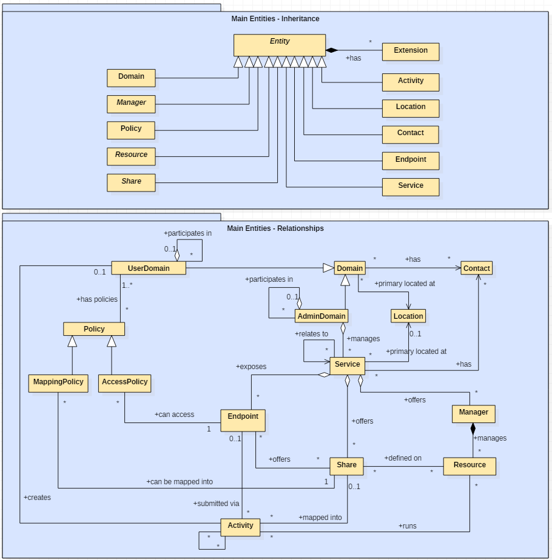

# Conceptual Model of the Main Entities

This section introduces the main entities of the GLUE information model. They capture the core concepts relevant in a Grid environment. The main entities SHOULD be used to derive specialized information models. In Figure 1, the classes and the related relationships are presented in the form of a UML Class Diagram.

**Figure 1 Entities and relationships for the Main Entities conceptual model**

## 6.1. Entity

The Entity class is the root entity from which all the GLUE classes inherit \(an exception is made for the Extension class\). The specialized classes will inherit both the associations and the attributes of Extension class. The attributes CreationTime and Validity are metadata related to the generation and life of the information. The Name attribute allows a human-readable name to be provided for any object, usable for e.g. monitoring or diagnostic displays. The Name SHOULD NOT have any semantic interpretation.

<table>
  <thead>
    <tr>
      <th style="text-align:left">Entity</th>
      <th style="text-align:left">Inherits from</th>
      <th style="text-align:left">Description</th>
      <th style="text-align:left"></th>
      <th style="text-align:left"></th>
    </tr>
  </thead>
  <tbody>
    <tr>
      <td style="text-align:left">
        
Entity

        
&lt;&lt;abstract&gt;&gt;

      </td>
      <td style="text-align:left"></td>
      <td style="text-align:left">Abstract root concept from which all the other concepts are derived (except
        the Extension class); it has metadata about information creation and validity
        plus a key-value pair extension mechanism.</td>
      <td style="text-align:left"></td>
      <td style="text-align:left"></td>
    </tr>
    <tr>
      <td style="text-align:left">Attribute</td>
      <td style="text-align:left">Type</td>
      <td style="text-align:left">Mult.</td>
      <td style="text-align:left">Unit</td>
      <td style="text-align:left">Description</td>
    </tr>
    <tr>
      <td style="text-align:left">CreationTime</td>
      <td style="text-align:left">DateTime_t</td>
      <td style="text-align:left">0..1</td>
      <td style="text-align:left"></td>
      <td style="text-align:left">Timestamp describing when the entity instance was generated.</td>
    </tr>
    <tr>
      <td style="text-align:left">Validity</td>
      <td style="text-align:left">UInt64</td>
      <td style="text-align:left">0..1</td>
      <td style="text-align:left">s</td>
      <td style="text-align:left">
        
The duration after CreationTime that the information presented in the
          Entity SHOULD be considered relevant. After that period has elapsed,

        
the information SHOULD NOT be considered relevant.

      </td>
    </tr>
    <tr>
      <td style="text-align:left">ID [key]</td>
      <td style="text-align:left">URI</td>
      <td style="text-align:left">1</td>
      <td style="text-align:left"></td>
      <td style="text-align:left">A globally unique ID.</td>
    </tr>
    <tr>
      <td style="text-align:left">Name</td>
      <td style="text-align:left">String</td>
      <td style="text-align:left">0..1</td>
      <td style="text-align:left"></td>
      <td style="text-align:left">A human-readable name.</td>
    </tr>
    <tr>
      <td style="text-align:left">OtherInfo</td>
      <td style="text-align:left">String</td>
      <td style="text-align:left">*</td>
      <td style="text-align:left"></td>
      <td style="text-align:left">Placeholder to publish information that does not fit in any other attribute.
        Free-form string, comma-separated tags, (name, value) pairs are all examples
        of valid syntax.</td>
    </tr>
    <tr>
      <td style="text-align:left">Association End</td>
      <td style="text-align:left">Mult.</td>
      <td style="text-align:left">Description</td>
      <td style="text-align:left"></td>
      <td style="text-align:left"></td>
    </tr>
    <tr>
      <td style="text-align:left">Extension.Key</td>
      <td style="text-align:left">*</td>
      <td style="text-align:left">The entity MAY be associated to zero or more key-value pairs.</td>
      <td
      style="text-align:left"></td>
        <td style="text-align:left"></td>
    </tr>
  </tbody>
</table>## Extension

The Extension class provides a general mechanism to add key/value pairs to GLUE classes when suitable specific attributes are not present. The creation time and validity of each Extension instance are those of the extended class instance.

| Entity | Inherits from | Description |  |  |
| :--- | :--- | :--- | :--- | :--- |
| Extension |  | A key/value pair enabling the association of extra information not captured by the model with an Entity instance. |  |  |
| Attribute | Type | Mult. | Unit | Description |
| LocalID | LocalID\_t | 1 |  | An identifier unique within the class instance to which it is associated |
| Key | String | 1 |  | An identifier local to the container class instance; typically an attribute name not present in the model. This identifier is not required to be unique; several instances of this class MAY hold the same value for this attribute. |
| Value | String | 1 |  | A value for the attribute named by the Key. |
| Association End | Mult. | Description |  |  |
| Entity | 1 | The key/value pair is associated to an Entity instance. |  |  |

## Location

The Location class is introduced to model geographical locations where a certain Domain or Service are placed. The aim is to provide a simple way to express geographical information, and it is not intended to be used in complex geographical information systems. Due to different requirements, the granularity is not strictly defined and is left to the information producers depending on their needs. Hence the extent of a geographical location can vary from an exact position to a region spanning several different countries, not necessarily adjacent. The accuracy of the latitude and longitude attributes should be defined in an interoperability profile defined by projects adopting this specification.

<table>
  <thead>
    <tr>
      <th style="text-align:left">Entity</th>
      <th style="text-align:left">Inherits from</th>
      <th style="text-align:left">Description</th>
      <th style="text-align:left"></th>
      <th style="text-align:left"></th>
    </tr>
  </thead>
  <tbody>
    <tr>
      <td style="text-align:left">Location</td>
      <td style="text-align:left">Entity</td>
      <td style="text-align:left">A geographical region where the granularity MAY vary from an exact position
        to a region spanning several different countries, not necessarily adjacent.</td>
      <td
      style="text-align:left"></td>
        <td style="text-align:left"></td>
    </tr>
    <tr>
      <td style="text-align:left">Inherited Attribute</td>
      <td style="text-align:left">Type</td>
      <td style="text-align:left">Mult.</td>
      <td style="text-align:left">Unit</td>
      <td style="text-align:left">Description</td>
    </tr>
    <tr>
      <td style="text-align:left"><em>CreationTime</em>
      </td>
      <td style="text-align:left"><em>DateTime_t</em>
      </td>
      <td style="text-align:left"><em>0..1</em>
      </td>
      <td style="text-align:left"></td>
      <td style="text-align:left"><em>Timestamp describing when the entity instance was generated</em>
      </td>
    </tr>
    <tr>
      <td style="text-align:left"><em>Validity</em>
      </td>
      <td style="text-align:left"><em>UInt64</em>
      </td>
      <td style="text-align:left"><em>0..1</em>
      </td>
      <td style="text-align:left"><em>s</em>
      </td>
      <td style="text-align:left">
        
<em>The duration after CreationTime that the information presented in the Entity SHOULD be considered relevant. After that period has elapsed,</em>
        

        
<em>the information SHOULD NOT be considered relevant</em>
        

      </td>
    </tr>
    <tr>
      <td style="text-align:left"><em>ID [key]</em>
      </td>
      <td style="text-align:left"><em>URI</em>
      </td>
      <td style="text-align:left"><em>1</em>
      </td>
      <td style="text-align:left"></td>
      <td style="text-align:left"><em>A global unique ID</em>
      </td>
    </tr>
    <tr>
      <td style="text-align:left"><em>Name</em>
      </td>
      <td style="text-align:left"><em>String</em>
      </td>
      <td style="text-align:left"><em>0..1</em>
      </td>
      <td style="text-align:left"></td>
      <td style="text-align:left"><em>Human-readable name</em>
      </td>
    </tr>
    <tr>
      <td style="text-align:left"><em>OtherInfo</em>
      </td>
      <td style="text-align:left"><em>String</em>
      </td>
      <td style="text-align:left"><em>*</em>
      </td>
      <td style="text-align:left"></td>
      <td style="text-align:left"><em>Placeholder to publish info that does not fit in any other attribute. Free-form string, comma-separated tags, (name, value ) pair are all examples of valid syntax</em>
      </td>
    </tr>
    <tr>
      <td style="text-align:left">Attribute</td>
      <td style="text-align:left">Type</td>
      <td style="text-align:left">Mult.</td>
      <td style="text-align:left">Unit</td>
      <td style="text-align:left">Description</td>
    </tr>
    <tr>
      <td style="text-align:left">Address</td>
      <td style="text-align:left">String</td>
      <td style="text-align:left">0..1</td>
      <td style="text-align:left"></td>
      <td style="text-align:left">Street address (free format).</td>
    </tr>
    <tr>
      <td style="text-align:left">Place</td>
      <td style="text-align:left">String</td>
      <td style="text-align:left">0..1</td>
      <td style="text-align:left"></td>
      <td style="text-align:left">Name of town/city.</td>
    </tr>
    <tr>
      <td style="text-align:left">Country</td>
      <td style="text-align:left">String</td>
      <td style="text-align:left">0..1</td>
      <td style="text-align:left"></td>
      <td style="text-align:left">Name of country.</td>
    </tr>
    <tr>
      <td style="text-align:left">PostCode</td>
      <td style="text-align:left">String</td>
      <td style="text-align:left">0..1</td>
      <td style="text-align:left"></td>
      <td style="text-align:left">Postal code.</td>
    </tr>
    <tr>
      <td style="text-align:left">Latitude</td>
      <td style="text-align:left">Real32</td>
      <td style="text-align:left">0..1</td>
      <td style="text-align:left">degree</td>
      <td style="text-align:left">The position of a place north or south of the equator measured from -90&#xB0;
        to +90&#xB0; with positive values going north and negative values going
        south.</td>
    </tr>
    <tr>
      <td style="text-align:left">Longitude</td>
      <td style="text-align:left">Real32</td>
      <td style="text-align:left">0..1</td>
      <td style="text-align:left">degree</td>
      <td style="text-align:left">The position of a place east or west of the primary meridian (located
        in Greenwich, UK) measured from -180&#xB0; to +180&#xB0; with positive
        values going east and negative values going west (the value -180&#xB0;
        is excluded from the range).</td>
    </tr>
    <tr>
      <td style="text-align:left">Association End</td>
      <td style="text-align:left">Mult.</td>
      <td style="text-align:left">Description</td>
      <td style="text-align:left"></td>
      <td style="text-align:left"></td>
    </tr>
    <tr>
      <td style="text-align:left">Service.ID</td>
      <td style="text-align:left">*</td>
      <td style="text-align:left">The location is related to zero or more services.</td>
      <td style="text-align:left"></td>
      <td style="text-align:left"></td>
    </tr>
    <tr>
      <td style="text-align:left">Domain.ID &lt;&lt;abstract&gt;&gt;</td>
      <td style="text-align:left">*</td>
      <td style="text-align:left">The location is related to zero or more domains.</td>
      <td style="text-align:left"></td>
      <td style="text-align:left"></td>
    </tr>
    <tr>
      <td style="text-align:left">Inherited Association End</td>
      <td style="text-align:left">Mult.</td>
      <td style="text-align:left">Description</td>
      <td style="text-align:left"></td>
      <td style="text-align:left"></td>
    </tr>
    <tr>
      <td style="text-align:left">Extension.Key</td>
      <td style="text-align:left">*</td>
      <td style="text-align:left">The entity MAY be associated to zero or more key-value pairs.</td>
      <td
      style="text-align:left"></td>
        <td style="text-align:left"></td>
    </tr>
    <tr>
      <td style="text-align:left">ComputingService.ID</td>
      <td style="text-align:left">*</td>
      <td style="text-align:left">The location is related to zero or more computing services.</td>
      <td style="text-align:left"></td>
      <td style="text-align:left"></td>
    </tr>
    <tr>
      <td style="text-align:left">CloudComputingService.ID</td>
      <td style="text-align:left">*</td>
      <td style="text-align:left">The location is related to zero or more cloud computing services</td>
      <td
      style="text-align:left"></td>
        <td style="text-align:left"></td>
    </tr>
    <tr>
      <td style="text-align:left">StorageService.ID</td>
      <td style="text-align:left">*</td>
      <td style="text-align:left">The location is related to zero or more storage services.</td>
      <td style="text-align:left"></td>
      <td style="text-align:left"></td>
    </tr>
    <tr>
      <td style="text-align:left">AdminDomain.ID</td>
      <td style="text-align:left">*</td>
      <td style="text-align:left">The location is related to zero or more admin domains.</td>
      <td style="text-align:left"></td>
      <td style="text-align:left"></td>
    </tr>
    <tr>
      <td style="text-align:left">UserDomain.ID</td>
      <td style="text-align:left">*</td>
      <td style="text-align:left">The location is related to zero or more user domains.</td>
      <td style="text-align:left"></td>
      <td style="text-align:left"></td>
    </tr>
  </tbody>
</table>## Contact

The Contact class is introduced to represent contact information for different groups or expert roles responsible for aspects of the operation of services and domains \(e.g., user support, security or sysadmin\). The various types of contact are identified by the Type attribute. In case of time-dependent contact information \(e.g., due to work on shifts\), the instances of this entity should represent only the currently active contact information.

The contact information SHOULD be encoded as a URI. There are several specifications recommending how to embed contacts into a URI. The following specifications SHOULD be used:

* telephone and fax: http://www.ietf.org/rfc/rfc2806.txt
* email: http://www.ietf.org/rfc/rfc2368.txt
* irc: http://www.w3.org/Addressing/draft-mirashi-url-irc-01.txt

<table>
  <thead>
    <tr>
      <th style="text-align:left">Entity</th>
      <th style="text-align:left">Inherits from</th>
      <th style="text-align:left">Description</th>
      <th style="text-align:left"></th>
      <th style="text-align:left"></th>
    </tr>
  </thead>
  <tbody>
    <tr>
      <td style="text-align:left">Contact</td>
      <td style="text-align:left">Entity</td>
      <td style="text-align:left">Information enabling the establishment of communication with a person
        or group of persons related to a Domain.</td>
      <td style="text-align:left"></td>
      <td style="text-align:left"></td>
    </tr>
    <tr>
      <td style="text-align:left">Inherited Attribute</td>
      <td style="text-align:left">Type</td>
      <td style="text-align:left">Mult.</td>
      <td style="text-align:left">Unit</td>
      <td style="text-align:left">Description</td>
    </tr>
    <tr>
      <td style="text-align:left"><em>CreationTime</em>
      </td>
      <td style="text-align:left"><em>DateTime_t</em>
      </td>
      <td style="text-align:left"><em>0..1</em>
      </td>
      <td style="text-align:left"></td>
      <td style="text-align:left"><em>Timestamp describing when the entity instance was generated</em>
      </td>
    </tr>
    <tr>
      <td style="text-align:left"><em>Validity</em>
      </td>
      <td style="text-align:left"><em>UInt64</em>
      </td>
      <td style="text-align:left"><em>0..1</em>
      </td>
      <td style="text-align:left"><em>s</em>
      </td>
      <td style="text-align:left">
        
<em>The duration after CreationTime that the information presented in the Entity SHOULD be considered relevant. After that period has elapsed,</em>
        

        
<em>the information SHOULD NOT be considered relevant</em>
        

      </td>
    </tr>
    <tr>
      <td style="text-align:left"><em>ID [key]</em>
      </td>
      <td style="text-align:left"><em>URI</em>
      </td>
      <td style="text-align:left"><em>1</em>
      </td>
      <td style="text-align:left"></td>
      <td style="text-align:left"><em>A global unique ID</em>
      </td>
    </tr>
    <tr>
      <td style="text-align:left"><em>Name</em>
      </td>
      <td style="text-align:left"><em>String</em>
      </td>
      <td style="text-align:left"><em>0..1</em>
      </td>
      <td style="text-align:left"></td>
      <td style="text-align:left"><em>Human-readable name</em>
      </td>
    </tr>
    <tr>
      <td style="text-align:left"><em>OtherInfo</em>
      </td>
      <td style="text-align:left"><em>String</em>
      </td>
      <td style="text-align:left"><em>*</em>
      </td>
      <td style="text-align:left"></td>
      <td style="text-align:left"><em>Placeholder to publish info that does not fit in any other attribute. Free-form string, comma-separated tags, (name, value ) pair are all examples of valid syntax</em>
      </td>
    </tr>
    <tr>
      <td style="text-align:left">Attribute</td>
      <td style="text-align:left">Type</td>
      <td style="text-align:left">Mult.</td>
      <td style="text-align:left">Unit</td>
      <td style="text-align:left">Description</td>
    </tr>
    <tr>
      <td style="text-align:left">Detail</td>
      <td style="text-align:left">URI</td>
      <td style="text-align:left">1</td>
      <td style="text-align:left"></td>
      <td style="text-align:left">URI embedding the contact information. The syntax of the URI depends on
        the nature of the communication channel.</td>
    </tr>
    <tr>
      <td style="text-align:left">Type</td>
      <td style="text-align:left">ContactType_t</td>
      <td style="text-align:left">1</td>
      <td style="text-align:left"></td>
      <td style="text-align:left">Type of contact.</td>
    </tr>
    <tr>
      <td style="text-align:left">Association End</td>
      <td style="text-align:left">Mult.</td>
      <td style="text-align:left">Description</td>
      <td style="text-align:left"></td>
      <td style="text-align:left"></td>
    </tr>
    <tr>
      <td style="text-align:left">Service.ID</td>
      <td style="text-align:left">*</td>
      <td style="text-align:left">The contact is related to zero or more services</td>
      <td style="text-align:left"></td>
      <td style="text-align:left"></td>
    </tr>
    <tr>
      <td style="text-align:left">Domain.ID &lt;&lt;abstract&gt;&gt;</td>
      <td style="text-align:left">*</td>
      <td style="text-align:left">The contact is related to zero or more domains</td>
      <td style="text-align:left"></td>
      <td style="text-align:left"></td>
    </tr>
    <tr>
      <td style="text-align:left">Inherited Association End</td>
      <td style="text-align:left">Mult.</td>
      <td style="text-align:left">Description</td>
      <td style="text-align:left"></td>
      <td style="text-align:left"></td>
    </tr>
    <tr>
      <td style="text-align:left">Extension.Key</td>
      <td style="text-align:left">*</td>
      <td style="text-align:left">The entity MAY be associated to zero or more key-value pairs</td>
      <td style="text-align:left"></td>
      <td style="text-align:left"></td>
    </tr>
    <tr>
      <td style="text-align:left">ComputingService.ID</td>
      <td style="text-align:left">*</td>
      <td style="text-align:left">The contact is related to zero or more computing services</td>
      <td style="text-align:left"></td>
      <td style="text-align:left"></td>
    </tr>
    <tr>
      <td style="text-align:left">CloudComputingService.ID</td>
      <td style="text-align:left">*</td>
      <td style="text-align:left">The contact is related to zero or more cloud computing services</td>
      <td
      style="text-align:left"></td>
        <td style="text-align:left"></td>
    </tr>
    <tr>
      <td style="text-align:left">StorageService.ID</td>
      <td style="text-align:left">*</td>
      <td style="text-align:left">The contact is related to zero or more storage services</td>
      <td style="text-align:left"></td>
      <td style="text-align:left"></td>
    </tr>
    <tr>
      <td style="text-align:left">AdminDomain.ID</td>
      <td style="text-align:left">*</td>
      <td style="text-align:left">The contact is related to zero or more admin domains</td>
      <td style="text-align:left"></td>
      <td style="text-align:left"></td>
    </tr>
    <tr>
      <td style="text-align:left">UserDomain.ID</td>
      <td style="text-align:left">*</td>
      <td style="text-align:left">The contact is related to zero or more user domains</td>
      <td style="text-align:left"></td>
      <td style="text-align:left"></td>
    </tr>
  </tbody>
</table>## Domain

The Domain class is introduced to model and identify groups of actors that MAY play roles in a Grid system. It is an abstract entity that MUST NOT be instantiated; it SHOULD be used in order to derive specialized entities.

<table>
  <thead>
    <tr>
      <th style="text-align:left">Entity</th>
      <th style="text-align:left">Inherits from</th>
      <th style="text-align:left">Description</th>
      <th style="text-align:left"></th>
      <th style="text-align:left"></th>
    </tr>
  </thead>
  <tbody>
    <tr>
      <td style="text-align:left">
        
Domain

        
&lt;&lt;abstract&gt;&gt;

      </td>
      <td style="text-align:left">Entity</td>
      <td style="text-align:left">A collection of actors that MAY be assigned with roles and privileges
        associated with Entities via Policies. A Domain MAY have relationships
        to other domains.</td>
      <td style="text-align:left"></td>
      <td style="text-align:left"></td>
    </tr>
    <tr>
      <td style="text-align:left">Inherited Attribute</td>
      <td style="text-align:left">Type</td>
      <td style="text-align:left">Mult.</td>
      <td style="text-align:left">Unit</td>
      <td style="text-align:left">Description</td>
    </tr>
    <tr>
      <td style="text-align:left"><em>CreationTime</em>
      </td>
      <td style="text-align:left"><em>DateTime_t</em>
      </td>
      <td style="text-align:left"><em>0..1</em>
      </td>
      <td style="text-align:left"></td>
      <td style="text-align:left"><em>Timestamp describing when the entity instance was generated</em>
      </td>
    </tr>
    <tr>
      <td style="text-align:left"><em>Validity</em>
      </td>
      <td style="text-align:left"><em>UInt64</em>
      </td>
      <td style="text-align:left"><em>0..1</em>
      </td>
      <td style="text-align:left"><em>s</em>
      </td>
      <td style="text-align:left">
        
<em>The duration after CreationTime that the information presented in the Entity SHOULD be considered relevant. After that period has elapsed,</em>
        

        
<em>the information SHOULD NOT be considered relevant</em>
        

      </td>
    </tr>
    <tr>
      <td style="text-align:left"><em>ID [key]</em>
      </td>
      <td style="text-align:left"><em>URI</em>
      </td>
      <td style="text-align:left"><em>1</em>
      </td>
      <td style="text-align:left"></td>
      <td style="text-align:left"><em>A global unique ID</em>
      </td>
    </tr>
    <tr>
      <td style="text-align:left"><em>Name</em>
      </td>
      <td style="text-align:left"><em>String</em>
      </td>
      <td style="text-align:left"><em>0..1</em>
      </td>
      <td style="text-align:left"></td>
      <td style="text-align:left"><em>Human-readable name</em>
      </td>
    </tr>
    <tr>
      <td style="text-align:left"><em>OtherInfo</em>
      </td>
      <td style="text-align:left"><em>String</em>
      </td>
      <td style="text-align:left"><em>*</em>
      </td>
      <td style="text-align:left"></td>
      <td style="text-align:left"><em>Placeholder to publish info that does not fit in any other attribute. Free-form string, comma-separated tags, (name, value ) pair are all examples of valid syntax</em>
      </td>
    </tr>
    <tr>
      <td style="text-align:left">Attribute</td>
      <td style="text-align:left">Type</td>
      <td style="text-align:left">Mult.</td>
      <td style="text-align:left">Unit</td>
      <td style="text-align:left">Description</td>
    </tr>
    <tr>
      <td style="text-align:left">Description</td>
      <td style="text-align:left">String</td>
      <td style="text-align:left">0..1</td>
      <td style="text-align:left"></td>
      <td style="text-align:left">A description of the domain (free format).</td>
    </tr>
    <tr>
      <td style="text-align:left">WWW</td>
      <td style="text-align:left">URL</td>
      <td style="text-align:left">*</td>
      <td style="text-align:left"></td>
      <td style="text-align:left">A URL identifying a web page with more information about the domain.</td>
    </tr>
    <tr>
      <td style="text-align:left">Association End</td>
      <td style="text-align:left">Mult.</td>
      <td style="text-align:left">Description</td>
      <td style="text-align:left"></td>
      <td style="text-align:left"></td>
    </tr>
    <tr>
      <td style="text-align:left">Contact.ID</td>
      <td style="text-align:left">*</td>
      <td style="text-align:left">A domain MAY be contacted via zero or more contacts.</td>
      <td style="text-align:left"></td>
      <td style="text-align:left"></td>
    </tr>
    <tr>
      <td style="text-align:left">Location.ID</td>
      <td style="text-align:left">0..1</td>
      <td style="text-align:left">A domain is primarily located at one location.</td>
      <td style="text-align:left"></td>
      <td style="text-align:left"></td>
    </tr>
    <tr>
      <td style="text-align:left">Association End</td>
      <td style="text-align:left">Mult.</td>
      <td style="text-align:left">Description</td>
      <td style="text-align:left"></td>
      <td style="text-align:left"></td>
    </tr>
    <tr>
      <td style="text-align:left">Extension.Key</td>
      <td style="text-align:left">*</td>
      <td style="text-align:left">The entity MAY be associated to zero or more key-value pairs.</td>
      <td
      style="text-align:left"></td>
        <td style="text-align:left"></td>
    </tr>
  </tbody>
</table>### AdminDomain

The AdminDomain class is introduced to model a collection of actors that manage a number of services. An AdminDomain MAY be associated to both Contact and Location class instances in order to provide contact information and geographical location respectively. An AdminDomain MAY be composed by other AdminDomains in a hierarchical structure. This structure MAY represent a “participates in” association.

<table>
  <thead>
    <tr>
      <th style="text-align:left">Entity</th>
      <th style="text-align:left">Inherits from</th>
      <th style="text-align:left">Description</th>
      <th style="text-align:left"></th>
      <th style="text-align:left"></th>
    </tr>
  </thead>
  <tbody>
    <tr>
      <td style="text-align:left">AdminDomain</td>
      <td style="text-align:left">Domain</td>
      <td style="text-align:left">A collection of actors that MAY be assigned administrative roles and privileges
        over services via policies. An AdminDomain manages services that MAY be
        geographically distributed, but nevertheless a primary location should
        be identified.</td>
      <td style="text-align:left"></td>
      <td style="text-align:left"></td>
    </tr>
    <tr>
      <td style="text-align:left">Inherited Attribute</td>
      <td style="text-align:left">Type</td>
      <td style="text-align:left">Mult.</td>
      <td style="text-align:left">Unit</td>
      <td style="text-align:left">Description</td>
    </tr>
    <tr>
      <td style="text-align:left"><em>CreationTime</em>
      </td>
      <td style="text-align:left"><em>DateTime_t</em>
      </td>
      <td style="text-align:left"><em>0..1</em>
      </td>
      <td style="text-align:left"></td>
      <td style="text-align:left"><em>Timestamp describing when the entity instance was generated</em>
      </td>
    </tr>
    <tr>
      <td style="text-align:left"><em>Validity</em>
      </td>
      <td style="text-align:left"><em>UInt64</em>
      </td>
      <td style="text-align:left"><em>0..1</em>
      </td>
      <td style="text-align:left"><em>s</em>
      </td>
      <td style="text-align:left">
        
<em>The duration after CreationTime that the information presented in the Entity SHOULD be considered relevant. After that period has elapsed,</em>
        

        
<em>the information SHOULD NOT be considered relevant</em>
        

      </td>
    </tr>
    <tr>
      <td style="text-align:left"><em>ID [key]</em>
      </td>
      <td style="text-align:left"><em>URI</em>
      </td>
      <td style="text-align:left"><em>1</em>
      </td>
      <td style="text-align:left"></td>
      <td style="text-align:left"><em>A global unique ID</em>
      </td>
    </tr>
    <tr>
      <td style="text-align:left"><em>Name</em>
      </td>
      <td style="text-align:left"><em>String</em>
      </td>
      <td style="text-align:left"><em>0..1</em>
      </td>
      <td style="text-align:left"></td>
      <td style="text-align:left"><em>Human-readable name</em>
      </td>
    </tr>
    <tr>
      <td style="text-align:left"><em>OtherInfo</em>
      </td>
      <td style="text-align:left"><em>String</em>
      </td>
      <td style="text-align:left"><em>*</em>
      </td>
      <td style="text-align:left"></td>
      <td style="text-align:left"><em>Placeholder to publish info that does not fit in any other attribute. Free-form string, comma-separated tags, (name, value ) pair are all examples of valid syntax</em>
      </td>
    </tr>
    <tr>
      <td style="text-align:left"><em>Description</em>
      </td>
      <td style="text-align:left"><em>String</em>
      </td>
      <td style="text-align:left"><em>0..1</em>
      </td>
      <td style="text-align:left"></td>
      <td style="text-align:left"><em>A description of the domain</em>
      </td>
    </tr>
    <tr>
      <td style="text-align:left"><em>WWW</em>
      </td>
      <td style="text-align:left"><em>URI</em>
      </td>
      <td style="text-align:left"><em>*</em>
      </td>
      <td style="text-align:left"></td>
      <td style="text-align:left"><em>The URL identifying a web page with more information about the domain</em>
      </td>
    </tr>
    <tr>
      <td style="text-align:left">Attribute</td>
      <td style="text-align:left">Type</td>
      <td style="text-align:left">Mult.</td>
      <td style="text-align:left">Unit</td>
      <td style="text-align:left">Description</td>
    </tr>
    <tr>
      <td style="text-align:left">Distributed</td>
      <td style="text-align:left">ExtendedBoolean_t</td>
      <td style="text-align:left">0..1</td>
      <td style="text-align:left"></td>
      <td style="text-align:left">True if the services managed by the AdminDomain are considered geographically
        distributed by the administrators themselves.</td>
    </tr>
    <tr>
      <td style="text-align:left">Owner</td>
      <td style="text-align:left">String</td>
      <td style="text-align:left">*</td>
      <td style="text-align:left"></td>
      <td style="text-align:left">Identification of a person or legal entity which pays for the services
        and resources (no particular format is defined).</td>
    </tr>
    <tr>
      <td style="text-align:left">Association End</td>
      <td style="text-align:left">Mult.</td>
      <td style="text-align:left">Description</td>
      <td style="text-align:left"></td>
      <td style="text-align:left"></td>
    </tr>
    <tr>
      <td style="text-align:left">Service.ID</td>
      <td style="text-align:left">*</td>
      <td style="text-align:left">An AdminDomain manages zero or more Services.</td>
      <td style="text-align:left"></td>
      <td style="text-align:left"></td>
    </tr>
    <tr>
      <td style="text-align:left">AdminDomain.ID</td>
      <td style="text-align:left">*</td>
      <td style="text-align:left">An AdminDomain aggregates zero or more AdminDomains.</td>
      <td style="text-align:left"></td>
      <td style="text-align:left"></td>
    </tr>
    <tr>
      <td style="text-align:left">AdminDomain.ID</td>
      <td style="text-align:left">0..1</td>
      <td style="text-align:left">An AdminDomain participates in another AdminDomain.</td>
      <td style="text-align:left"></td>
      <td style="text-align:left"></td>
    </tr>
    <tr>
      <td style="text-align:left">Inherited Association End</td>
      <td style="text-align:left">Mult.</td>
      <td style="text-align:left">Description</td>
      <td style="text-align:left"></td>
      <td style="text-align:left"></td>
    </tr>
    <tr>
      <td style="text-align:left">Extension.Key</td>
      <td style="text-align:left">*</td>
      <td style="text-align:left">The entity MAY be extended via key-value pairs.</td>
      <td style="text-align:left"></td>
      <td style="text-align:left"></td>
    </tr>
    <tr>
      <td style="text-align:left">ComputingService.ID</td>
      <td style="text-align:left">*</td>
      <td style="text-align:left">An AdminDomain manages zero or more Computing Services.</td>
      <td style="text-align:left"></td>
      <td style="text-align:left"></td>
    </tr>
    <tr>
      <td style="text-align:left">CloudComputingService.ID</td>
      <td style="text-align:left">*</td>
      <td style="text-align:left">An AdminDomain manages zero or more Cloud Computing Services</td>
      <td style="text-align:left"></td>
      <td style="text-align:left"></td>
    </tr>
    <tr>
      <td style="text-align:left">StorageService.ID</td>
      <td style="text-align:left">*</td>
      <td style="text-align:left">An AdminDomain manages zero or more Storage Services.</td>
      <td style="text-align:left"></td>
      <td style="text-align:left"></td>
    </tr>
    <tr>
      <td style="text-align:left">Contact.ID</td>
      <td style="text-align:left">*</td>
      <td style="text-align:left">A domain MAY be contacted via zero or more contacts.</td>
      <td style="text-align:left"></td>
      <td style="text-align:left"></td>
    </tr>
    <tr>
      <td style="text-align:left">Location.ID</td>
      <td style="text-align:left">0..1</td>
      <td style="text-align:left">A domain is primary located at one location.</td>
      <td style="text-align:left"></td>
      <td style="text-align:left"></td>
    </tr>
  </tbody>
</table>### UserDomain

The UserDomain class SHOULD be used to capture the concept of a Virtual Organization \(VO\). By VO, we mean a set of individuals and/or institutions having direct access to computers, software, data, and other resources for collaborative problem-solving or other purposes. Resources utilized by a VO are expected to be accessible via network endpoints and constrained by defined utilization targets called shares. The VO MAY exhibit its internal structure in terms of groups of individuals, each of them constituting a UserDomain. UserDomains MAY be hierarchically structured. The “participates in” association MAY represent this structure.

<table>
  <thead>
    <tr>
      <th style="text-align:left">Entity</th>
      <th style="text-align:left">Inherits from</th>
      <th style="text-align:left">Description</th>
      <th style="text-align:left"></th>
      <th style="text-align:left"></th>
    </tr>
  </thead>
  <tbody>
    <tr>
      <td style="text-align:left">UserDomain</td>
      <td style="text-align:left">Domain</td>
      <td style="text-align:left">A collection of actors that MAY be assigned with user roles and privileges
        to services or shares via policies.</td>
      <td style="text-align:left"></td>
      <td style="text-align:left"></td>
    </tr>
    <tr>
      <td style="text-align:left">Inherited Attribute</td>
      <td style="text-align:left">Type</td>
      <td style="text-align:left">Mult.</td>
      <td style="text-align:left">Unit</td>
      <td style="text-align:left">Description</td>
    </tr>
    <tr>
      <td style="text-align:left"><em>CreationTime</em>
      </td>
      <td style="text-align:left"><em>DateTime_t</em>
      </td>
      <td style="text-align:left"><em>0..1</em>
      </td>
      <td style="text-align:left"></td>
      <td style="text-align:left"><em>Timestamp describing when the entity instance was generated</em>
      </td>
    </tr>
    <tr>
      <td style="text-align:left"><em>Validity</em>
      </td>
      <td style="text-align:left"><em>UInt64</em>
      </td>
      <td style="text-align:left"><em>0..1</em>
      </td>
      <td style="text-align:left"><em>s</em>
      </td>
      <td style="text-align:left">
        
<em>The duration after CreationTime that the information presented in the Entity SHOULD be considered relevant. After that period has elapsed,</em>
        

        
<em>the information SHOULD NOT be considered relevant</em>
        

      </td>
    </tr>
    <tr>
      <td style="text-align:left"><em>ID [key]</em>
      </td>
      <td style="text-align:left"><em>URI</em>
      </td>
      <td style="text-align:left"><em>1</em>
      </td>
      <td style="text-align:left"></td>
      <td style="text-align:left"><em>A global unique ID</em>
      </td>
    </tr>
    <tr>
      <td style="text-align:left"><em>Name</em>
      </td>
      <td style="text-align:left"><em>String</em>
      </td>
      <td style="text-align:left"><em>0..1</em>
      </td>
      <td style="text-align:left"></td>
      <td style="text-align:left"><em>Human-readable name</em>
      </td>
    </tr>
    <tr>
      <td style="text-align:left"><em>OtherInfo</em>
      </td>
      <td style="text-align:left"><em>String</em>
      </td>
      <td style="text-align:left"><em>*</em>
      </td>
      <td style="text-align:left"></td>
      <td style="text-align:left"><em>Placeholder to publish info that does not fit in any other attribute. Free-form string, comma-separated tags, (name, value ) pair are all examples of valid syntax</em>
      </td>
    </tr>
    <tr>
      <td style="text-align:left"><em>Description</em>
      </td>
      <td style="text-align:left"><em>String</em>
      </td>
      <td style="text-align:left"><em>0..1</em>
      </td>
      <td style="text-align:left"></td>
      <td style="text-align:left"><em>A description of the domain</em>
      </td>
    </tr>
    <tr>
      <td style="text-align:left"><em>WWW</em>
      </td>
      <td style="text-align:left"><em>URI</em>
      </td>
      <td style="text-align:left"><em>*</em>
      </td>
      <td style="text-align:left"></td>
      <td style="text-align:left"><em>The URL identifying a web page with more information about the domain</em>
      </td>
    </tr>
    <tr>
      <td style="text-align:left">Attribute</td>
      <td style="text-align:left">Type</td>
      <td style="text-align:left">Mult.</td>
      <td style="text-align:left">Unit</td>
      <td style="text-align:left">Description</td>
    </tr>
    <tr>
      <td style="text-align:left">Level</td>
      <td style="text-align:left">UInt32</td>
      <td style="text-align:left">0..1</td>
      <td style="text-align:left"></td>
      <td style="text-align:left">The number of hops to reach the root for hierarchically organized domains
        described by the &#x201C;composed by&#x201D; association (0 is for the
        root).</td>
    </tr>
    <tr>
      <td style="text-align:left">UserManager</td>
      <td style="text-align:left">URI</td>
      <td style="text-align:left">*</td>
      <td style="text-align:left"></td>
      <td style="text-align:left">An Endpoint ID for the endpoint of a service managing the association
        of users with the domain, and related attributes such as groups or roles.</td>
    </tr>
    <tr>
      <td style="text-align:left">Member</td>
      <td style="text-align:left">String</td>
      <td style="text-align:left">*</td>
      <td style="text-align:left"></td>
      <td style="text-align:left">An identifier for a user in this user domain.</td>
    </tr>
    <tr>
      <td style="text-align:left">Association End</td>
      <td style="text-align:left">Mult.</td>
      <td style="text-align:left">Description</td>
      <td style="text-align:left"></td>
      <td style="text-align:left"></td>
    </tr>
    <tr>
      <td style="text-align:left">Policy.ID &lt;&lt;abstract&gt;&gt;</td>
      <td style="text-align:left">*</td>
      <td style="text-align:left">A User Domain has associated zero or more policies.</td>
      <td style="text-align:left"></td>
      <td style="text-align:left"></td>
    </tr>
    <tr>
      <td style="text-align:left">UserDomain.ID</td>
      <td style="text-align:left">*</td>
      <td style="text-align:left">A User Domain aggregates zero or more User Domains.</td>
      <td style="text-align:left"></td>
      <td style="text-align:left"></td>
    </tr>
    <tr>
      <td style="text-align:left">UserDomain.ID</td>
      <td style="text-align:left">0..1</td>
      <td style="text-align:left">A User Domain participates in another User Domain.</td>
      <td style="text-align:left"></td>
      <td style="text-align:left"></td>
    </tr>
    <tr>
      <td style="text-align:left">Inherited Association End</td>
      <td style="text-align:left">Mult.</td>
      <td style="text-align:left">Description</td>
      <td style="text-align:left"></td>
      <td style="text-align:left"></td>
    </tr>
    <tr>
      <td style="text-align:left">Extension.Key</td>
      <td style="text-align:left">*</td>
      <td style="text-align:left">The entity MAY be extended via key-value pairs.</td>
      <td style="text-align:left"></td>
      <td style="text-align:left"></td>
    </tr>
    <tr>
      <td style="text-align:left">Contact.ID</td>
      <td style="text-align:left">*</td>
      <td style="text-align:left">The domain MAY be contacted via zero or more contacts.</td>
      <td style="text-align:left"></td>
      <td style="text-align:left"></td>
    </tr>
    <tr>
      <td style="text-align:left">Location.ID</td>
      <td style="text-align:left">0..1</td>
      <td style="text-align:left">A domain is primary located at one location.</td>
      <td style="text-align:left"></td>
      <td style="text-align:left"></td>
    </tr>
    <tr>
      <td style="text-align:left">AccessPolicy.ID</td>
      <td style="text-align:left">*</td>
      <td style="text-align:left">A User Domain has associated zero or more access policies.</td>
      <td style="text-align:left"></td>
      <td style="text-align:left"></td>
    </tr>
    <tr>
      <td style="text-align:left">MappingPolicy.ID</td>
      <td style="text-align:left">*</td>
      <td style="text-align:left">A User Domain has associated zero or more mapping policies.</td>
      <td style="text-align:left"></td>
      <td style="text-align:left"></td>
    </tr>
  </tbody>
</table>As regards the UserManager attribute, it is RECOMMENDED that its value is an Endpoint ID enabling discovery of the related Service class instance and associated attributes. An example of a User Manager would be an endpoint for a VOMS \(Virtual Organization Membership Service, http://en.wikipedia.org/wiki/VOMS\) server.

## Service

One of the main goals of the GLUE information model is to enable the discovery of the Grid capabilities available in a certain infrastructure. Based on the use cases and modeling experience, a number of concepts were identified as general building blocks: Endpoint, Share, Manager, Resource. The Service class enables the unique identification of instances of these concepts participating in the provision of some unified capability. The Service class SHOULD be also used to characterize this overall capability.

<table>
  <thead>
    <tr>
      <th style="text-align:left">Entity</th>
      <th style="text-align:left">Inherits from</th>
      <th style="text-align:left">Description</th>
      <th style="text-align:left"></th>
      <th style="text-align:left"></th>
    </tr>
  </thead>
  <tbody>
    <tr>
      <td style="text-align:left">Service</td>
      <td style="text-align:left">Entity</td>
      <td style="text-align:left">An abstracted, logical view of actual software components that participate
        in the creation of an entity providing one or more functionalities useful
        in a Grid environment. A service exposes zero or more Endpoints having
        well-defined interfaces, zero or more Shares and zero or more Managers
        and the related Resources. The Service is autonomous and denotes a weak
        aggregation among Endpoints, the underlying Managers and the related Resources,
        and the defined Shares. The Service enables the identification of this
        whole set of entities providing the functionality with a persistent name.</td>
      <td
      style="text-align:left"></td>
        <td style="text-align:left"></td>
    </tr>
    <tr>
      <td style="text-align:left">Inherited Attribute</td>
      <td style="text-align:left">Type</td>
      <td style="text-align:left">Mult.</td>
      <td style="text-align:left">Unit</td>
      <td style="text-align:left">Description</td>
    </tr>
    <tr>
      <td style="text-align:left"><em>CreationTime</em>
      </td>
      <td style="text-align:left"><em>DateTime_t</em>
      </td>
      <td style="text-align:left"><em>0..1</em>
      </td>
      <td style="text-align:left"></td>
      <td style="text-align:left"><em>Timestamp describing when the entity instance was generated</em>
      </td>
    </tr>
    <tr>
      <td style="text-align:left"><em>Validity</em>
      </td>
      <td style="text-align:left"><em>UInt64</em>
      </td>
      <td style="text-align:left"><em>0..1</em>
      </td>
      <td style="text-align:left"><em>s</em>
      </td>
      <td style="text-align:left">
        
<em>The duration after CreationTime that the information presented in the Entity SHOULD be considered relevant. After that period has elapsed,</em>
        

        
<em>the information SHOULD NOT be considered relevant</em>
        

      </td>
    </tr>
    <tr>
      <td style="text-align:left"><em>ID [key]</em>
      </td>
      <td style="text-align:left"><em>URI</em>
      </td>
      <td style="text-align:left"><em>1</em>
      </td>
      <td style="text-align:left"></td>
      <td style="text-align:left"><em>A global unique ID</em>
      </td>
    </tr>
    <tr>
      <td style="text-align:left"><em>Name</em>
      </td>
      <td style="text-align:left"><em>String</em>
      </td>
      <td style="text-align:left"><em>0..1</em>
      </td>
      <td style="text-align:left"></td>
      <td style="text-align:left"><em>Human-readable name</em>
      </td>
    </tr>
    <tr>
      <td style="text-align:left"><em>OtherInfo</em>
      </td>
      <td style="text-align:left"><em>String</em>
      </td>
      <td style="text-align:left"><em>*</em>
      </td>
      <td style="text-align:left"></td>
      <td style="text-align:left"><em>Placeholder to publish info that does not fit in any other attribute. Free-form string, comma-separated tags, (name, value ) pair are all examples of valid syntax</em>
      </td>
    </tr>
    <tr>
      <td style="text-align:left">Attribute</td>
      <td style="text-align:left">Type</td>
      <td style="text-align:left">Mult.</td>
      <td style="text-align:left">Unit</td>
      <td style="text-align:left">Description</td>
    </tr>
    <tr>
      <td style="text-align:left">Capability</td>
      <td style="text-align:left">Capability_t</td>
      <td style="text-align:left">*</td>
      <td style="text-align:left"></td>
      <td style="text-align:left">The provided capabilities according to the Open Grid Service Architecture
        (OGSA) architecture [OGF-GFD80] (this is the union of all values assigned
        to the Capability attribute of the Endpoints which form part of this service).</td>
    </tr>
    <tr>
      <td style="text-align:left">Type</td>
      <td style="text-align:left">ServiceType_t</td>
      <td style="text-align:left">1</td>
      <td style="text-align:left"></td>
      <td style="text-align:left">The type of service according to a namespace-based classification (the
        namespace MAY be related to a middleware name, an organization or other
        concepts; org.ogf.glue.* is reserved for Types defined by the OGF GLUE
        Working Group).</td>
    </tr>
    <tr>
      <td style="text-align:left">QualityLevel</td>
      <td style="text-align:left">QualityLevel_t</td>
      <td style="text-align:left">1</td>
      <td style="text-align:left"></td>
      <td style="text-align:left">The maturity of the Service in terms of the quality of the underlying
        software components; the value corresponds to the highest QualityLevel
        among the available Endpoints.</td>
    </tr>
    <tr>
      <td style="text-align:left">StatusInfo</td>
      <td style="text-align:left">URL</td>
      <td style="text-align:left">*</td>
      <td style="text-align:left"></td>
      <td style="text-align:left">A URL specifying a web page providing additional information, for example
        monitoring of the underlying services.</td>
    </tr>
    <tr>
      <td style="text-align:left">Complexity</td>
      <td style="text-align:left">String</td>
      <td style="text-align:left">0..1</td>
      <td style="text-align:left"></td>
      <td style="text-align:left">A human-readable summary description of the complexity in terms of the
        number of endpoint types, shares and resources. The syntax should be: endpointType=X,
        share=Y, resource=Z.</td>
    </tr>
    <tr>
      <td style="text-align:left">Association End</td>
      <td style="text-align:left">Mult.</td>
      <td style="text-align:left">Description</td>
      <td style="text-align:left"></td>
      <td style="text-align:left"></td>
    </tr>
    <tr>
      <td style="text-align:left">Endpoint.ID</td>
      <td style="text-align:left">*</td>
      <td style="text-align:left">A service exposes zero or more endpoints.</td>
      <td style="text-align:left"></td>
      <td style="text-align:left"></td>
    </tr>
    <tr>
      <td style="text-align:left">Share.ID &lt;&lt;abstract&gt;&gt;</td>
      <td style="text-align:left">*</td>
      <td style="text-align:left">A service offers zero or more shares.</td>
      <td style="text-align:left"></td>
      <td style="text-align:left"></td>
    </tr>
    <tr>
      <td style="text-align:left">Manager.ID &lt;&lt;abstract&gt;&gt;</td>
      <td style="text-align:left">*</td>
      <td style="text-align:left">A service offers zero or more managers.</td>
      <td style="text-align:left"></td>
      <td style="text-align:left"></td>
    </tr>
    <tr>
      <td style="text-align:left">Contact.ID</td>
      <td style="text-align:left">*</td>
      <td style="text-align:left">A service has zero or more contacts.</td>
      <td style="text-align:left"></td>
      <td style="text-align:left"></td>
    </tr>
    <tr>
      <td style="text-align:left">Location.ID</td>
      <td style="text-align:left">0..1</td>
      <td style="text-align:left">A service is primary located at a location.</td>
      <td style="text-align:left"></td>
      <td style="text-align:left"></td>
    </tr>
    <tr>
      <td style="text-align:left">Service.ID</td>
      <td style="text-align:left">*</td>
      <td style="text-align:left">A service is related to zero or more services.</td>
      <td style="text-align:left"></td>
      <td style="text-align:left"></td>
    </tr>
    <tr>
      <td style="text-align:left"></td>
      <td style="text-align:left"></td>
      <td style="text-align:left"></td>
      <td style="text-align:left"></td>
      <td style="text-align:left"></td>
    </tr>
    <tr>
      <td style="text-align:left">Inherited Association End</td>
      <td style="text-align:left">Mult.</td>
      <td style="text-align:left">Description</td>
      <td style="text-align:left"></td>
      <td style="text-align:left"></td>
    </tr>
    <tr>
      <td style="text-align:left">Extension.Key</td>
      <td style="text-align:left">*</td>
      <td style="text-align:left">The entity MAY be extended via key-value pairs.</td>
      <td style="text-align:left"></td>
      <td style="text-align:left"></td>
    </tr>
  </tbody>
</table>A simple Service aggregates an Endpoint, no Share, no Manager and no Resource \(e.g., a metadata catalogue service\). In the context of a Service class, the same Resource MAY be exposed via multiple Endpoints based on the defined Shares. For instance, in the area of storage systems, two Endpoints implementing SRMv1 \[SRMV1\] and SRMv2.2 \[SRMV2\] interfaces respectively MAY expose the same Resource via different Endpoints offering different interface versions; in the area of computing systems, the CREAM \[cream\] and GRAM \[GRAM\] Endpoints MAY expose the Resources locally managed by the same Manager \(typically a batch system\). Endpoints, Shares, Managers and Resources MUST belong to precisely one Service.

## Endpoint

The Endpoint class models a network location that can be contacted to access certain functionalities based on a well-defined interface. The defined attributes refer to aspects such as the network location, the exposed interface name and version, the details of the implementation, the functional state and the scheduled downtime.

<table>
  <thead>
    <tr>
      <th style="text-align:left">Entity</th>
      <th style="text-align:left">Inherits from</th>
      <th style="text-align:left">Description</th>
      <th style="text-align:left"></th>
      <th style="text-align:left"></th>
    </tr>
  </thead>
  <tbody>
    <tr>
      <td style="text-align:left">Endpoint</td>
      <td style="text-align:left">Entity</td>
      <td style="text-align:left">A network location having a well-defined interface and exposing specific
        service functionalities.</td>
      <td style="text-align:left"></td>
      <td style="text-align:left"></td>
    </tr>
    <tr>
      <td style="text-align:left">Inherited Attribute</td>
      <td style="text-align:left">Type</td>
      <td style="text-align:left">Mult.</td>
      <td style="text-align:left">Unit</td>
      <td style="text-align:left">Description</td>
    </tr>
    <tr>
      <td style="text-align:left"><em>CreationTime</em>
      </td>
      <td style="text-align:left"><em>DateTime_t</em>
      </td>
      <td style="text-align:left"><em>0..1</em>
      </td>
      <td style="text-align:left"></td>
      <td style="text-align:left"><em>Timestamp describing when the entity instance was generated</em>
      </td>
    </tr>
    <tr>
      <td style="text-align:left"><em>Validity</em>
      </td>
      <td style="text-align:left"><em>UInt64</em>
      </td>
      <td style="text-align:left"><em>0..1</em>
      </td>
      <td style="text-align:left"><em>s</em>
      </td>
      <td style="text-align:left">
        
<em>The duration after CreationTime that the information presented in the Entity SHOULD be considered relevant. After that period has elapsed,</em>
        

        
<em>the information SHOULD NOT be considered relevant</em>
        

      </td>
    </tr>
    <tr>
      <td style="text-align:left"><em>ID [key]</em>
      </td>
      <td style="text-align:left"><em>URI</em>
      </td>
      <td style="text-align:left"><em>1</em>
      </td>
      <td style="text-align:left"></td>
      <td style="text-align:left"><em>A global unique ID</em>
      </td>
    </tr>
    <tr>
      <td style="text-align:left"><em>Name</em>
      </td>
      <td style="text-align:left"><em>String</em>
      </td>
      <td style="text-align:left"><em>0..1</em>
      </td>
      <td style="text-align:left"></td>
      <td style="text-align:left"><em>Human-readable name</em>
      </td>
    </tr>
    <tr>
      <td style="text-align:left"><em>OtherInfo</em>
      </td>
      <td style="text-align:left"><em>String</em>
      </td>
      <td style="text-align:left"><em>*</em>
      </td>
      <td style="text-align:left"></td>
      <td style="text-align:left"><em>Placeholder to publish info that does not fit in any other attribute. Free-form string, comma-separated tags, (name, value ) pair are all examples of valid syntax</em>
      </td>
    </tr>
    <tr>
      <td style="text-align:left">Attribute</td>
      <td style="text-align:left">Type</td>
      <td style="text-align:left">Mult.</td>
      <td style="text-align:left">Unit</td>
      <td style="text-align:left"></td>
    </tr>
    <tr>
      <td style="text-align:left">URL</td>
      <td style="text-align:left">URL</td>
      <td style="text-align:left">1</td>
      <td style="text-align:left"></td>
      <td style="text-align:left">Network location of an endpoint,which enables a specific component of
        the Service to be contacted.</td>
    </tr>
    <tr>
      <td style="text-align:left">Capability</td>
      <td style="text-align:left">Capability_t</td>
      <td style="text-align:left">*</td>
      <td style="text-align:left"></td>
      <td style="text-align:left">The provided capability according to the OGSA architecture classification.</td>
    </tr>
    <tr>
      <td style="text-align:left">Technology</td>
      <td style="text-align:left">EndpointTechnology_t</td>
      <td style="text-align:left">0..1</td>
      <td style="text-align:left"></td>
      <td style="text-align:left">The technology used to implement the endpoint interface.</td>
    </tr>
    <tr>
      <td style="text-align:left">InterfaceName</td>
      <td style="text-align:left">InterfaceName_t</td>
      <td style="text-align:left">1</td>
      <td style="text-align:left"></td>
      <td style="text-align:left">The identification name of the primary protocol supported by the endpoint
        interface.</td>
    </tr>
    <tr>
      <td style="text-align:left">InterfaceVersion</td>
      <td style="text-align:left">String</td>
      <td style="text-align:left">0..*</td>
      <td style="text-align:left"></td>
      <td style="text-align:left">The version of the primary interface protocol (free format).</td>
    </tr>
    <tr>
      <td style="text-align:left">InterfaceExtension</td>
      <td style="text-align:left">URI</td>
      <td style="text-align:left">*</td>
      <td style="text-align:left"></td>
      <td style="text-align:left">The identification of an extension to the interface protocol supported
        by the Endpoint.</td>
    </tr>
    <tr>
      <td style="text-align:left">WSDL</td>
      <td style="text-align:left">URL</td>
      <td style="text-align:left">*</td>
      <td style="text-align:left"></td>
      <td style="text-align:left">The URL of a WSDL document describing the offered interface (this applies
        only to Web Services endpoints).</td>
    </tr>
    <tr>
      <td style="text-align:left">SupportedProfile</td>
      <td style="text-align:left">URI</td>
      <td style="text-align:left">*</td>
      <td style="text-align:left"></td>
      <td style="text-align:left">A URI identifying a supported profile for the Endpoint interface.</td>
    </tr>
    <tr>
      <td style="text-align:left">Semantics</td>
      <td style="text-align:left">URL</td>
      <td style="text-align:left">*</td>
      <td style="text-align:left"></td>
      <td style="text-align:left">The URl of a document providing a human-readable description of the semantics
        of the Endpoint functionalities (e.g. a software manual).</td>
    </tr>
    <tr>
      <td style="text-align:left">Implementor</td>
      <td style="text-align:left">String</td>
      <td style="text-align:left">0..1</td>
      <td style="text-align:left"></td>
      <td style="text-align:left">The name of the main organization implementing this software component
        (free format, but the chosen names SHOULD be clearly identifiable with
        the organisation).</td>
    </tr>
    <tr>
      <td style="text-align:left">ImplementationName</td>
      <td style="text-align:left">String</td>
      <td style="text-align:left">0..1</td>
      <td style="text-align:left"></td>
      <td style="text-align:left">The name of the implementation (as defined by the Implementor).</td>
    </tr>
    <tr>
      <td style="text-align:left">ImplementationVersion</td>
      <td style="text-align:left">String</td>
      <td style="text-align:left">0..1</td>
      <td style="text-align:left"></td>
      <td style="text-align:left">The version of the implementation (the syntax is defined by the Implementor,
        but MAY be: major.minor.patch).</td>
    </tr>
    <tr>
      <td style="text-align:left">QualityLevel</td>
      <td style="text-align:left">QualityLevel_t</td>
      <td style="text-align:left">1</td>
      <td style="text-align:left"></td>
      <td style="text-align:left">The maturity of the endpoint in terms of the quality of the software components
        which implement it.</td>
    </tr>
    <tr>
      <td style="text-align:left">HealthState</td>
      <td style="text-align:left">EndpointHealthState_t</td>
      <td style="text-align:left">1</td>
      <td style="text-align:left"></td>
      <td style="text-align:left">A state representing the current health of the Endpoint in terms of its
        ability to properly deliver the expected functionality.</td>
    </tr>
    <tr>
      <td style="text-align:left">HealthStateInfo</td>
      <td style="text-align:left">String</td>
      <td style="text-align:left">0..1</td>
      <td style="text-align:left"></td>
      <td style="text-align:left">A human-readable explanation of the HealthState of the Endpoint (free
        format).</td>
    </tr>
    <tr>
      <td style="text-align:left">ServingState</td>
      <td style="text-align:left">ServingState_t</td>
      <td style="text-align:left">1</td>
      <td style="text-align:left"></td>
      <td style="text-align:left">A state specifying whether the Endpoint is currently accepting new requests,
        and whether it is currently servicing requests which have already been
        accepted.</td>
    </tr>
    <tr>
      <td style="text-align:left">StartTime</td>
      <td style="text-align:left">DateTime_t</td>
      <td style="text-align:left">0..1</td>
      <td style="text-align:left"></td>
      <td style="text-align:left">The timestamp of the start time of the service underlying the Endpoint.</td>
    </tr>
    <tr>
      <td style="text-align:left"><em>Authentication</em>
      </td>
      <td style="text-align:left"><em>EndpointAuthentication_t</em>
      </td>
      <td style="text-align:left"><em>0..1</em>
      </td>
      <td style="text-align:left"></td>
      <td style="text-align:left"><em>Name of the authentication method supported by the endpoint.</em>
      </td>
    </tr>
    <tr>
      <td style="text-align:left">IssuerCA</td>
      <td style="text-align:left">DN_t</td>
      <td style="text-align:left">0..1</td>
      <td style="text-align:left"></td>
      <td style="text-align:left">The Distinguished Name of the Certification Authority issuing the host/service
        certificate presented by the Endpoint.</td>
    </tr>
    <tr>
      <td style="text-align:left">TrustedCA</td>
      <td style="text-align:left">DN_t</td>
      <td style="text-align:left">*</td>
      <td style="text-align:left"></td>
      <td style="text-align:left">The Distinguished Name of a trusted Certification Authority (CA); i.e.,
        certificates issued by the CA are accepted by the authentication process.
        Alternatively this may identify a standard bundle of accepted CAs, e.g.
        those accredited by the IGTF. Note that this does not imply that such certificates
        will be authorized to use the Endpoint.</td>
    </tr>
    <tr>
      <td style="text-align:left">DowntimeAnnounce</td>
      <td style="text-align:left">DateTime_t</td>
      <td style="text-align:left">0..1</td>
      <td style="text-align:left"></td>
      <td style="text-align:left">The timestamp for an announcement of the next scheduled downtime.</td>
    </tr>
    <tr>
      <td style="text-align:left">DowntimfeStart</td>
      <td style="text-align:left">DateTime_t</td>
      <td style="text-align:left">0..1</td>
      <td style="text-align:left"></td>
      <td style="text-align:left">A timestamp describing when the next downtime is scheduled to start.</td>
    </tr>
    <tr>
      <td style="text-align:left">DowntimeEnd</td>
      <td style="text-align:left">DateTime_t</td>
      <td style="text-align:left">0..1</td>
      <td style="text-align:left"></td>
      <td style="text-align:left">A timestamp describing when the next downtime is scheduled to end.</td>
    </tr>
    <tr>
      <td style="text-align:left">DowntimeInfo</td>
      <td style="text-align:left">String</td>
      <td style="text-align:left">0..1</td>
      <td style="text-align:left"></td>
      <td style="text-align:left">A human-readable description of the next scheduled downtime (free format).</td>
    </tr>
    <tr>
      <td style="text-align:left">Association End</td>
      <td style="text-align:left">Mult.</td>
      <td style="text-align:left">Description</td>
      <td style="text-align:left"></td>
      <td style="text-align:left"></td>
    </tr>
    <tr>
      <td style="text-align:left">Service.ID</td>
      <td style="text-align:left">1</td>
      <td style="text-align:left">An endpoint is part of a Service.</td>
      <td style="text-align:left"></td>
      <td style="text-align:left"></td>
    </tr>
    <tr>
      <td style="text-align:left">Share.ID &lt;&lt;abstract&gt;&gt;</td>
      <td style="text-align:left">*</td>
      <td style="text-align:left">An endpoint MAY pass activities to zero or more Shares.</td>
      <td style="text-align:left"></td>
      <td style="text-align:left"></td>
    </tr>
    <tr>
      <td style="text-align:left">AccessPolicy.ID</td>
      <td style="text-align:left">*</td>
      <td style="text-align:left">An endpoint has associated zero or more AccessPolicies.</td>
      <td style="text-align:left"></td>
      <td style="text-align:left"></td>
    </tr>
    <tr>
      <td style="text-align:left">Activity.ID</td>
      <td style="text-align:left">*</td>
      <td style="text-align:left">An endpoint has accepted and is managing zero or more Activities.</td>
      <td
      style="text-align:left"></td>
        <td style="text-align:left"></td>
    </tr>
    <tr>
      <td style="text-align:left">Inherited Association End</td>
      <td style="text-align:left">Mult.</td>
      <td style="text-align:left">Description</td>
      <td style="text-align:left"></td>
      <td style="text-align:left"></td>
    </tr>
    <tr>
      <td style="text-align:left">Extension.Key</td>
      <td style="text-align:left">*</td>
      <td style="text-align:left">The entity MAY be extended via key-value pairs.</td>
      <td style="text-align:left"></td>
      <td style="text-align:left"></td>
    </tr>
  </tbody>
</table>For Grid services requiring a richer set of attributes for the Endpoint, specific models MAY be derived by specializing from the Endpoint class and adding new properties or relationships. The current proposal contains the ComputingEndpoint specialization \(see Section 8.2\) and the StorageEndpoint specialization \(see Section 9.4\).

The network location of an endpoint MUST be encoded in a URI. When available, standard schemes for the encoding SHOULD be used \(e.g., as used for the Java Messaging Service http://www.ietf.org/internet-drafts/draft-merrick-jms-uri-03.txt\).

Concerning the SupportedProfile attribute, if there is no recommended URI for the identification of a certain profile, then the following options SHALL be considered: \(1\) use the main URL of the document specifying the profile, or \(2\) use the target namespace URI \(in case of an XML Schema representation of the profile\).

## Share

The Share class is an abstract entity that MUST NOT be instantiated; it SHOULD be used in order to derive specialized entities. At this level, it is introduced to capture the concept of a utilization target, that is a constrained usage of service functionalities or resources that MAY be created based on aspects such as identify or UserDomain membership, usage information or resource characteristics.

<table>
  <thead>
    <tr>
      <th style="text-align:left">Entity</th>
      <th style="text-align:left">Inherits from</th>
      <th style="text-align:left">Description</th>
      <th style="text-align:left"></th>
      <th style="text-align:left"></th>
    </tr>
  </thead>
  <tbody>
    <tr>
      <td style="text-align:left">
        
Share

        
&lt;&lt;abstract&gt;&gt;

      </td>
      <td style="text-align:left">Entity</td>
      <td style="text-align:left">A utilization target for a set of Resources managed by a local Manager
        and offered via related Endpoints. The share is defined by configuration
        parameters and characterized by status information.</td>
      <td style="text-align:left"></td>
      <td style="text-align:left"></td>
    </tr>
    <tr>
      <td style="text-align:left">Inherited Attribute</td>
      <td style="text-align:left">Type</td>
      <td style="text-align:left">Mult.</td>
      <td style="text-align:left">Unit</td>
      <td style="text-align:left">Description</td>
    </tr>
    <tr>
      <td style="text-align:left"><em>CreationTime</em>
      </td>
      <td style="text-align:left"><em>DateTime_t</em>
      </td>
      <td style="text-align:left"><em>0..1</em>
      </td>
      <td style="text-align:left"></td>
      <td style="text-align:left"><em>Timestamp describing when the entity instance was generated</em>
      </td>
    </tr>
    <tr>
      <td style="text-align:left"><em>Validity</em>
      </td>
      <td style="text-align:left"><em>UInt64</em>
      </td>
      <td style="text-align:left"><em>0..1</em>
      </td>
      <td style="text-align:left"><em>s</em>
      </td>
      <td style="text-align:left">
        
<em>The duration after CreationTime that the information presented in the Entity SHOULD be considered relevant. After that period has elapsed,</em>
        

        
<em>the information SHOULD NOT be considered relevant</em>
        

      </td>
    </tr>
    <tr>
      <td style="text-align:left"><em>ID [key]</em>
      </td>
      <td style="text-align:left"><em>URI</em>
      </td>
      <td style="text-align:left"><em>1</em>
      </td>
      <td style="text-align:left"></td>
      <td style="text-align:left"><em>A global unique ID</em>
      </td>
    </tr>
    <tr>
      <td style="text-align:left"><em>Name</em>
      </td>
      <td style="text-align:left"><em>String</em>
      </td>
      <td style="text-align:left"><em>0..1</em>
      </td>
      <td style="text-align:left"></td>
      <td style="text-align:left"><em>Human-readable name</em>
      </td>
    </tr>
    <tr>
      <td style="text-align:left"><em>OtherInfo</em>
      </td>
      <td style="text-align:left"><em>String</em>
      </td>
      <td style="text-align:left"><em>*</em>
      </td>
      <td style="text-align:left"></td>
      <td style="text-align:left"><em>Placeholder to publish info that does not fit in any other attribute. Free-form string, comma-separated tags, (name, value ) pair are all examples of valid syntax</em>
      </td>
    </tr>
    <tr>
      <td style="text-align:left">Attribute</td>
      <td style="text-align:left">Type</td>
      <td style="text-align:left">Mult.</td>
      <td style="text-align:left">Unit</td>
      <td style="text-align:left">Description</td>
    </tr>
    <tr>
      <td style="text-align:left">Description</td>
      <td style="text-align:left">String</td>
      <td style="text-align:left">0..1</td>
      <td style="text-align:left"></td>
      <td style="text-align:left">A human-readable description of this share (free format).</td>
    </tr>
    <tr>
      <td style="text-align:left">Association End</td>
      <td style="text-align:left">Mult.</td>
      <td style="text-align:left">Description</td>
      <td style="text-align:left"></td>
      <td style="text-align:left"></td>
    </tr>
    <tr>
      <td style="text-align:left">Endpoint.ID</td>
      <td style="text-align:left">*</td>
      <td style="text-align:left">A share is consumed via one or more endpoints.</td>
      <td style="text-align:left"></td>
      <td style="text-align:left"></td>
    </tr>
    <tr>
      <td style="text-align:left">Resource.ID &lt;&lt;abstract&gt;&gt;</td>
      <td style="text-align:left">*</td>
      <td style="text-align:left">A share is defined on one or more resources.</td>
      <td style="text-align:left"></td>
      <td style="text-align:left"></td>
    </tr>
    <tr>
      <td style="text-align:left">Service.ID</td>
      <td style="text-align:left">1</td>
      <td style="text-align:left">A share participates in a service.</td>
      <td style="text-align:left"></td>
      <td style="text-align:left"></td>
    </tr>
    <tr>
      <td style="text-align:left">Activity.ID</td>
      <td style="text-align:left">*</td>
      <td style="text-align:left">A share is consumed by zero or more activities.</td>
      <td style="text-align:left"></td>
      <td style="text-align:left"></td>
    </tr>
    <tr>
      <td style="text-align:left">MappingPolicy.ID</td>
      <td style="text-align:left">*</td>
      <td style="text-align:left">A share has zero or more mapping policies.</td>
      <td style="text-align:left"></td>
      <td style="text-align:left"></td>
    </tr>
    <tr>
      <td style="text-align:left">Inherited Association End</td>
      <td style="text-align:left">Mult.</td>
      <td style="text-align:left">Description</td>
      <td style="text-align:left"></td>
      <td style="text-align:left"></td>
    </tr>
    <tr>
      <td style="text-align:left">Extension.Key</td>
      <td style="text-align:left">*</td>
      <td style="text-align:left">The entity MAY be extended via key-value pairs.</td>
      <td style="text-align:left"></td>
      <td style="text-align:left"></td>
    </tr>
  </tbody>
</table>## Manager

The Manager class is an abstract entity that MUST NOT be instantiated; it SHOULD be used in order to derive specialized entities. At this level, it is introduced to capture the characteristics of a local software layer \(not directly exposed via an Endpoint\) which has control of the underlying resources. The functionalities of a manager layer that need to be accessible by remote users are typically abstracted by a middleware component via a standard interface, and are modeled by the concept of Endpoint. Examples of managers are: for computing resources, batch systems such as OpenPBS or LSF; for storage resources, GPFS or HPSS.

<table>
  <thead>
    <tr>
      <th style="text-align:left">Entity</th>
      <th style="text-align:left">Inherits from</th>
      <th style="text-align:left">Description</th>
      <th style="text-align:left"></th>
      <th style="text-align:left"></th>
    </tr>
  </thead>
  <tbody>
    <tr>
      <td style="text-align:left">
        
Manager

        
&lt;&lt;abstract&gt;&gt;

      </td>
      <td style="text-align:left">Entity</td>
      <td style="text-align:left">A software component locally managing one or more resources. It MAY also
        describe aggregated information about the managed resources.</td>
      <td style="text-align:left"></td>
      <td style="text-align:left"></td>
    </tr>
    <tr>
      <td style="text-align:left">Inherited Attribute</td>
      <td style="text-align:left">Type</td>
      <td style="text-align:left">Mult.</td>
      <td style="text-align:left">Unit</td>
      <td style="text-align:left">Description</td>
    </tr>
    <tr>
      <td style="text-align:left"><em>CreationTime</em>
      </td>
      <td style="text-align:left"><em>DateTime_t</em>
      </td>
      <td style="text-align:left"><em>0..1</em>
      </td>
      <td style="text-align:left"></td>
      <td style="text-align:left"><em>Timestamp describing when the entity instance was generated</em>
      </td>
    </tr>
    <tr>
      <td style="text-align:left"><em>Validity</em>
      </td>
      <td style="text-align:left"><em>UInt64</em>
      </td>
      <td style="text-align:left"><em>0..1</em>
      </td>
      <td style="text-align:left"><em>s</em>
      </td>
      <td style="text-align:left">
        
<em>The duration after CreationTime that the information presented in the Entity SHOULD be considered relevant. After that period has elapsed,</em>
        

        
<em>the information SHOULD NOT be considered relevant</em>
        

      </td>
    </tr>
    <tr>
      <td style="text-align:left"><em>ID [key]</em>
      </td>
      <td style="text-align:left"><em>URI</em>
      </td>
      <td style="text-align:left"><em>1</em>
      </td>
      <td style="text-align:left"></td>
      <td style="text-align:left"><em>A global unique ID</em>
      </td>
    </tr>
    <tr>
      <td style="text-align:left"><em>Name</em>
      </td>
      <td style="text-align:left"><em>String</em>
      </td>
      <td style="text-align:left"><em>0..1</em>
      </td>
      <td style="text-align:left"></td>
      <td style="text-align:left"><em>Human-readable name</em>
      </td>
    </tr>
    <tr>
      <td style="text-align:left"><em>OtherInfo</em>
      </td>
      <td style="text-align:left"><em>String</em>
      </td>
      <td style="text-align:left"><em>*</em>
      </td>
      <td style="text-align:left"></td>
      <td style="text-align:left"><em>Placeholder to publish info that does not fit in any other attribute. Free-form string, comma-separated tags, (name, value ) pair are all examples of valid syntax</em>
      </td>
    </tr>
    <tr>
      <td style="text-align:left">Attribute</td>
      <td style="text-align:left">Type</td>
      <td style="text-align:left">Mult.</td>
      <td style="text-align:left">Unit</td>
      <td style="text-align:left"></td>
    </tr>
    <tr>
      <td style="text-align:left">ProductName</td>
      <td style="text-align:left">String</td>
      <td style="text-align:left">1</td>
      <td style="text-align:left"></td>
      <td style="text-align:left">The name of the software product which implements the Manager functionality.
        The attribute is free format, but SHOULD correspond to the standard name
        by which the product is generally known.</td>
    </tr>
    <tr>
      <td style="text-align:left">ProductVersion</td>
      <td style="text-align:left">String</td>
      <td style="text-align:left">0..1</td>
      <td style="text-align:left"></td>
      <td style="text-align:left">The version of the software product which implements the Manager functionality.
        The attribute is free format, but SHOULD correspond to the primary version
        as defined by the software provider.</td>
    </tr>
    <tr>
      <td style="text-align:left">Association End</td>
      <td style="text-align:left">Mult.</td>
      <td style="text-align:left">Description</td>
      <td style="text-align:left"></td>
      <td style="text-align:left"></td>
    </tr>
    <tr>
      <td style="text-align:left">Service.ID</td>
      <td style="text-align:left">1</td>
      <td style="text-align:left">A manager participates in a service.</td>
      <td style="text-align:left"></td>
      <td style="text-align:left"></td>
    </tr>
    <tr>
      <td style="text-align:left">Resource.ID &lt;&lt;abstract&gt;&gt;</td>
      <td style="text-align:left">1..*</td>
      <td style="text-align:left">A manager manages zero or more resources.</td>
      <td style="text-align:left"></td>
      <td style="text-align:left"></td>
    </tr>
    <tr>
      <td style="text-align:left">Inherited Association End</td>
      <td style="text-align:left">Mult.</td>
      <td style="text-align:left">Description</td>
      <td style="text-align:left"></td>
      <td style="text-align:left"></td>
    </tr>
    <tr>
      <td style="text-align:left">Extension.Key</td>
      <td style="text-align:left">*</td>
      <td style="text-align:left">The entity MAY be extended via key-value pairs.</td>
      <td style="text-align:left"></td>
      <td style="text-align:left"></td>
    </tr>
  </tbody>
</table>## Resource

The Resource class is an abstract entity that MUST NOT be instantiated; it SHOULD be used in order to derive specialized entities. It is introduced to identify and model hardware entities providing capabilities which are exposed via Endpoints. Examples are execution environments for computational activities or data stores for data.

<table>
  <thead>
    <tr>
      <th style="text-align:left">Entity</th>
      <th style="text-align:left">Inherits from</th>
      <th style="text-align:left">Description</th>
      <th style="text-align:left"></th>
      <th style="text-align:left"></th>
    </tr>
  </thead>
  <tbody>
    <tr>
      <td style="text-align:left">
        
Resource

        
&lt;&lt;abstract&gt;&gt;

      </td>
      <td style="text-align:left">Entity</td>
      <td style="text-align:left">An entity providing a capability or capacity, managed by a local software
        component (Manager), part of a logical Service, reachable via one or more
        Endpoints and having one or more Shares defined on it. A Resource MAY refer
        to a specified category of hardware, with summary information on the available
        resources in that category.</td>
      <td style="text-align:left"></td>
      <td style="text-align:left"></td>
    </tr>
    <tr>
      <td style="text-align:left">Inherited Attribute</td>
      <td style="text-align:left">Type</td>
      <td style="text-align:left">Mult.</td>
      <td style="text-align:left">Unit</td>
      <td style="text-align:left">Description</td>
    </tr>
    <tr>
      <td style="text-align:left"><em>CreationTime</em>
      </td>
      <td style="text-align:left"><em>DateTime_t</em>
      </td>
      <td style="text-align:left"><em>0..1</em>
      </td>
      <td style="text-align:left"></td>
      <td style="text-align:left"><em>Timestamp describing when the entity instance was generated</em>
      </td>
    </tr>
    <tr>
      <td style="text-align:left"><em>Validity</em>
      </td>
      <td style="text-align:left"><em>UInt64</em>
      </td>
      <td style="text-align:left"><em>0..1</em>
      </td>
      <td style="text-align:left"><em>s</em>
      </td>
      <td style="text-align:left">
        
<em>The duration after CreationTime that the information presented in the Entity SHOULD be considered relevant. After that period has elapsed,</em>
        

        
<em>the information SHOULD NOT be considered relevant</em>
        

      </td>
    </tr>
    <tr>
      <td style="text-align:left"><em>ID [key]</em>
      </td>
      <td style="text-align:left"><em>URI</em>
      </td>
      <td style="text-align:left"><em>1</em>
      </td>
      <td style="text-align:left"></td>
      <td style="text-align:left"><em>A global unique ID</em>
      </td>
    </tr>
    <tr>
      <td style="text-align:left"><em>Name</em>
      </td>
      <td style="text-align:left"><em>String</em>
      </td>
      <td style="text-align:left"><em>0..1</em>
      </td>
      <td style="text-align:left"></td>
      <td style="text-align:left"><em>Human-readable name</em>
      </td>
    </tr>
    <tr>
      <td style="text-align:left"><em>OtherInfo</em>
      </td>
      <td style="text-align:left"><em>String</em>
      </td>
      <td style="text-align:left"><em>*</em>
      </td>
      <td style="text-align:left"></td>
      <td style="text-align:left"><em>Placeholder to publish info that does not fit in any other attribute. Free-form string, comma-separated tags, (name, value ) pair are all examples of valid syntax</em>
      </td>
    </tr>
    <tr>
      <td style="text-align:left">Attribute</td>
      <td style="text-align:left">Type</td>
      <td style="text-align:left">Mult.</td>
      <td style="text-align:left">Unit</td>
      <td style="text-align:left">Description</td>
    </tr>
    <tr>
      <td style="text-align:left"><em>No extra properties are defined in the specialized entity</em>
      </td>
      <td style="text-align:left"></td>
      <td style="text-align:left"></td>
      <td style="text-align:left"></td>
      <td style="text-align:left"></td>
    </tr>
    <tr>
      <td style="text-align:left">Association End</td>
      <td style="text-align:left">Mult.</td>
      <td style="text-align:left">Description</td>
      <td style="text-align:left"></td>
      <td style="text-align:left"></td>
    </tr>
    <tr>
      <td style="text-align:left">Manager.ID &lt;&lt;abstract&gt;&gt;</td>
      <td style="text-align:left">1</td>
      <td style="text-align:left">A resource is managed by a manager.</td>
      <td style="text-align:left"></td>
      <td style="text-align:left"></td>
    </tr>
    <tr>
      <td style="text-align:left">Share.ID &lt;&lt;abstract&gt;&gt;</td>
      <td style="text-align:left">*</td>
      <td style="text-align:left">A resource provides capacity in terms of shares.</td>
      <td style="text-align:left"></td>
      <td style="text-align:left"></td>
    </tr>
    <tr>
      <td style="text-align:left">Activity.ID</td>
      <td style="text-align:left">*</td>
      <td style="text-align:left">A resource runs zero or more activities.</td>
      <td style="text-align:left"></td>
      <td style="text-align:left"></td>
    </tr>
    <tr>
      <td style="text-align:left">Inherited Association End</td>
      <td style="text-align:left">Mult.</td>
      <td style="text-align:left">Description</td>
      <td style="text-align:left"></td>
      <td style="text-align:left"></td>
    </tr>
    <tr>
      <td style="text-align:left">Extension.Key</td>
      <td style="text-align:left">*</td>
      <td style="text-align:left">The entity MAY be extended via key-value pairs.</td>
      <td style="text-align:left"></td>
      <td style="text-align:left"></td>
    </tr>
  </tbody>
</table>## Activity

The Activity class models units of work which are submitted to Services via Endpoints. Grid jobs, i.e. Computing Activities in GLUE, are example of Activities for a Computing Service. An interesting type of relationship for jobs derives from their propagation through several Services. For instance, a broker Service submits a Grid job to a selected execution Service; upon completion the execution Service submits a logging record to an accounting Service. Each of these Services may have associated an instance of a Grid Activity related to the lifecycle of the job within the service. All instances refer to the same conceptual job submitted by the user.

<table>
  <thead>
    <tr>
      <th style="text-align:left">Entity</th>
      <th style="text-align:left">Inherits from</th>
      <th style="text-align:left">Description</th>
      <th style="text-align:left"></th>
      <th style="text-align:left"></th>
    </tr>
  </thead>
  <tbody>
    <tr>
      <td style="text-align:left">Activity</td>
      <td style="text-align:left">Entity</td>
      <td style="text-align:left">An Activity is a unit of work managed by a Service and submitted via an
        Endpoint; when accepted by the Endpoint, than it MAY be mapped to a Share
        and MAY be executed by a local Manager via one or more Resources. An Activity
        MAY have relationships to other Activities being managed by different Services,
        in which case it shares a common context.</td>
      <td style="text-align:left"></td>
      <td style="text-align:left"></td>
    </tr>
    <tr>
      <td style="text-align:left">Inherited Attribute</td>
      <td style="text-align:left">Type</td>
      <td style="text-align:left">Mult.</td>
      <td style="text-align:left">Unit</td>
      <td style="text-align:left">Description</td>
    </tr>
    <tr>
      <td style="text-align:left"><em>CreationTime</em>
      </td>
      <td style="text-align:left"><em>DateTime_t</em>
      </td>
      <td style="text-align:left"><em>0..1</em>
      </td>
      <td style="text-align:left"></td>
      <td style="text-align:left"><em>Timestamp describing when the entity instance was generated</em>
      </td>
    </tr>
    <tr>
      <td style="text-align:left"><em>Validity</em>
      </td>
      <td style="text-align:left"><em>UInt64</em>
      </td>
      <td style="text-align:left"><em>0..1</em>
      </td>
      <td style="text-align:left"><em>s</em>
      </td>
      <td style="text-align:left">
        
<em>The duration after CreationTime that the information presented in the Entity SHOULD be considered relevant. After that period has elapsed,</em>
        

        
<em>the information SHOULD NOT be considered relevant</em>
        

      </td>
    </tr>
    <tr>
      <td style="text-align:left"><em>ID [key]</em>
      </td>
      <td style="text-align:left"><em>URI</em>
      </td>
      <td style="text-align:left"><em>1</em>
      </td>
      <td style="text-align:left"></td>
      <td style="text-align:left"><em>A global unique ID</em>
      </td>
    </tr>
    <tr>
      <td style="text-align:left"><em>Name</em>
      </td>
      <td style="text-align:left"><em>String</em>
      </td>
      <td style="text-align:left"><em>0..1</em>
      </td>
      <td style="text-align:left"></td>
      <td style="text-align:left"><em>Human-readable name</em>
      </td>
    </tr>
    <tr>
      <td style="text-align:left"><em>OtherInfo</em>
      </td>
      <td style="text-align:left"><em>String</em>
      </td>
      <td style="text-align:left"><em>*</em>
      </td>
      <td style="text-align:left"></td>
      <td style="text-align:left"><em>Placeholder to publish info that does not fit in any other attribute. Free-form string, comma-separated tags, (name, value ) pair are all examples of valid syntax</em>
      </td>
    </tr>
    <tr>
      <td style="text-align:left">Attribute</td>
      <td style="text-align:left">Type</td>
      <td style="text-align:left">Mult.</td>
      <td style="text-align:left">Unit</td>
      <td style="text-align:left">Description</td>
    </tr>
    <tr>
      <td style="text-align:left"><em>No extra properties are defined in the specialized entity</em>
      </td>
      <td style="text-align:left"></td>
      <td style="text-align:left"></td>
      <td style="text-align:left"></td>
      <td style="text-align:left"></td>
    </tr>
    <tr>
      <td style="text-align:left">Association End</td>
      <td style="text-align:left">Mult.</td>
      <td style="text-align:left">Description</td>
      <td style="text-align:left"></td>
      <td style="text-align:left"></td>
    </tr>
    <tr>
      <td style="text-align:left">UserDomain.ID</td>
      <td style="text-align:left">0..1</td>
      <td style="text-align:left">An activity is managed by a user domain.</td>
      <td style="text-align:left"></td>
      <td style="text-align:left"></td>
    </tr>
    <tr>
      <td style="text-align:left">Endpoint.ID</td>
      <td style="text-align:left">0..1</td>
      <td style="text-align:left">An activity is submitted to an endpoint.</td>
      <td style="text-align:left"></td>
      <td style="text-align:left"></td>
    </tr>
    <tr>
      <td style="text-align:left">Share.ID &lt;&lt;abstract&gt;&gt;</td>
      <td style="text-align:left">0..1</td>
      <td style="text-align:left">An activity is mapped into a share.</td>
      <td style="text-align:left"></td>
      <td style="text-align:left"></td>
    </tr>
    <tr>
      <td style="text-align:left">Resource.ID &lt;&lt;abstract&gt;&gt;</td>
      <td style="text-align:left">0..1</td>
      <td style="text-align:left">An activity is executed in a resource.</td>
      <td style="text-align:left"></td>
      <td style="text-align:left"></td>
    </tr>
    <tr>
      <td style="text-align:left">Activity.ID</td>
      <td style="text-align:left">*</td>
      <td style="text-align:left">An activity is related to zero or more activities.</td>
      <td style="text-align:left"></td>
      <td style="text-align:left"></td>
    </tr>
    <tr>
      <td style="text-align:left">Inherited Association End</td>
      <td style="text-align:left">Mult.</td>
      <td style="text-align:left">Description</td>
      <td style="text-align:left"></td>
      <td style="text-align:left"></td>
    </tr>
    <tr>
      <td style="text-align:left">Extension.Key</td>
      <td style="text-align:left">*</td>
      <td style="text-align:left">The entity MAY be extended via key-value pairs.</td>
      <td style="text-align:left"></td>
      <td style="text-align:left"></td>
    </tr>
  </tbody>
</table>## Policy

The Policy class is an abstract entity that MUST NOT be instantiated; it SHOULD be used in order to derive specialized entities. This class is introduced to model statements, rules or assertions that define the correct or expected behavior of entities. Two specializations are introduced: AccessPolicy related to Endpoints and MappingPolicy related to Shares.

For a given entity to which policies are associated \(i.e., Endpoint and AccessPolicy, Share and MappingPolicy\), several instances of the Policy class MAY be defined. This is allowed in order to enable the advertisement of policies using different schemes. We RECOMMEND that only one instance per policy scheme is associated to the same entity instance. The evaluation algorithm for the rules SHOULD be defined by the policy scheme.

If an entity instance is associated to different Policy instances, each of them based on a different scheme, then the evaluation process SHOULD consider each set of policies independently. This means that the evaluation SHOULD rely on a certain policy scheme which is selected and understood by the consumer, and not by composing policies expressed using different schemes.

In this document, we provide the definition for a “basic” scheme \(see Appendix B.37\). Such a scheme is designed to be simple and is inspired by real world scenarios in current production Grid systems. The Rule attribute implicitly contains a reference to the associated User Domains; therefore, in the concrete data model mapping, we RECOMMEND to not represent the association between User Domain and Access Policy or Mapping Policy explicitly since it is already captured by the Rule.

More complex schemes MAY be defined in profile documents describing the usage of the schema in particular Grid infrastructures.

The published Policies do not represent a contract, and hence the associated Service is not bound to honour the decisions implied by the published rules. In addition the published rules may be expressed at a coarse granularity, which may be modified internally by more finely-grained rules which are not published. However, the published rules SHOULD match the decisions which will be made in practice in a substantial majority of cases.

<table>
  <thead>
    <tr>
      <th style="text-align:left">Entity</th>
      <th style="text-align:left">Inherits from</th>
      <th style="text-align:left">Description</th>
      <th style="text-align:left"></th>
      <th style="text-align:left"></th>
    </tr>
  </thead>
  <tbody>
    <tr>
      <td style="text-align:left">
        
Policy

        
&lt;&lt;abstract&gt;&gt;

      </td>
      <td style="text-align:left">Entity</td>
      <td style="text-align:left">Statements, rules or assertions that specify the correct or expected behavior
        of an entity.</td>
      <td style="text-align:left"></td>
      <td style="text-align:left"></td>
    </tr>
    <tr>
      <td style="text-align:left">Inherited Attribute</td>
      <td style="text-align:left">Type</td>
      <td style="text-align:left">Mult.</td>
      <td style="text-align:left">Unit</td>
      <td style="text-align:left">Description</td>
    </tr>
    <tr>
      <td style="text-align:left"><em>CreationTime</em>
      </td>
      <td style="text-align:left"><em>DateTime_t</em>
      </td>
      <td style="text-align:left"><em>0..1</em>
      </td>
      <td style="text-align:left"></td>
      <td style="text-align:left"><em>Timestamp describing when the entity instance was generated</em>
      </td>
    </tr>
    <tr>
      <td style="text-align:left"><em>Validity</em>
      </td>
      <td style="text-align:left"><em>UInt64</em>
      </td>
      <td style="text-align:left"><em>0..1</em>
      </td>
      <td style="text-align:left"><em>s</em>
      </td>
      <td style="text-align:left"><em>The duration after CreationTime that the information presented in the Entity SHOULD be considered relevant. After that period has elapsed,</em>  <em>the information SHOULD NOT be considered relevant</em>
      </td>
    </tr>
    <tr>
      <td style="text-align:left"><em>ID [key]</em>
      </td>
      <td style="text-align:left"><em>URI</em>
      </td>
      <td style="text-align:left"><em>1</em>
      </td>
      <td style="text-align:left"></td>
      <td style="text-align:left"><em>A global unique ID</em>
      </td>
    </tr>
    <tr>
      <td style="text-align:left"><em>Name</em>
      </td>
      <td style="text-align:left"><em>String</em>
      </td>
      <td style="text-align:left"><em>0..1</em>
      </td>
      <td style="text-align:left"></td>
      <td style="text-align:left"><em>Human-readable name</em>
      </td>
    </tr>
    <tr>
      <td style="text-align:left"><em>OtherInfo</em>
      </td>
      <td style="text-align:left"><em>String</em>
      </td>
      <td style="text-align:left"><em>*</em>
      </td>
      <td style="text-align:left"></td>
      <td style="text-align:left"><em>Placeholder to publish info that does not fit in any other attribute. Free-form string, comma-separated tags, (name, value ) pair are all examples of valid syntax</em>
      </td>
    </tr>
    <tr>
      <td style="text-align:left">Attribute</td>
      <td style="text-align:left">Type</td>
      <td style="text-align:left">Mult.</td>
      <td style="text-align:left">Unit</td>
      <td style="text-align:left">Description</td>
    </tr>
    <tr>
      <td style="text-align:left">Scheme</td>
      <td style="text-align:left">PolicyScheme_t</td>
      <td style="text-align:left">1</td>
      <td style="text-align:left"></td>
      <td style="text-align:left">The scheme used to define the syntax and semantics of the policy Rules.</td>
    </tr>
    <tr>
      <td style="text-align:left">Rule</td>
      <td style="text-align:left">String</td>
      <td style="text-align:left">1..*</td>
      <td style="text-align:left"></td>
      <td style="text-align:left">A policy rule (for the basic policy scheme, the syntax is provided in
        the Appendix).</td>
    </tr>
    <tr>
      <td style="text-align:left">Association End</td>
      <td style="text-align:left">Mult.</td>
      <td style="text-align:left">Description</td>
      <td style="text-align:left"></td>
      <td style="text-align:left"></td>
    </tr>
    <tr>
      <td style="text-align:left">UserDomain.ID</td>
      <td style="text-align:left">1..*</td>
      <td style="text-align:left">A policy is related to a user domain.</td>
      <td style="text-align:left"></td>
      <td style="text-align:left"></td>
    </tr>
    <tr>
      <td style="text-align:left">Inherited Association End</td>
      <td style="text-align:left">Mult.</td>
      <td style="text-align:left">Description</td>
      <td style="text-align:left"></td>
      <td style="text-align:left"></td>
    </tr>
    <tr>
      <td style="text-align:left">Extension.Key</td>
      <td style="text-align:left">*</td>
      <td style="text-align:left">The entity MAY be extended via key-value pairs.</td>
      <td style="text-align:left"></td>
      <td style="text-align:left"></td>
    </tr>
  </tbody>
</table>### AccessPolicy

The AccessPolicy class is a specialization of the Policy class. This entity MAY be used to express authorization rules, e.g. which UserDomains MAY access a certain service Endpoint. The granularity of these policies SHOULD be coarse-grained and suitable for pre-selection of services. The actual decision on the service side is performed by an authorization component that MAY contain a finer-grained set of policy rules that in some case MAY contradict the published coarse-grained policy rules. The default policy is assumed to be to deny access, hence Endpoints for which there are no matching Rules SHOULD NOT be selected for possible use.

Examples of actors involved in this entity are UserDomains representing VOs or groups.

| Entity | Inherits from | Description |  |  |
| :--- | :--- | :--- | :--- | :--- |
| AccessPolicy | Policy | Statements, rules or assertions that provide coarse-granularity information about the authorization of access by groups of actors to an Endpoint. |  |  |
| Inherited Attribute | Type | Mult | Unit | Description |
| _CreationTime_ | _DateTime\_t_ | _0..1_ |  | _Timestamp describing when the entity instance was generated_ |
| _Validity_ | _UInt64_ | _0..1_ | _s_ | _The duration after CreationTime that the information presented in the Entity SHOULD be considered relevant. After that period has elapsed,_ _the information SHOULD NOT be considered relevant_ |
| _ID \[key\]_ | _URI_ | _1_ |  | _A global unique ID_ |
| _Name_ | _String_ | _0..1_ |  | _Human-readable name_ |
| _OtherInfo_ | _String_ | _\*_ |  | _Placeholder to publish info that does not fit in any other attribute. Free-form string, comma-separated tags, \(name, value \) pair are all examples of valid syntax_ |
| _Scheme_ | _PolicyScheme\_t_ | _1_ |  | _Scheme adopted to define the policy rules_ |
| _Rule_ | _PolicyRule\_t_ | _1..\*_ |  | _A policy rule \(for the basic policy scheme, syntax is provide in the Appendix\)_ |
| Attribute | Type | Mult. | Unit | Description |
| _No extra properties are defined in the specialized entity._ |  |  |  |  |
| Association End | Mult. | Description |  |  |
| Endpoint.ID | 1 | An access policy is related to an endpoint. |  |  |
| Inherited Association End | Mult. | Description |  |  |
| Extension.Key | \* | The entity MAY be extended via key-value pairs. |  |  |
| UserDomain.ID | 1..\* | An access policy is related to a user domain. |  |  |

### MappingPolicy

The MappingPolicy class is a specialization of the Policy class. This entity MAY be used to express which UserDomains MAY consume a certain share of resources. The granularity of these policies SHOULD be coarse-grained and suitable for pre-selection of services. The actual decision on the service side is performed by an authorization component that MAY contain a finer-grained set of policy rules that in some case MAY contradict the published coarse-grained policy rules.

Conceptually, the union of all the MappingPolicy rules should match the corresponding AccessPolicy rules, i.e. any authorised UserDomain will be mapped to at least one Share. However, publication of Shares is OPTIONAL, and hence there MAY be no Share with a matching MappingPolicy rule. In this case a consumer SHOULD NOT make any assumption about the properties of the Share to which it will be mapped. Conversely, the published MappingPolicy rules MAY not have a corresponding AccessPolicy, in which case the implication is that there is some unpublished access method enabling access to the associated Share.

When evaluating the mapping to a certain Share using the algorithm implied by the policy scheme, if multiple solutions are available then the consumer SHOULD NOT make any assumption about which Share will be assigned to its Activity, and if it requires a specific Share it SHOULD request that Share explicitly.

| Entity | Inherits from | Description |  |  |
| :--- | :--- | :--- | :--- | :--- |
| MappingPolicy | Policy | Statements, rules or assertions that provide coarse-granularity information about the mapping of User Domain requests to a Share. |  |  |
| Inherited Attribute | Type | Mult | Unit | Description |
| _CreationTime_ | _DateTime\_t_ | _0..1_ |  | _Timestamp describing when the entity instance was generated_ |
| _Validity_ | _UInt64_ | _0..1_ | _s_ | _The duration after CreationTime that the information presented in the Entity SHOULD be considered relevant. After that period has elapsed,_ _the information SHOULD NOT be considered relevant_ |
| _ID \[key\]_ | _URI_ | _1_ |  | _A global unique ID_ |
| _Name_ | _String_ | _0..1_ |  | _Human-readable name_ |
| _OtherInfo_ | _String_ | _\*_ |  | _Placeholder to publish info that does not fit in any other attribute. Free-form string, comma-separated tags, \(name, value \) pair are all examples of valid syntax_ |
| _Scheme_ | _PolicyScheme\_t_ | _1_ |  | _Scheme adopted to define the policy rules_ |
| _Rule_ | _PolicyRule\_t_ | _1..\*_ |  | _A policy rule \(for the basic policy scheme, syntax is provide in the Appendix\)_ |
| Attribute | Type | Mult. | Unit | Description |
| _No extra properties are defined in the specialized entity_. |  |  |  |  |
| Association End | Mult. | Description |  |  |
| Share.ID &lt;&lt;abstract&gt;&gt; | 1 | A mapping policy is related to a share. |  |  |
| Inherited Association End | Mult. | Description |  |  |
| Extension.Key | \* | The entity MAY be extended via key-value pairs. |  |  |
| UserDomain.ID | 1..\* | An access policy is related to a user domain. |  |  |

